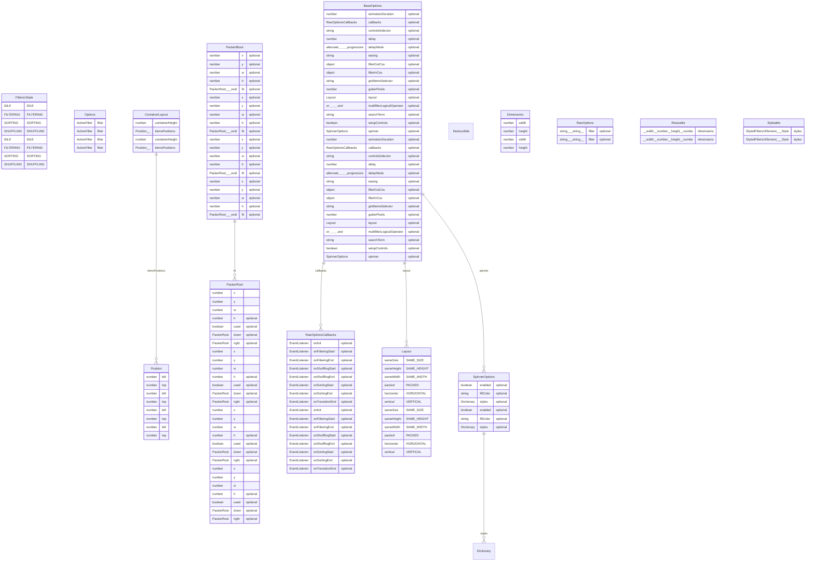

# ERP — Project Map

> Generated by [Devroadmap](https://github.com/) on 2026-07-11. Regenerate with the `Devroadmap: Generate` command.

| Files | Functions | Classes | Imports | Endpoints | Models |
|---|---|---|---|---|---|
| 1817 | 2135 | 56 | 240 | 0 | 40 |

## Directory structure

```text
src/
  main/
    resources/ (908 files)
target/
  classes/
    static/ (908 files)
. (1 files at root)
```

## Data models



| Model | Kind | Fields | Table | File |
|---|---|---|---|---|
| `FilterizrState` | interface | 4 | — | src/main/resources/static/plugins/filterizr/config/filterizrState.d.ts |
| `Layout` | interface | 6 | — | src/main/resources/static/plugins/filterizr/config/layout.d.ts |
| `Position` | interface | 2 | — | src/main/resources/static/plugins/filterizr/FilterItem.d.ts |
| `Options` | interface | 1 | — | src/main/resources/static/plugins/filterizr/FilterizrOptions/FilterizrOptions.d.ts |
| `PackerRoot` | interface | 7 | — | src/main/resources/static/plugins/filterizr/layouts/Packer.d.ts |
| `PackerBlock` | interface | 5 | — | src/main/resources/static/plugins/filterizr/layouts/Packer.d.ts |
| `PackerRoot` | interface | 7 | — | src/main/resources/static/plugins/filterizr/makeLayoutPositions/Packer.d.ts |
| `PackerBlock` | interface | 5 | — | src/main/resources/static/plugins/filterizr/makeLayoutPositions/Packer.d.ts |
| `BaseOptions` | interface | 15 | — | src/main/resources/static/plugins/filterizr/types/interfaces/BaseOptions.d.ts |
| `ContainerLayout` | interface | 2 | — | src/main/resources/static/plugins/filterizr/types/interfaces/ContainerLayout.d.ts |
| `Destructible` | interface | 0 | — | src/main/resources/static/plugins/filterizr/types/interfaces/Destructible.d.ts |
| `Dictionary` | interface | 0 | — | src/main/resources/static/plugins/filterizr/types/interfaces/Dictionary.d.ts |
| `Dimensions` | interface | 2 | — | src/main/resources/static/plugins/filterizr/types/interfaces/Dimensions.d.ts |
| `Options` | interface | 1 | — | src/main/resources/static/plugins/filterizr/types/interfaces/Options.d.ts |
| `Position` | interface | 2 | — | src/main/resources/static/plugins/filterizr/types/interfaces/Position.d.ts |
| `RawOptions` | interface | 1 | — | src/main/resources/static/plugins/filterizr/types/interfaces/RawOptions.d.ts |
| `RawOptionsCallbacks` | interface | 8 | — | src/main/resources/static/plugins/filterizr/types/interfaces/RawOptionsCallbacks.d.ts |
| `Resizable` | interface | 1 | — | src/main/resources/static/plugins/filterizr/types/interfaces/Resizable.d.ts |
| `SpinnerOptions` | interface | 3 | — | src/main/resources/static/plugins/filterizr/types/interfaces/SpinnerOptions.d.ts |
| `Styleable` | interface | 1 | — | src/main/resources/static/plugins/filterizr/types/interfaces/Styleable.d.ts |
| `FilterizrState` | interface | 4 | — | target/classes/static/plugins/filterizr/config/filterizrState.d.ts |
| `Layout` | interface | 6 | — | target/classes/static/plugins/filterizr/config/layout.d.ts |
| `Position` | interface | 2 | — | target/classes/static/plugins/filterizr/FilterItem.d.ts |
| `Options` | interface | 1 | — | target/classes/static/plugins/filterizr/FilterizrOptions/FilterizrOptions.d.ts |
| `PackerRoot` | interface | 7 | — | target/classes/static/plugins/filterizr/layouts/Packer.d.ts |
| `PackerBlock` | interface | 5 | — | target/classes/static/plugins/filterizr/layouts/Packer.d.ts |
| `PackerRoot` | interface | 7 | — | target/classes/static/plugins/filterizr/makeLayoutPositions/Packer.d.ts |
| `PackerBlock` | interface | 5 | — | target/classes/static/plugins/filterizr/makeLayoutPositions/Packer.d.ts |
| `BaseOptions` | interface | 15 | — | target/classes/static/plugins/filterizr/types/interfaces/BaseOptions.d.ts |
| `ContainerLayout` | interface | 2 | — | target/classes/static/plugins/filterizr/types/interfaces/ContainerLayout.d.ts |
| `Destructible` | interface | 0 | — | target/classes/static/plugins/filterizr/types/interfaces/Destructible.d.ts |
| `Dictionary` | interface | 0 | — | target/classes/static/plugins/filterizr/types/interfaces/Dictionary.d.ts |
| `Dimensions` | interface | 2 | — | target/classes/static/plugins/filterizr/types/interfaces/Dimensions.d.ts |
| `Options` | interface | 1 | — | target/classes/static/plugins/filterizr/types/interfaces/Options.d.ts |
| `Position` | interface | 2 | — | target/classes/static/plugins/filterizr/types/interfaces/Position.d.ts |
| `RawOptions` | interface | 1 | — | target/classes/static/plugins/filterizr/types/interfaces/RawOptions.d.ts |
| `RawOptionsCallbacks` | interface | 8 | — | target/classes/static/plugins/filterizr/types/interfaces/RawOptionsCallbacks.d.ts |
| `Resizable` | interface | 1 | — | target/classes/static/plugins/filterizr/types/interfaces/Resizable.d.ts |
| `SpinnerOptions` | interface | 3 | — | target/classes/static/plugins/filterizr/types/interfaces/SpinnerOptions.d.ts |
| `Styleable` | interface | 1 | — | target/classes/static/plugins/filterizr/types/interfaces/Styleable.d.ts |

## File inventory

<details>
<summary>All indexed files</summary>

| File | Language | Functions | Classes | Imports |
|---|---|---|---|---|
| compare_reports.py | python | 1 | 0 | 2 |
| src/main/resources/static/js/common.js | javascript | 0 | 0 | 0 |
| src/main/resources/static/js/companyAsset.js | javascript | 0 | 0 | 0 |
| src/main/resources/static/js/dashboard.js | javascript | 6 | 0 | 0 |
| src/main/resources/static/js/dcDashboard.js | javascript | 2 | 0 | 0 |
| src/main/resources/static/js/dcListByItemReport.js | javascript | 1 | 0 | 0 |
| src/main/resources/static/js/deliveryChallan.js | javascript | 13 | 0 | 0 |
| src/main/resources/static/js/goodsReceiptNote.js | javascript | 4 | 0 | 0 |
| src/main/resources/static/js/grnListByItem.js | javascript | 1 | 0 | 0 |
| src/main/resources/static/js/invoice.js | javascript | 12 | 0 | 0 |
| src/main/resources/static/js/invoiceDashboard.js | javascript | 1 | 0 | 0 |
| src/main/resources/static/js/itemMaster.js | javascript | 26 | 0 | 0 |
| src/main/resources/static/js/newGoodsReceiptNote.js | javascript | 9 | 0 | 0 |
| src/main/resources/static/js/nonBillable.js | javascript | 0 | 0 | 0 |
| src/main/resources/static/js/outstandingStock.js | javascript | 1 | 0 | 0 |
| src/main/resources/static/js/pageHeader.js | javascript | 0 | 0 | 0 |
| src/main/resources/static/js/party.js | javascript | 62 | 0 | 0 |
| src/main/resources/static/js/partyAddress.js | javascript | 3 | 0 | 0 |
| src/main/resources/static/js/partyBank.js | javascript | 1 | 0 | 0 |
| src/main/resources/static/js/partyList.js | javascript | 0 | 0 | 0 |
| src/main/resources/static/js/pendingDcreport.js | javascript | 1 | 0 | 0 |
| src/main/resources/static/js/pendingPoReportByPoNumber.js | javascript | 1 | 0 | 0 |
| src/main/resources/static/js/pendingreport.js | javascript | 1 | 0 | 0 |
| src/main/resources/static/js/po-dashboard.js | javascript | 10 | 0 | 0 |
| src/main/resources/static/js/poItemHistory.js | javascript | 1 | 0 | 0 |
| src/main/resources/static/js/poListByItem.js | javascript | 2 | 0 | 0 |
| src/main/resources/static/js/projectPreview.js | javascript | 4 | 0 | 0 |
| src/main/resources/static/js/purchaseOrder.js | javascript | 22 | 0 | 0 |
| src/main/resources/static/js/reportDashboard.js | javascript | 29 | 0 | 0 |
| src/main/resources/static/js/returnable.js | javascript | 1 | 0 | 0 |
| src/main/resources/static/js/returnableItemList.js | javascript | 0 | 0 | 0 |
| src/main/resources/static/js/salesListReport.js | javascript | 1 | 0 | 0 |
| src/main/resources/static/js/salesOrder.js | javascript | 30 | 0 | 0 |
| src/main/resources/static/js/salesReport.js | javascript | 7 | 0 | 0 |
| src/main/resources/static/js/soChart.js | javascript | 6 | 0 | 0 |
| src/main/resources/static/js/tds.js | javascript | 10 | 0 | 0 |
| src/main/resources/static/js/user.js | javascript | 1 | 0 | 0 |
| src/main/resources/static/js/userList.js | javascript | 0 | 0 | 0 |
| src/main/resources/static/js/welcome.js | javascript | 0 | 0 | 0 |
| src/main/resources/static/js/workOrder.js | javascript | 3 | 0 | 0 |
| src/main/resources/static/js/workOrderList.js | javascript | 0 | 0 | 0 |
| src/main/resources/static/plugins/adminlt/js/app.js | javascript | 1 | 0 | 0 |
| src/main/resources/static/plugins/adminlt/js/app.min.js | javascript | 0 | 0 | 0 |
| src/main/resources/static/plugins/bootbox/bootbox.min.js | javascript | 0 | 0 | 0 |
| src/main/resources/static/plugins/bootstrap-colorpicker/js/bootstrap-colorpicker.js | javascript | 0 | 0 | 0 |
| src/main/resources/static/plugins/bootstrap-colorpicker/js/bootstrap-colorpicker.min.js | javascript | 0 | 0 | 0 |
| src/main/resources/static/plugins/bootstrap-slider/bootstrap-slider.js | javascript | 0 | 0 | 0 |
| src/main/resources/static/plugins/bootstrap-slider/bootstrap-slider.min.js | javascript | 0 | 0 | 0 |
| src/main/resources/static/plugins/bootstrap-switch/js/bootstrap-switch.js | javascript | 0 | 0 | 0 |
| src/main/resources/static/plugins/bootstrap-switch/js/bootstrap-switch.min.js | javascript | 0 | 0 | 0 |
| src/main/resources/static/plugins/bootstrap/js/bootstrap-multiselect.js | javascript | 0 | 0 | 0 |
| src/main/resources/static/plugins/bootstrap/js/bootstrap-toggle.min.js | javascript | 0 | 0 | 0 |
| src/main/resources/static/plugins/bootstrap/js/bootstrap.bundle.js | javascript | 0 | 0 | 0 |
| src/main/resources/static/plugins/bootstrap/js/bootstrap.bundle.min.js | javascript | 0 | 0 | 0 |
| src/main/resources/static/plugins/bootstrap/js/bootstrap.js | javascript | 0 | 0 | 0 |
| src/main/resources/static/plugins/bootstrap/js/bootstrap.min.js | javascript | 0 | 0 | 0 |
| src/main/resources/static/plugins/bootstrap/js/npm.js | javascript | 0 | 0 | 0 |
| src/main/resources/static/plugins/bootstrap4-duallistbox/jquery.bootstrap-duallistbox.js | javascript | 0 | 0 | 0 |
| src/main/resources/static/plugins/bootstrap4-duallistbox/jquery.bootstrap-duallistbox.min.js | javascript | 0 | 0 | 0 |
| src/main/resources/static/plugins/bs-custom-file-input/bs-custom-file-input.js | javascript | 0 | 0 | 0 |
| src/main/resources/static/plugins/bs-custom-file-input/bs-custom-file-input.min.js | javascript | 0 | 0 | 0 |
| src/main/resources/static/plugins/chart.js/Chart.bundle.js | javascript | 0 | 0 | 0 |
| src/main/resources/static/plugins/chart.js/Chart.bundle.min.js | javascript | 0 | 0 | 0 |
| src/main/resources/static/plugins/chart.js/Chart.js | javascript | 0 | 0 | 0 |
| src/main/resources/static/plugins/chart.js/Chart.min.js | javascript | 0 | 0 | 0 |
| src/main/resources/static/plugins/crop_plugin/scripts/jquery.Jcrop.js | javascript | 0 | 0 | 0 |
| src/main/resources/static/plugins/crop_plugin/scripts/jquery.SimpleCropper.js | javascript | 0 | 0 | 0 |
| src/main/resources/static/plugins/datatables-autofill/js/autoFill.bootstrap4.js | javascript | 0 | 0 | 0 |
| src/main/resources/static/plugins/datatables-autofill/js/autoFill.bootstrap4.min.js | javascript | 0 | 0 | 0 |
| src/main/resources/static/plugins/datatables-autofill/js/dataTables.autoFill.js | javascript | 0 | 0 | 0 |
| src/main/resources/static/plugins/datatables-autofill/js/dataTables.autoFill.min.js | javascript | 0 | 0 | 0 |
| src/main/resources/static/plugins/datatables-bs4/js/dataTables.bootstrap4.js | javascript | 0 | 0 | 0 |
| src/main/resources/static/plugins/datatables-bs4/js/dataTables.bootstrap4.min.js | javascript | 0 | 0 | 0 |
| src/main/resources/static/plugins/datatables-buttons/js/buttons.bootstrap4.js | javascript | 0 | 0 | 0 |
| src/main/resources/static/plugins/datatables-buttons/js/buttons.bootstrap4.min.js | javascript | 0 | 0 | 0 |
| src/main/resources/static/plugins/datatables-buttons/js/buttons.colVis.js | javascript | 0 | 0 | 0 |
| src/main/resources/static/plugins/datatables-buttons/js/buttons.colVis.min.js | javascript | 0 | 0 | 0 |
| src/main/resources/static/plugins/datatables-buttons/js/buttons.flash.js | javascript | 0 | 0 | 0 |
| src/main/resources/static/plugins/datatables-buttons/js/buttons.flash.min.js | javascript | 0 | 0 | 0 |
| src/main/resources/static/plugins/datatables-buttons/js/buttons.html5.js | javascript | 0 | 0 | 0 |
| src/main/resources/static/plugins/datatables-buttons/js/buttons.html5.min.js | javascript | 0 | 0 | 0 |
| src/main/resources/static/plugins/datatables-buttons/js/buttons.print.js | javascript | 0 | 0 | 0 |
| src/main/resources/static/plugins/datatables-buttons/js/buttons.print.min.js | javascript | 0 | 0 | 0 |
| src/main/resources/static/plugins/datatables-buttons/js/dataTables.buttons.js | javascript | 0 | 0 | 0 |
| src/main/resources/static/plugins/datatables-buttons/js/dataTables.buttons.min.js | javascript | 0 | 0 | 0 |
| src/main/resources/static/plugins/datatables-colreorder/js/colReorder.bootstrap4.js | javascript | 0 | 0 | 0 |
| src/main/resources/static/plugins/datatables-colreorder/js/colReorder.bootstrap4.min.js | javascript | 0 | 0 | 0 |
| src/main/resources/static/plugins/datatables-colreorder/js/dataTables.colReorder.js | javascript | 0 | 0 | 0 |
| src/main/resources/static/plugins/datatables-colreorder/js/dataTables.colReorder.min.js | javascript | 0 | 0 | 0 |
| src/main/resources/static/plugins/datatables-fixedcolumns/js/dataTables.fixedColumns.js | javascript | 0 | 0 | 0 |
| src/main/resources/static/plugins/datatables-fixedcolumns/js/dataTables.fixedColumns.min.js | javascript | 0 | 0 | 0 |
| src/main/resources/static/plugins/datatables-fixedcolumns/js/fixedColumns.bootstrap4.js | javascript | 0 | 0 | 0 |
| src/main/resources/static/plugins/datatables-fixedcolumns/js/fixedColumns.bootstrap4.min.js | javascript | 0 | 0 | 0 |
| src/main/resources/static/plugins/datatables-fixedheader/js/dataTables.fixedHeader.js | javascript | 0 | 0 | 0 |
| src/main/resources/static/plugins/datatables-fixedheader/js/dataTables.fixedHeader.min.js | javascript | 0 | 0 | 0 |
| src/main/resources/static/plugins/datatables-fixedheader/js/fixedHeader.bootstrap4.js | javascript | 0 | 0 | 0 |
| src/main/resources/static/plugins/datatables-fixedheader/js/fixedHeader.bootstrap4.min.js | javascript | 0 | 0 | 0 |
| src/main/resources/static/plugins/datatables-keytable/js/dataTables.keyTable.js | javascript | 0 | 0 | 0 |
| src/main/resources/static/plugins/datatables-keytable/js/dataTables.keyTable.min.js | javascript | 0 | 0 | 0 |
| src/main/resources/static/plugins/datatables-keytable/js/keyTable.bootstrap4.js | javascript | 0 | 0 | 0 |
| src/main/resources/static/plugins/datatables-keytable/js/keyTable.bootstrap4.min.js | javascript | 0 | 0 | 0 |
| src/main/resources/static/plugins/datatables-responsive/js/dataTables.responsive.js | javascript | 0 | 0 | 0 |
| src/main/resources/static/plugins/datatables-responsive/js/dataTables.responsive.min.js | javascript | 0 | 0 | 0 |
| src/main/resources/static/plugins/datatables-responsive/js/responsive.bootstrap4.js | javascript | 0 | 0 | 0 |
| src/main/resources/static/plugins/datatables-responsive/js/responsive.bootstrap4.min.js | javascript | 0 | 0 | 0 |
| src/main/resources/static/plugins/datatables-rowgroup/js/dataTables.rowGroup.js | javascript | 0 | 0 | 0 |
| src/main/resources/static/plugins/datatables-rowgroup/js/dataTables.rowGroup.min.js | javascript | 0 | 0 | 0 |
| src/main/resources/static/plugins/datatables-rowgroup/js/rowGroup.bootstrap4.js | javascript | 0 | 0 | 0 |
| src/main/resources/static/plugins/datatables-rowgroup/js/rowGroup.bootstrap4.min.js | javascript | 0 | 0 | 0 |
| src/main/resources/static/plugins/datatables-rowreorder/js/dataTables.rowReorder.js | javascript | 0 | 0 | 0 |
| src/main/resources/static/plugins/datatables-rowreorder/js/dataTables.rowReorder.min.js | javascript | 0 | 0 | 0 |
| src/main/resources/static/plugins/datatables-rowreorder/js/rowReorder.bootstrap4.js | javascript | 0 | 0 | 0 |
| src/main/resources/static/plugins/datatables-rowreorder/js/rowReorder.bootstrap4.min.js | javascript | 0 | 0 | 0 |
| src/main/resources/static/plugins/datatables-scroller/js/dataTables.scroller.js | javascript | 0 | 0 | 0 |
| src/main/resources/static/plugins/datatables-scroller/js/dataTables.scroller.min.js | javascript | 0 | 0 | 0 |
| src/main/resources/static/plugins/datatables-scroller/js/scroller.bootstrap4.js | javascript | 0 | 0 | 0 |
| src/main/resources/static/plugins/datatables-scroller/js/scroller.bootstrap4.min.js | javascript | 0 | 0 | 0 |
| src/main/resources/static/plugins/datatables-select/js/dataTables.select.js | javascript | 0 | 0 | 0 |
| src/main/resources/static/plugins/datatables-select/js/dataTables.select.min.js | javascript | 0 | 0 | 0 |
| src/main/resources/static/plugins/datatables-select/js/select.bootstrap4.js | javascript | 0 | 0 | 0 |
| src/main/resources/static/plugins/datatables-select/js/select.bootstrap4.min.js | javascript | 0 | 0 | 0 |
| src/main/resources/static/plugins/datatables/jquery.dataTables.js | javascript | 0 | 0 | 0 |
| src/main/resources/static/plugins/datatables/jquery.dataTables.min.js | javascript | 0 | 0 | 0 |
| src/main/resources/static/plugins/daterangepicker/daterangepicker.js | javascript | 0 | 0 | 0 |
| src/main/resources/static/plugins/daterangepicker/example/amd/main.js | javascript | 0 | 0 | 0 |
| src/main/resources/static/plugins/daterangepicker/example/amd/require.js | javascript | 0 | 0 | 0 |
| src/main/resources/static/plugins/daterangepicker/example/browserify/bundle.js | javascript | 0 | 0 | 0 |
| src/main/resources/static/plugins/daterangepicker/example/browserify/main.js | javascript | 0 | 0 | 2 |
| src/main/resources/static/plugins/daterangepicker/moment.min.js | javascript | 0 | 0 | 0 |
| src/main/resources/static/plugins/daterangepicker/package.js | javascript | 0 | 0 | 0 |
| src/main/resources/static/plugins/daterangepicker/website.js | javascript | 0 | 0 | 0 |
| src/main/resources/static/plugins/daterangepicker/website/website.js | javascript | 0 | 0 | 0 |
| src/main/resources/static/plugins/ekko-lightbox/ekko-lightbox.js | javascript | 0 | 0 | 0 |
| src/main/resources/static/plugins/ekko-lightbox/ekko-lightbox.min.js | javascript | 0 | 0 | 0 |
| src/main/resources/static/plugins/fastclick/fastclick.js | javascript | 0 | 0 | 0 |
| src/main/resources/static/plugins/filterizr/ActiveFilter.d.ts | typescript | 0 | 1 | 1 |
| src/main/resources/static/plugins/filterizr/animate.d.ts | typescript | 0 | 0 | 0 |
| src/main/resources/static/plugins/filterizr/BrowserWindow.d.ts | typescript | 0 | 1 | 0 |
| src/main/resources/static/plugins/filterizr/config/cssEasingValuesRegexp.d.ts | typescript | 0 | 0 | 0 |
| src/main/resources/static/plugins/filterizr/config/filterizrState.d.ts | typescript | 0 | 0 | 0 |
| src/main/resources/static/plugins/filterizr/config/index.d.ts | typescript | 0 | 0 | 0 |
| src/main/resources/static/plugins/filterizr/config/layout.d.ts | typescript | 0 | 0 | 0 |
| src/main/resources/static/plugins/filterizr/EventReceiver.d.ts | typescript | 0 | 1 | 1 |
| src/main/resources/static/plugins/filterizr/FilterContainer.d.ts | typescript | 0 | 1 | 3 |
| src/main/resources/static/plugins/filterizr/FilterContainer/FilterContainer.d.ts | typescript | 0 | 1 | 5 |
| src/main/resources/static/plugins/filterizr/FilterContainer/index.d.ts | typescript | 0 | 0 | 0 |
| src/main/resources/static/plugins/filterizr/FilterContainer/StyledFilterContainer.d.ts | typescript | 0 | 1 | 1 |
| src/main/resources/static/plugins/filterizr/FilterContainer/styles.d.ts | typescript | 0 | 0 | 1 |
| src/main/resources/static/plugins/filterizr/FilterControls.d.ts | typescript | 0 | 1 | 2 |
| src/main/resources/static/plugins/filterizr/FilterItem.d.ts | typescript | 0 | 1 | 2 |
| src/main/resources/static/plugins/filterizr/FilterItem/FilterItem.d.ts | typescript | 0 | 1 | 4 |
| src/main/resources/static/plugins/filterizr/FilterItem/index.d.ts | typescript | 0 | 0 | 0 |
| src/main/resources/static/plugins/filterizr/FilterItem/StyledFilterItem.d.ts | typescript | 0 | 1 | 3 |
| src/main/resources/static/plugins/filterizr/FilterItem/styles.d.ts | typescript | 0 | 0 | 2 |
| src/main/resources/static/plugins/filterizr/FilterItems.d.ts | typescript | 0 | 1 | 3 |
| src/main/resources/static/plugins/filterizr/FilterItems/FilterItems.d.ts | typescript | 0 | 1 | 5 |
| src/main/resources/static/plugins/filterizr/FilterItems/index.d.ts | typescript | 0 | 0 | 0 |
| src/main/resources/static/plugins/filterizr/FilterItems/StyledFilterItems.d.ts | typescript | 0 | 1 | 2 |
| src/main/resources/static/plugins/filterizr/Filterizr.d.ts | typescript | 0 | 1 | 5 |
| src/main/resources/static/plugins/filterizr/filterizr.min.js | javascript | 0 | 0 | 0 |
| src/main/resources/static/plugins/filterizr/Filterizr/Filterizr.d.ts | typescript | 0 | 1 | 5 |
| src/main/resources/static/plugins/filterizr/Filterizr/index.d.ts | typescript | 0 | 0 | 0 |
| src/main/resources/static/plugins/filterizr/Filterizr/installAsJQueryPlugin.d.ts | typescript | 0 | 0 | 0 |
| src/main/resources/static/plugins/filterizr/FilterizrElement.d.ts | typescript | 0 | 1 | 4 |
| src/main/resources/static/plugins/filterizr/FilterizrOptions/defaultOptions.d.ts | typescript | 0 | 0 | 1 |
| src/main/resources/static/plugins/filterizr/FilterizrOptions/FilterizrOptions.d.ts | typescript | 0 | 1 | 3 |
| src/main/resources/static/plugins/filterizr/FilterizrOptions/index.d.ts | typescript | 0 | 0 | 0 |
| src/main/resources/static/plugins/filterizr/getLayoutPositions.d.ts | typescript | 0 | 0 | 2 |
| src/main/resources/static/plugins/filterizr/index.d.ts | typescript | 0 | 0 | 0 |
| src/main/resources/static/plugins/filterizr/index.jquery.d.ts | typescript | 0 | 0 | 1 |
| src/main/resources/static/plugins/filterizr/installAsJQueryPlugin.d.ts | typescript | 0 | 0 | 0 |
| src/main/resources/static/plugins/filterizr/jquery.filterizr.min.js | javascript | 0 | 0 | 0 |
| src/main/resources/static/plugins/filterizr/layouts/getHorizontalLayoutPositions.d.ts | typescript | 0 | 0 | 2 |
| src/main/resources/static/plugins/filterizr/layouts/getPackedLayoutPositions.d.ts | typescript | 0 | 0 | 2 |
| src/main/resources/static/plugins/filterizr/layouts/getSameHeightLayoutPositions.d.ts | typescript | 0 | 0 | 2 |
| src/main/resources/static/plugins/filterizr/layouts/getSameSizeLayoutPosition.d.ts | typescript | 0 | 0 | 2 |
| src/main/resources/static/plugins/filterizr/layouts/getSameWidthLayoutPositions.d.ts | typescript | 0 | 0 | 2 |
| src/main/resources/static/plugins/filterizr/layouts/getVerticalLayoutPositions.d.ts | typescript | 0 | 0 | 2 |
| src/main/resources/static/plugins/filterizr/layouts/Packer.d.ts | typescript | 0 | 1 | 0 |
| src/main/resources/static/plugins/filterizr/makeLayoutPositions/index.d.ts | typescript | 0 | 0 | 0 |
| src/main/resources/static/plugins/filterizr/makeLayoutPositions/makeHorizontalLayoutPositions.d.ts | typescript | 0 | 0 | 1 |
| src/main/resources/static/plugins/filterizr/makeLayoutPositions/makeLayoutPositions.d.ts | typescript | 0 | 0 | 1 |
| src/main/resources/static/plugins/filterizr/makeLayoutPositions/makePackedLayoutPositions.d.ts | typescript | 0 | 0 | 1 |
| src/main/resources/static/plugins/filterizr/makeLayoutPositions/makeSameHeightLayoutPositions.d.ts | typescript | 0 | 0 | 1 |
| src/main/resources/static/plugins/filterizr/makeLayoutPositions/makeSameSizeLayoutPosition.d.ts | typescript | 0 | 0 | 1 |
| src/main/resources/static/plugins/filterizr/makeLayoutPositions/makeSameWidthLayoutPositions.d.ts | typescript | 0 | 0 | 1 |
| src/main/resources/static/plugins/filterizr/makeLayoutPositions/makeVerticalLayoutPositions.d.ts | typescript | 0 | 0 | 1 |
| src/main/resources/static/plugins/filterizr/makeLayoutPositions/Packer.d.ts | typescript | 0 | 1 | 0 |
| src/main/resources/static/plugins/filterizr/Spinner/index.d.ts | typescript | 0 | 0 | 0 |
| src/main/resources/static/plugins/filterizr/Spinner/makeSpinner.d.ts | typescript | 0 | 0 | 1 |
| src/main/resources/static/plugins/filterizr/Spinner/Spinner.d.ts | typescript | 0 | 1 | 4 |
| src/main/resources/static/plugins/filterizr/Spinner/StyledSpinner.d.ts | typescript | 0 | 1 | 1 |
| src/main/resources/static/plugins/filterizr/StyledFilterizrElement.d.ts | typescript | 0 | 1 | 2 |
| src/main/resources/static/plugins/filterizr/StyledFilterizrElements.d.ts | typescript | 0 | 1 | 0 |
| src/main/resources/static/plugins/filterizr/types/index.d.ts | typescript | 0 | 0 | 0 |
| src/main/resources/static/plugins/filterizr/types/interfaces/BaseOptions.d.ts | typescript | 0 | 0 | 3 |
| src/main/resources/static/plugins/filterizr/types/interfaces/ContainerLayout.d.ts | typescript | 0 | 0 | 1 |
| src/main/resources/static/plugins/filterizr/types/interfaces/Destructible.d.ts | typescript | 0 | 0 | 0 |
| src/main/resources/static/plugins/filterizr/types/interfaces/Dictionary.d.ts | typescript | 0 | 0 | 0 |
| src/main/resources/static/plugins/filterizr/types/interfaces/Dimensions.d.ts | typescript | 0 | 0 | 0 |
| src/main/resources/static/plugins/filterizr/types/interfaces/index.d.ts | typescript | 0 | 0 | 0 |
| src/main/resources/static/plugins/filterizr/types/interfaces/Options.d.ts | typescript | 0 | 0 | 2 |
| src/main/resources/static/plugins/filterizr/types/interfaces/Position.d.ts | typescript | 0 | 0 | 0 |
| src/main/resources/static/plugins/filterizr/types/interfaces/RawOptions.d.ts | typescript | 0 | 0 | 1 |
| src/main/resources/static/plugins/filterizr/types/interfaces/RawOptionsCallbacks.d.ts | typescript | 0 | 0 | 0 |
| src/main/resources/static/plugins/filterizr/types/interfaces/Resizable.d.ts | typescript | 0 | 0 | 0 |
| src/main/resources/static/plugins/filterizr/types/interfaces/SpinnerOptions.d.ts | typescript | 0 | 0 | 1 |
| src/main/resources/static/plugins/filterizr/types/interfaces/Styleable.d.ts | typescript | 0 | 0 | 2 |
| src/main/resources/static/plugins/filterizr/utils.d.ts | typescript | 0 | 0 | 2 |
| src/main/resources/static/plugins/filterizr/utils/allStringsOfArray1InArray2.d.ts | typescript | 0 | 0 | 0 |
| src/main/resources/static/plugins/filterizr/utils/checkOptionForErrors.d.ts | typescript | 0 | 0 | 0 |
| src/main/resources/static/plugins/filterizr/utils/debounce.d.ts | typescript | 0 | 0 | 0 |
| src/main/resources/static/plugins/filterizr/utils/filterItemArraysHaveSameSorting.d.ts | typescript | 0 | 0 | 1 |
| src/main/resources/static/plugins/filterizr/utils/getDataAttributesOfHTMLNode.d.ts | typescript | 0 | 0 | 1 |
| src/main/resources/static/plugins/filterizr/utils/getHTMLElement.d.ts | typescript | 0 | 0 | 0 |
| src/main/resources/static/plugins/filterizr/utils/index.d.ts | typescript | 0 | 0 | 0 |
| src/main/resources/static/plugins/filterizr/utils/intersection.d.ts | typescript | 0 | 0 | 0 |
| src/main/resources/static/plugins/filterizr/utils/merge.d.ts | typescript | 0 | 0 | 1 |
| src/main/resources/static/plugins/filterizr/utils/noop.d.ts | typescript | 0 | 0 | 0 |
| src/main/resources/static/plugins/filterizr/utils/setStyles.d.ts | typescript | 0 | 0 | 0 |
| src/main/resources/static/plugins/filterizr/utils/shuffle.d.ts | typescript | 0 | 0 | 0 |
| src/main/resources/static/plugins/filterizr/utils/sortBy.d.ts | typescript | 0 | 0 | 0 |
| src/main/resources/static/plugins/filterizr/vanilla.filterizr.min.js | javascript | 0 | 0 | 0 |
| src/main/resources/static/plugins/flot-old/excanvas.js | javascript | 0 | 0 | 0 |
| src/main/resources/static/plugins/flot-old/excanvas.min.js | javascript | 0 | 0 | 0 |
| src/main/resources/static/plugins/flot-old/jquery.colorhelpers.js | javascript | 0 | 0 | 0 |
| src/main/resources/static/plugins/flot-old/jquery.colorhelpers.min.js | javascript | 0 | 0 | 0 |
| src/main/resources/static/plugins/flot-old/jquery.flot.canvas.js | javascript | 0 | 0 | 0 |
| src/main/resources/static/plugins/flot-old/jquery.flot.canvas.min.js | javascript | 0 | 0 | 0 |
| src/main/resources/static/plugins/flot-old/jquery.flot.categories.js | javascript | 0 | 0 | 0 |
| src/main/resources/static/plugins/flot-old/jquery.flot.categories.min.js | javascript | 0 | 0 | 0 |
| src/main/resources/static/plugins/flot-old/jquery.flot.crosshair.js | javascript | 0 | 0 | 0 |
| src/main/resources/static/plugins/flot-old/jquery.flot.crosshair.min.js | javascript | 0 | 0 | 0 |
| src/main/resources/static/plugins/flot-old/jquery.flot.errorbars.js | javascript | 0 | 0 | 0 |
| src/main/resources/static/plugins/flot-old/jquery.flot.errorbars.min.js | javascript | 0 | 0 | 0 |
| src/main/resources/static/plugins/flot-old/jquery.flot.fillbetween.js | javascript | 0 | 0 | 0 |
| src/main/resources/static/plugins/flot-old/jquery.flot.fillbetween.min.js | javascript | 0 | 0 | 0 |
| src/main/resources/static/plugins/flot-old/jquery.flot.image.js | javascript | 0 | 0 | 0 |
| src/main/resources/static/plugins/flot-old/jquery.flot.image.min.js | javascript | 0 | 0 | 0 |
| src/main/resources/static/plugins/flot-old/jquery.flot.js | javascript | 0 | 0 | 0 |
| src/main/resources/static/plugins/flot-old/jquery.flot.min.js | javascript | 0 | 0 | 0 |
| src/main/resources/static/plugins/flot-old/jquery.flot.navigate.js | javascript | 0 | 0 | 0 |
| src/main/resources/static/plugins/flot-old/jquery.flot.navigate.min.js | javascript | 0 | 0 | 0 |
| src/main/resources/static/plugins/flot-old/jquery.flot.pie.js | javascript | 0 | 0 | 0 |
| src/main/resources/static/plugins/flot-old/jquery.flot.pie.min.js | javascript | 0 | 0 | 0 |
| src/main/resources/static/plugins/flot-old/jquery.flot.resize.js | javascript | 0 | 0 | 0 |
| src/main/resources/static/plugins/flot-old/jquery.flot.resize.min.js | javascript | 0 | 0 | 0 |
| src/main/resources/static/plugins/flot-old/jquery.flot.selection.js | javascript | 0 | 0 | 0 |
| src/main/resources/static/plugins/flot-old/jquery.flot.selection.min.js | javascript | 0 | 0 | 0 |
| src/main/resources/static/plugins/flot-old/jquery.flot.stack.js | javascript | 0 | 0 | 0 |
| src/main/resources/static/plugins/flot-old/jquery.flot.stack.min.js | javascript | 0 | 0 | 0 |
| src/main/resources/static/plugins/flot-old/jquery.flot.symbol.js | javascript | 0 | 0 | 0 |
| src/main/resources/static/plugins/flot-old/jquery.flot.symbol.min.js | javascript | 0 | 0 | 0 |
| src/main/resources/static/plugins/flot-old/jquery.flot.threshold.js | javascript | 0 | 0 | 0 |
| src/main/resources/static/plugins/flot-old/jquery.flot.threshold.min.js | javascript | 0 | 0 | 0 |
| src/main/resources/static/plugins/flot-old/jquery.flot.time.js | javascript | 0 | 0 | 0 |
| src/main/resources/static/plugins/flot-old/jquery.flot.time.min.js | javascript | 0 | 0 | 0 |
| src/main/resources/static/plugins/flot/jquery.flot.js | javascript | 2 | 0 | 0 |
| src/main/resources/static/plugins/fullcalendar-bootstrap/main.d.ts | typescript | 0 | 0 | 0 |
| src/main/resources/static/plugins/fullcalendar-bootstrap/main.esm.js | javascript | 2 | 0 | 1 |
| src/main/resources/static/plugins/fullcalendar-bootstrap/main.js | javascript | 0 | 0 | 0 |
| src/main/resources/static/plugins/fullcalendar-bootstrap/main.min.js | javascript | 0 | 0 | 0 |
| src/main/resources/static/plugins/fullcalendar-daygrid/main.d.ts | typescript | 0 | 0 | 0 |
| src/main/resources/static/plugins/fullcalendar-daygrid/main.esm.js | javascript | 7 | 0 | 1 |
| src/main/resources/static/plugins/fullcalendar-daygrid/main.js | javascript | 0 | 0 | 0 |
| src/main/resources/static/plugins/fullcalendar-daygrid/main.min.js | javascript | 0 | 0 | 0 |
| src/main/resources/static/plugins/fullcalendar-interaction/main.d.ts | typescript | 0 | 0 | 0 |
| src/main/resources/static/plugins/fullcalendar-interaction/main.esm.js | javascript | 18 | 0 | 1 |
| src/main/resources/static/plugins/fullcalendar-interaction/main.js | javascript | 0 | 0 | 0 |
| src/main/resources/static/plugins/fullcalendar-interaction/main.min.js | javascript | 0 | 0 | 0 |
| src/main/resources/static/plugins/fullcalendar-timegrid/main.d.ts | typescript | 0 | 0 | 0 |
| src/main/resources/static/plugins/fullcalendar-timegrid/main.esm.js | javascript | 11 | 0 | 2 |
| src/main/resources/static/plugins/fullcalendar-timegrid/main.js | javascript | 0 | 0 | 0 |
| src/main/resources/static/plugins/fullcalendar-timegrid/main.min.js | javascript | 0 | 0 | 0 |
| src/main/resources/static/plugins/fullcalendar/locales-all.js | javascript | 0 | 0 | 0 |
| src/main/resources/static/plugins/fullcalendar/locales-all.min.js | javascript | 0 | 0 | 0 |
| src/main/resources/static/plugins/fullcalendar/locales/af.js | javascript | 0 | 0 | 0 |
| src/main/resources/static/plugins/fullcalendar/locales/ar-dz.js | javascript | 0 | 0 | 0 |
| src/main/resources/static/plugins/fullcalendar/locales/ar-kw.js | javascript | 0 | 0 | 0 |
| src/main/resources/static/plugins/fullcalendar/locales/ar-ly.js | javascript | 0 | 0 | 0 |
| src/main/resources/static/plugins/fullcalendar/locales/ar-ma.js | javascript | 0 | 0 | 0 |
| src/main/resources/static/plugins/fullcalendar/locales/ar-sa.js | javascript | 0 | 0 | 0 |
| src/main/resources/static/plugins/fullcalendar/locales/ar-tn.js | javascript | 0 | 0 | 0 |
| src/main/resources/static/plugins/fullcalendar/locales/ar.js | javascript | 0 | 0 | 0 |
| src/main/resources/static/plugins/fullcalendar/locales/bg.js | javascript | 0 | 0 | 0 |
| src/main/resources/static/plugins/fullcalendar/locales/bs.js | javascript | 0 | 0 | 0 |
| src/main/resources/static/plugins/fullcalendar/locales/ca.js | javascript | 0 | 0 | 0 |
| src/main/resources/static/plugins/fullcalendar/locales/cs.js | javascript | 0 | 0 | 0 |
| src/main/resources/static/plugins/fullcalendar/locales/da.js | javascript | 0 | 0 | 0 |
| src/main/resources/static/plugins/fullcalendar/locales/de.js | javascript | 0 | 0 | 0 |
| src/main/resources/static/plugins/fullcalendar/locales/el.js | javascript | 0 | 0 | 0 |
| src/main/resources/static/plugins/fullcalendar/locales/en-au.js | javascript | 0 | 0 | 0 |
| src/main/resources/static/plugins/fullcalendar/locales/en-gb.js | javascript | 0 | 0 | 0 |
| src/main/resources/static/plugins/fullcalendar/locales/en-nz.js | javascript | 0 | 0 | 0 |
| src/main/resources/static/plugins/fullcalendar/locales/es-us.js | javascript | 0 | 0 | 0 |
| src/main/resources/static/plugins/fullcalendar/locales/es.js | javascript | 0 | 0 | 0 |
| src/main/resources/static/plugins/fullcalendar/locales/et.js | javascript | 0 | 0 | 0 |
| src/main/resources/static/plugins/fullcalendar/locales/eu.js | javascript | 0 | 0 | 0 |
| src/main/resources/static/plugins/fullcalendar/locales/fa.js | javascript | 0 | 0 | 0 |
| src/main/resources/static/plugins/fullcalendar/locales/fi.js | javascript | 0 | 0 | 0 |
| src/main/resources/static/plugins/fullcalendar/locales/fr-ca.js | javascript | 0 | 0 | 0 |
| src/main/resources/static/plugins/fullcalendar/locales/fr-ch.js | javascript | 0 | 0 | 0 |
| src/main/resources/static/plugins/fullcalendar/locales/fr.js | javascript | 0 | 0 | 0 |
| src/main/resources/static/plugins/fullcalendar/locales/gl.js | javascript | 0 | 0 | 0 |
| src/main/resources/static/plugins/fullcalendar/locales/he.js | javascript | 0 | 0 | 0 |
| src/main/resources/static/plugins/fullcalendar/locales/hi.js | javascript | 0 | 0 | 0 |
| src/main/resources/static/plugins/fullcalendar/locales/hr.js | javascript | 0 | 0 | 0 |
| src/main/resources/static/plugins/fullcalendar/locales/hu.js | javascript | 0 | 0 | 0 |
| src/main/resources/static/plugins/fullcalendar/locales/id.js | javascript | 0 | 0 | 0 |
| src/main/resources/static/plugins/fullcalendar/locales/is.js | javascript | 0 | 0 | 0 |
| src/main/resources/static/plugins/fullcalendar/locales/it.js | javascript | 0 | 0 | 0 |
| src/main/resources/static/plugins/fullcalendar/locales/ja.js | javascript | 0 | 0 | 0 |
| src/main/resources/static/plugins/fullcalendar/locales/ka.js | javascript | 0 | 0 | 0 |
| src/main/resources/static/plugins/fullcalendar/locales/kk.js | javascript | 0 | 0 | 0 |
| src/main/resources/static/plugins/fullcalendar/locales/ko.js | javascript | 0 | 0 | 0 |
| src/main/resources/static/plugins/fullcalendar/locales/lb.js | javascript | 0 | 0 | 0 |
| src/main/resources/static/plugins/fullcalendar/locales/lt.js | javascript | 0 | 0 | 0 |
| src/main/resources/static/plugins/fullcalendar/locales/lv.js | javascript | 0 | 0 | 0 |
| src/main/resources/static/plugins/fullcalendar/locales/mk.js | javascript | 0 | 0 | 0 |
| src/main/resources/static/plugins/fullcalendar/locales/ms.js | javascript | 0 | 0 | 0 |
| src/main/resources/static/plugins/fullcalendar/locales/nb.js | javascript | 0 | 0 | 0 |
| src/main/resources/static/plugins/fullcalendar/locales/nl.js | javascript | 0 | 0 | 0 |
| src/main/resources/static/plugins/fullcalendar/locales/nn.js | javascript | 0 | 0 | 0 |
| src/main/resources/static/plugins/fullcalendar/locales/pl.js | javascript | 0 | 0 | 0 |
| src/main/resources/static/plugins/fullcalendar/locales/pt-br.js | javascript | 0 | 0 | 0 |
| src/main/resources/static/plugins/fullcalendar/locales/pt.js | javascript | 0 | 0 | 0 |
| src/main/resources/static/plugins/fullcalendar/locales/ro.js | javascript | 0 | 0 | 0 |
| src/main/resources/static/plugins/fullcalendar/locales/ru.js | javascript | 0 | 0 | 0 |
| src/main/resources/static/plugins/fullcalendar/locales/sk.js | javascript | 0 | 0 | 0 |
| src/main/resources/static/plugins/fullcalendar/locales/sl.js | javascript | 0 | 0 | 0 |
| src/main/resources/static/plugins/fullcalendar/locales/sq.js | javascript | 0 | 0 | 0 |
| src/main/resources/static/plugins/fullcalendar/locales/sr-cyrl.js | javascript | 0 | 0 | 0 |
| src/main/resources/static/plugins/fullcalendar/locales/sr.js | javascript | 0 | 0 | 0 |
| src/main/resources/static/plugins/fullcalendar/locales/sv.js | javascript | 0 | 0 | 0 |
| src/main/resources/static/plugins/fullcalendar/locales/th.js | javascript | 0 | 0 | 0 |
| src/main/resources/static/plugins/fullcalendar/locales/tr.js | javascript | 0 | 0 | 0 |
| src/main/resources/static/plugins/fullcalendar/locales/uk.js | javascript | 0 | 0 | 0 |
| src/main/resources/static/plugins/fullcalendar/locales/vi.js | javascript | 0 | 0 | 0 |
| src/main/resources/static/plugins/fullcalendar/locales/zh-cn.js | javascript | 0 | 0 | 0 |
| src/main/resources/static/plugins/fullcalendar/locales/zh-tw.js | javascript | 0 | 0 | 0 |
| src/main/resources/static/plugins/fullcalendar/main.d.ts | typescript | 0 | 0 | 0 |
| src/main/resources/static/plugins/fullcalendar/main.esm.js | javascript | 284 | 0 | 0 |
| src/main/resources/static/plugins/fullcalendar/main.js | javascript | 0 | 0 | 0 |
| src/main/resources/static/plugins/fullcalendar/main.min.js | javascript | 0 | 0 | 0 |
| src/main/resources/static/plugins/funnel-chart/lib/3/amcharts.js | javascript | 0 | 0 | 0 |
| src/main/resources/static/plugins/funnel-chart/lib/3/funnel.js | javascript | 0 | 0 | 0 |
| src/main/resources/static/plugins/funnel-chart/lib/3/pie.js | javascript | 0 | 0 | 0 |
| src/main/resources/static/plugins/funnel-chart/lib/3/plugins/export/export.min.js | javascript | 0 | 0 | 0 |
| src/main/resources/static/plugins/funnel-chart/lib/3/serial.js | javascript | 0 | 0 | 0 |
| src/main/resources/static/plugins/funnel-chart/lib/3/themes/light.js | javascript | 0 | 0 | 0 |
| src/main/resources/static/plugins/funnel-chart/lib/4/charts.js | javascript | 0 | 0 | 0 |
| src/main/resources/static/plugins/funnel-chart/lib/4/core.js | javascript | 0 | 0 | 0 |
| src/main/resources/static/plugins/funnel-chart/lib/4/themes/animated.js | javascript | 0 | 0 | 0 |
| src/main/resources/static/plugins/inputmask/inputmask/bindings/inputmask.binding.js | javascript | 0 | 0 | 0 |
| src/main/resources/static/plugins/inputmask/inputmask/dependencyLibs/inputmask.dependencyLib.jqlite.js | javascript | 0 | 0 | 0 |
| src/main/resources/static/plugins/inputmask/inputmask/dependencyLibs/inputmask.dependencyLib.jquery.js | javascript | 0 | 0 | 0 |
| src/main/resources/static/plugins/inputmask/inputmask/dependencyLibs/inputmask.dependencyLib.js | javascript | 0 | 0 | 0 |
| src/main/resources/static/plugins/inputmask/inputmask/global/window.js | javascript | 0 | 0 | 0 |
| src/main/resources/static/plugins/inputmask/inputmask/inputmask.date.extensions.js | javascript | 0 | 0 | 0 |
| src/main/resources/static/plugins/inputmask/inputmask/inputmask.extensions.js | javascript | 0 | 0 | 0 |
| src/main/resources/static/plugins/inputmask/inputmask/inputmask.js | javascript | 0 | 0 | 0 |
| src/main/resources/static/plugins/inputmask/inputmask/inputmask.numeric.extensions.js | javascript | 0 | 0 | 0 |
| src/main/resources/static/plugins/inputmask/inputmask/jquery.inputmask.js | javascript | 0 | 0 | 0 |
| src/main/resources/static/plugins/inputmask/jquery.inputmask.bundle.js | javascript | 0 | 0 | 0 |
| src/main/resources/static/plugins/inputmask/min/inputmask/bindings/inputmask.binding.min.js | javascript | 0 | 0 | 0 |
| src/main/resources/static/plugins/inputmask/min/inputmask/dependencyLibs/inputmask.dependencyLib.jqlite.min.js | javascript | 0 | 0 | 0 |
| src/main/resources/static/plugins/inputmask/min/inputmask/dependencyLibs/inputmask.dependencyLib.jquery.min.js | javascript | 0 | 0 | 0 |
| src/main/resources/static/plugins/inputmask/min/inputmask/dependencyLibs/inputmask.dependencyLib.min.js | javascript | 0 | 0 | 0 |
| src/main/resources/static/plugins/inputmask/min/inputmask/global/window.min.js | javascript | 0 | 0 | 0 |
| src/main/resources/static/plugins/inputmask/min/inputmask/inputmask.date.extensions.min.js | javascript | 0 | 0 | 0 |
| src/main/resources/static/plugins/inputmask/min/inputmask/inputmask.extensions.min.js | javascript | 0 | 0 | 0 |
| src/main/resources/static/plugins/inputmask/min/inputmask/inputmask.min.js | javascript | 0 | 0 | 0 |
| src/main/resources/static/plugins/inputmask/min/inputmask/inputmask.numeric.extensions.min.js | javascript | 0 | 0 | 0 |
| src/main/resources/static/plugins/inputmask/min/inputmask/jquery.inputmask.min.js | javascript | 0 | 0 | 0 |
| src/main/resources/static/plugins/inputmask/min/jquery.inputmask.bundle.min.js | javascript | 0 | 0 | 0 |
| src/main/resources/static/plugins/ion-rangeslider/js/ion.rangeSlider.js | javascript | 0 | 0 | 0 |
| src/main/resources/static/plugins/ion-rangeslider/js/ion.rangeSlider.min.js | javascript | 0 | 0 | 0 |
| src/main/resources/static/plugins/ionicons-2.0.1/builder/generate.py | python | 11 | 0 | 3 |
| src/main/resources/static/plugins/ionicons-2.0.1/builder/scripts/eotlitetool.py | python | 11 | 3 | 2 |
| src/main/resources/static/plugins/ionicons-2.0.1/builder/scripts/generate_font.py | python | 0 | 0 | 7 |
| src/main/resources/static/plugins/jquery-knob/jquery.knob.min.js | javascript | 0 | 0 | 0 |
| src/main/resources/static/plugins/jquery-mapael/jquery.mapael.js | javascript | 0 | 0 | 0 |
| src/main/resources/static/plugins/jquery-mapael/jquery.mapael.min.js | javascript | 0 | 0 | 0 |
| src/main/resources/static/plugins/jquery-mapael/maps/france_departments.js | javascript | 0 | 0 | 0 |
| src/main/resources/static/plugins/jquery-mapael/maps/france_departments.min.js | javascript | 0 | 0 | 0 |
| src/main/resources/static/plugins/jquery-mapael/maps/usa_states.js | javascript | 0 | 0 | 0 |
| src/main/resources/static/plugins/jquery-mapael/maps/usa_states.min.js | javascript | 0 | 0 | 0 |
| src/main/resources/static/plugins/jquery-mapael/maps/world_countries_mercator.js | javascript | 0 | 0 | 0 |
| src/main/resources/static/plugins/jquery-mapael/maps/world_countries_mercator.min.js | javascript | 0 | 0 | 0 |
| src/main/resources/static/plugins/jquery-mapael/maps/world_countries_miller.js | javascript | 0 | 0 | 0 |
| src/main/resources/static/plugins/jquery-mapael/maps/world_countries_miller.min.js | javascript | 0 | 0 | 0 |
| src/main/resources/static/plugins/jquery-mapael/maps/world_countries.js | javascript | 0 | 0 | 0 |
| src/main/resources/static/plugins/jquery-mapael/maps/world_countries.min.js | javascript | 0 | 0 | 0 |
| src/main/resources/static/plugins/jquery-mousewheel/jquery.mousewheel.js | javascript | 0 | 0 | 0 |
| src/main/resources/static/plugins/jquery-ui/external/jquery/jquery.js | javascript | 0 | 0 | 0 |
| src/main/resources/static/plugins/jquery-ui/jquery-ui.js | javascript | 0 | 0 | 0 |
| src/main/resources/static/plugins/jquery-ui/jquery-ui.min.js | javascript | 0 | 0 | 0 |
| src/main/resources/static/plugins/jquery-validation/additional-methods.js | javascript | 0 | 0 | 0 |
| src/main/resources/static/plugins/jquery-validation/additional-methods.min.js | javascript | 0 | 0 | 0 |
| src/main/resources/static/plugins/jquery-validation/jquery.validate.js | javascript | 0 | 0 | 0 |
| src/main/resources/static/plugins/jquery-validation/jquery.validate.min.js | javascript | 0 | 0 | 0 |
| src/main/resources/static/plugins/jquery-validation/localization/messages_ar.js | javascript | 0 | 0 | 0 |
| src/main/resources/static/plugins/jquery-validation/localization/messages_ar.min.js | javascript | 0 | 0 | 0 |
| src/main/resources/static/plugins/jquery-validation/localization/messages_az.js | javascript | 0 | 0 | 0 |
| src/main/resources/static/plugins/jquery-validation/localization/messages_az.min.js | javascript | 0 | 0 | 0 |
| src/main/resources/static/plugins/jquery-validation/localization/messages_bg.js | javascript | 0 | 0 | 0 |
| src/main/resources/static/plugins/jquery-validation/localization/messages_bg.min.js | javascript | 0 | 0 | 0 |
| src/main/resources/static/plugins/jquery-validation/localization/messages_bn_BD.js | javascript | 0 | 0 | 0 |
| src/main/resources/static/plugins/jquery-validation/localization/messages_bn_BD.min.js | javascript | 0 | 0 | 0 |
| src/main/resources/static/plugins/jquery-validation/localization/messages_ca.js | javascript | 0 | 0 | 0 |
| src/main/resources/static/plugins/jquery-validation/localization/messages_ca.min.js | javascript | 0 | 0 | 0 |
| src/main/resources/static/plugins/jquery-validation/localization/messages_cs.js | javascript | 0 | 0 | 0 |
| src/main/resources/static/plugins/jquery-validation/localization/messages_cs.min.js | javascript | 0 | 0 | 0 |
| src/main/resources/static/plugins/jquery-validation/localization/messages_da.js | javascript | 0 | 0 | 0 |
| src/main/resources/static/plugins/jquery-validation/localization/messages_da.min.js | javascript | 0 | 0 | 0 |
| src/main/resources/static/plugins/jquery-validation/localization/messages_de.js | javascript | 0 | 0 | 0 |
| src/main/resources/static/plugins/jquery-validation/localization/messages_de.min.js | javascript | 0 | 0 | 0 |
| src/main/resources/static/plugins/jquery-validation/localization/messages_el.js | javascript | 0 | 0 | 0 |
| src/main/resources/static/plugins/jquery-validation/localization/messages_el.min.js | javascript | 0 | 0 | 0 |
| src/main/resources/static/plugins/jquery-validation/localization/messages_es_AR.js | javascript | 0 | 0 | 0 |
| src/main/resources/static/plugins/jquery-validation/localization/messages_es_AR.min.js | javascript | 0 | 0 | 0 |
| src/main/resources/static/plugins/jquery-validation/localization/messages_es_PE.js | javascript | 0 | 0 | 0 |
| src/main/resources/static/plugins/jquery-validation/localization/messages_es_PE.min.js | javascript | 0 | 0 | 0 |
| src/main/resources/static/plugins/jquery-validation/localization/messages_es.js | javascript | 0 | 0 | 0 |
| src/main/resources/static/plugins/jquery-validation/localization/messages_es.min.js | javascript | 0 | 0 | 0 |
| src/main/resources/static/plugins/jquery-validation/localization/messages_et.js | javascript | 0 | 0 | 0 |
| src/main/resources/static/plugins/jquery-validation/localization/messages_et.min.js | javascript | 0 | 0 | 0 |
| src/main/resources/static/plugins/jquery-validation/localization/messages_eu.js | javascript | 0 | 0 | 0 |
| src/main/resources/static/plugins/jquery-validation/localization/messages_eu.min.js | javascript | 0 | 0 | 0 |
| src/main/resources/static/plugins/jquery-validation/localization/messages_fa.js | javascript | 0 | 0 | 0 |
| src/main/resources/static/plugins/jquery-validation/localization/messages_fa.min.js | javascript | 0 | 0 | 0 |
| src/main/resources/static/plugins/jquery-validation/localization/messages_fi.js | javascript | 0 | 0 | 0 |
| src/main/resources/static/plugins/jquery-validation/localization/messages_fi.min.js | javascript | 0 | 0 | 0 |
| src/main/resources/static/plugins/jquery-validation/localization/messages_fr.js | javascript | 0 | 0 | 0 |
| src/main/resources/static/plugins/jquery-validation/localization/messages_fr.min.js | javascript | 0 | 0 | 0 |
| src/main/resources/static/plugins/jquery-validation/localization/messages_ge.js | javascript | 0 | 0 | 0 |
| src/main/resources/static/plugins/jquery-validation/localization/messages_ge.min.js | javascript | 0 | 0 | 0 |
| src/main/resources/static/plugins/jquery-validation/localization/messages_gl.js | javascript | 0 | 0 | 0 |
| src/main/resources/static/plugins/jquery-validation/localization/messages_gl.min.js | javascript | 0 | 0 | 0 |
| src/main/resources/static/plugins/jquery-validation/localization/messages_he.js | javascript | 0 | 0 | 0 |
| src/main/resources/static/plugins/jquery-validation/localization/messages_he.min.js | javascript | 0 | 0 | 0 |
| src/main/resources/static/plugins/jquery-validation/localization/messages_hr.js | javascript | 0 | 0 | 0 |
| src/main/resources/static/plugins/jquery-validation/localization/messages_hr.min.js | javascript | 0 | 0 | 0 |
| src/main/resources/static/plugins/jquery-validation/localization/messages_hu.js | javascript | 0 | 0 | 0 |
| src/main/resources/static/plugins/jquery-validation/localization/messages_hu.min.js | javascript | 0 | 0 | 0 |
| src/main/resources/static/plugins/jquery-validation/localization/messages_hy_AM.js | javascript | 0 | 0 | 0 |
| src/main/resources/static/plugins/jquery-validation/localization/messages_hy_AM.min.js | javascript | 0 | 0 | 0 |
| src/main/resources/static/plugins/jquery-validation/localization/messages_id.js | javascript | 0 | 0 | 0 |
| src/main/resources/static/plugins/jquery-validation/localization/messages_id.min.js | javascript | 0 | 0 | 0 |
| src/main/resources/static/plugins/jquery-validation/localization/messages_is.js | javascript | 0 | 0 | 0 |
| src/main/resources/static/plugins/jquery-validation/localization/messages_is.min.js | javascript | 0 | 0 | 0 |
| src/main/resources/static/plugins/jquery-validation/localization/messages_it.js | javascript | 0 | 0 | 0 |
| src/main/resources/static/plugins/jquery-validation/localization/messages_it.min.js | javascript | 0 | 0 | 0 |
| src/main/resources/static/plugins/jquery-validation/localization/messages_ja.js | javascript | 0 | 0 | 0 |
| src/main/resources/static/plugins/jquery-validation/localization/messages_ja.min.js | javascript | 0 | 0 | 0 |
| src/main/resources/static/plugins/jquery-validation/localization/messages_ka.js | javascript | 0 | 0 | 0 |
| src/main/resources/static/plugins/jquery-validation/localization/messages_ka.min.js | javascript | 0 | 0 | 0 |
| src/main/resources/static/plugins/jquery-validation/localization/messages_kk.js | javascript | 0 | 0 | 0 |
| src/main/resources/static/plugins/jquery-validation/localization/messages_kk.min.js | javascript | 0 | 0 | 0 |
| src/main/resources/static/plugins/jquery-validation/localization/messages_ko.js | javascript | 0 | 0 | 0 |
| src/main/resources/static/plugins/jquery-validation/localization/messages_ko.min.js | javascript | 0 | 0 | 0 |
| src/main/resources/static/plugins/jquery-validation/localization/messages_lt.js | javascript | 0 | 0 | 0 |
| src/main/resources/static/plugins/jquery-validation/localization/messages_lt.min.js | javascript | 0 | 0 | 0 |
| src/main/resources/static/plugins/jquery-validation/localization/messages_lv.js | javascript | 0 | 0 | 0 |
| src/main/resources/static/plugins/jquery-validation/localization/messages_lv.min.js | javascript | 0 | 0 | 0 |
| src/main/resources/static/plugins/jquery-validation/localization/messages_mk.js | javascript | 0 | 0 | 0 |
| src/main/resources/static/plugins/jquery-validation/localization/messages_mk.min.js | javascript | 0 | 0 | 0 |
| src/main/resources/static/plugins/jquery-validation/localization/messages_my.js | javascript | 0 | 0 | 0 |
| src/main/resources/static/plugins/jquery-validation/localization/messages_my.min.js | javascript | 0 | 0 | 0 |
| src/main/resources/static/plugins/jquery-validation/localization/messages_nl.js | javascript | 0 | 0 | 0 |
| src/main/resources/static/plugins/jquery-validation/localization/messages_nl.min.js | javascript | 0 | 0 | 0 |
| src/main/resources/static/plugins/jquery-validation/localization/messages_no.js | javascript | 0 | 0 | 0 |
| src/main/resources/static/plugins/jquery-validation/localization/messages_no.min.js | javascript | 0 | 0 | 0 |
| src/main/resources/static/plugins/jquery-validation/localization/messages_pl.js | javascript | 0 | 0 | 0 |
| src/main/resources/static/plugins/jquery-validation/localization/messages_pl.min.js | javascript | 0 | 0 | 0 |
| src/main/resources/static/plugins/jquery-validation/localization/messages_pt_BR.js | javascript | 0 | 0 | 0 |
| src/main/resources/static/plugins/jquery-validation/localization/messages_pt_BR.min.js | javascript | 0 | 0 | 0 |
| src/main/resources/static/plugins/jquery-validation/localization/messages_pt_PT.js | javascript | 0 | 0 | 0 |
| src/main/resources/static/plugins/jquery-validation/localization/messages_pt_PT.min.js | javascript | 0 | 0 | 0 |
| src/main/resources/static/plugins/jquery-validation/localization/messages_ro.js | javascript | 0 | 0 | 0 |
| src/main/resources/static/plugins/jquery-validation/localization/messages_ro.min.js | javascript | 0 | 0 | 0 |
| src/main/resources/static/plugins/jquery-validation/localization/messages_ru.js | javascript | 0 | 0 | 0 |
| src/main/resources/static/plugins/jquery-validation/localization/messages_ru.min.js | javascript | 0 | 0 | 0 |
| src/main/resources/static/plugins/jquery-validation/localization/messages_sd.js | javascript | 0 | 0 | 0 |
| src/main/resources/static/plugins/jquery-validation/localization/messages_sd.min.js | javascript | 0 | 0 | 0 |
| src/main/resources/static/plugins/jquery-validation/localization/messages_si.js | javascript | 0 | 0 | 0 |
| src/main/resources/static/plugins/jquery-validation/localization/messages_si.min.js | javascript | 0 | 0 | 0 |
| src/main/resources/static/plugins/jquery-validation/localization/messages_sk.js | javascript | 0 | 0 | 0 |
| src/main/resources/static/plugins/jquery-validation/localization/messages_sk.min.js | javascript | 0 | 0 | 0 |
| src/main/resources/static/plugins/jquery-validation/localization/messages_sl.js | javascript | 0 | 0 | 0 |
| src/main/resources/static/plugins/jquery-validation/localization/messages_sl.min.js | javascript | 0 | 0 | 0 |
| src/main/resources/static/plugins/jquery-validation/localization/messages_sr_lat.js | javascript | 0 | 0 | 0 |
| src/main/resources/static/plugins/jquery-validation/localization/messages_sr_lat.min.js | javascript | 0 | 0 | 0 |
| src/main/resources/static/plugins/jquery-validation/localization/messages_sr.js | javascript | 0 | 0 | 0 |
| src/main/resources/static/plugins/jquery-validation/localization/messages_sr.min.js | javascript | 0 | 0 | 0 |
| src/main/resources/static/plugins/jquery-validation/localization/messages_sv.js | javascript | 0 | 0 | 0 |
| src/main/resources/static/plugins/jquery-validation/localization/messages_sv.min.js | javascript | 0 | 0 | 0 |
| src/main/resources/static/plugins/jquery-validation/localization/messages_th.js | javascript | 0 | 0 | 0 |
| src/main/resources/static/plugins/jquery-validation/localization/messages_th.min.js | javascript | 0 | 0 | 0 |
| src/main/resources/static/plugins/jquery-validation/localization/messages_tj.js | javascript | 0 | 0 | 0 |
| src/main/resources/static/plugins/jquery-validation/localization/messages_tj.min.js | javascript | 0 | 0 | 0 |
| src/main/resources/static/plugins/jquery-validation/localization/messages_tr.js | javascript | 0 | 0 | 0 |
| src/main/resources/static/plugins/jquery-validation/localization/messages_tr.min.js | javascript | 0 | 0 | 0 |
| src/main/resources/static/plugins/jquery-validation/localization/messages_uk.js | javascript | 0 | 0 | 0 |
| src/main/resources/static/plugins/jquery-validation/localization/messages_uk.min.js | javascript | 0 | 0 | 0 |
| src/main/resources/static/plugins/jquery-validation/localization/messages_ur.js | javascript | 0 | 0 | 0 |
| src/main/resources/static/plugins/jquery-validation/localization/messages_ur.min.js | javascript | 0 | 0 | 0 |
| src/main/resources/static/plugins/jquery-validation/localization/messages_vi.js | javascript | 0 | 0 | 0 |
| src/main/resources/static/plugins/jquery-validation/localization/messages_vi.min.js | javascript | 0 | 0 | 0 |
| src/main/resources/static/plugins/jquery-validation/localization/messages_zh_TW.js | javascript | 0 | 0 | 0 |
| src/main/resources/static/plugins/jquery-validation/localization/messages_zh_TW.min.js | javascript | 0 | 0 | 0 |
| src/main/resources/static/plugins/jquery-validation/localization/messages_zh.js | javascript | 0 | 0 | 0 |
| src/main/resources/static/plugins/jquery-validation/localization/messages_zh.min.js | javascript | 0 | 0 | 0 |
| src/main/resources/static/plugins/jquery-validation/localization/methods_de.js | javascript | 0 | 0 | 0 |
| src/main/resources/static/plugins/jquery-validation/localization/methods_de.min.js | javascript | 0 | 0 | 0 |
| src/main/resources/static/plugins/jquery-validation/localization/methods_es_CL.js | javascript | 0 | 0 | 0 |
| src/main/resources/static/plugins/jquery-validation/localization/methods_es_CL.min.js | javascript | 0 | 0 | 0 |
| src/main/resources/static/plugins/jquery-validation/localization/methods_fi.js | javascript | 0 | 0 | 0 |
| src/main/resources/static/plugins/jquery-validation/localization/methods_fi.min.js | javascript | 0 | 0 | 0 |
| src/main/resources/static/plugins/jquery-validation/localization/methods_it.js | javascript | 0 | 0 | 0 |
| src/main/resources/static/plugins/jquery-validation/localization/methods_it.min.js | javascript | 0 | 0 | 0 |
| src/main/resources/static/plugins/jquery-validation/localization/methods_nl.js | javascript | 0 | 0 | 0 |
| src/main/resources/static/plugins/jquery-validation/localization/methods_nl.min.js | javascript | 0 | 0 | 0 |
| src/main/resources/static/plugins/jquery-validation/localization/methods_pt.js | javascript | 0 | 0 | 0 |
| src/main/resources/static/plugins/jquery-validation/localization/methods_pt.min.js | javascript | 0 | 0 | 0 |
| src/main/resources/static/plugins/jquery.custom-plugins.js | javascript | 0 | 0 | 0 |
| src/main/resources/static/plugins/jquery/core.js | javascript | 0 | 0 | 0 |
| src/main/resources/static/plugins/jquery/jquery.js | javascript | 0 | 0 | 0 |
| src/main/resources/static/plugins/jquery/jquery.min.js | javascript | 0 | 0 | 0 |
| src/main/resources/static/plugins/jquery/jquery.slim.js | javascript | 0 | 0 | 0 |
| src/main/resources/static/plugins/jquery/jquery.slim.min.js | javascript | 0 | 0 | 0 |
| src/main/resources/static/plugins/jqvmap/jquery.vmap.js | javascript | 3 | 0 | 0 |
| src/main/resources/static/plugins/jqvmap/jquery.vmap.min.js | javascript | 3 | 0 | 0 |
| src/main/resources/static/plugins/jqvmap/maps/continents/jquery.vmap.africa.js | javascript | 0 | 0 | 0 |
| src/main/resources/static/plugins/jqvmap/maps/continents/jquery.vmap.asia.js | javascript | 0 | 0 | 0 |
| src/main/resources/static/plugins/jqvmap/maps/continents/jquery.vmap.australia.js | javascript | 0 | 0 | 0 |
| src/main/resources/static/plugins/jqvmap/maps/continents/jquery.vmap.europe.js | javascript | 0 | 0 | 0 |
| src/main/resources/static/plugins/jqvmap/maps/continents/jquery.vmap.north-america.js | javascript | 0 | 0 | 0 |
| src/main/resources/static/plugins/jqvmap/maps/continents/jquery.vmap.south-america.js | javascript | 0 | 0 | 0 |
| src/main/resources/static/plugins/jqvmap/maps/jquery.vmap.algeria.js | javascript | 0 | 0 | 0 |
| src/main/resources/static/plugins/jqvmap/maps/jquery.vmap.argentina.js | javascript | 0 | 0 | 0 |
| src/main/resources/static/plugins/jqvmap/maps/jquery.vmap.brazil.js | javascript | 0 | 0 | 0 |
| src/main/resources/static/plugins/jqvmap/maps/jquery.vmap.canada.js | javascript | 0 | 0 | 0 |
| src/main/resources/static/plugins/jqvmap/maps/jquery.vmap.croatia.js | javascript | 0 | 0 | 0 |
| src/main/resources/static/plugins/jqvmap/maps/jquery.vmap.europe.js | javascript | 0 | 0 | 0 |
| src/main/resources/static/plugins/jqvmap/maps/jquery.vmap.france.js | javascript | 0 | 0 | 0 |
| src/main/resources/static/plugins/jqvmap/maps/jquery.vmap.germany.js | javascript | 0 | 0 | 0 |
| src/main/resources/static/plugins/jqvmap/maps/jquery.vmap.greece.js | javascript | 0 | 0 | 0 |
| src/main/resources/static/plugins/jqvmap/maps/jquery.vmap.indonesia.js | javascript | 0 | 0 | 0 |
| src/main/resources/static/plugins/jqvmap/maps/jquery.vmap.iran.js | javascript | 0 | 0 | 0 |
| src/main/resources/static/plugins/jqvmap/maps/jquery.vmap.iraq.js | javascript | 0 | 0 | 0 |
| src/main/resources/static/plugins/jqvmap/maps/jquery.vmap.new_regions_france.js | javascript | 0 | 0 | 0 |
| src/main/resources/static/plugins/jqvmap/maps/jquery.vmap.russia.js | javascript | 0 | 0 | 0 |
| src/main/resources/static/plugins/jqvmap/maps/jquery.vmap.serbia.js | javascript | 0 | 0 | 0 |
| src/main/resources/static/plugins/jqvmap/maps/jquery.vmap.tunisia.js | javascript | 0 | 0 | 0 |
| src/main/resources/static/plugins/jqvmap/maps/jquery.vmap.turkey.js | javascript | 0 | 0 | 0 |
| src/main/resources/static/plugins/jqvmap/maps/jquery.vmap.ukraine.js | javascript | 0 | 0 | 0 |
| src/main/resources/static/plugins/jqvmap/maps/jquery.vmap.usa.counties.js | javascript | 0 | 0 | 0 |
| src/main/resources/static/plugins/jqvmap/maps/jquery.vmap.usa.districts.js | javascript | 0 | 0 | 0 |
| src/main/resources/static/plugins/jqvmap/maps/jquery.vmap.usa.js | javascript | 0 | 0 | 0 |
| src/main/resources/static/plugins/jqvmap/maps/jquery.vmap.world.js | javascript | 0 | 0 | 0 |
| src/main/resources/static/plugins/jsgrid/demos/db.js | javascript | 0 | 0 | 0 |
| src/main/resources/static/plugins/jsgrid/i18n/jsgrid-de.js | javascript | 0 | 0 | 0 |
| src/main/resources/static/plugins/jsgrid/i18n/jsgrid-es.js | javascript | 0 | 0 | 0 |
| src/main/resources/static/plugins/jsgrid/i18n/jsgrid-fr.js | javascript | 0 | 0 | 0 |
| src/main/resources/static/plugins/jsgrid/i18n/jsgrid-he.js | javascript | 0 | 0 | 0 |
| src/main/resources/static/plugins/jsgrid/i18n/jsgrid-ja.js | javascript | 0 | 0 | 0 |
| src/main/resources/static/plugins/jsgrid/i18n/jsgrid-ka.js | javascript | 0 | 0 | 0 |
| src/main/resources/static/plugins/jsgrid/i18n/jsgrid-pl.js | javascript | 0 | 0 | 0 |
| src/main/resources/static/plugins/jsgrid/i18n/jsgrid-pt-br.js | javascript | 0 | 0 | 0 |
| src/main/resources/static/plugins/jsgrid/i18n/jsgrid-pt.js | javascript | 0 | 0 | 0 |
| src/main/resources/static/plugins/jsgrid/i18n/jsgrid-ru.js | javascript | 0 | 0 | 0 |
| src/main/resources/static/plugins/jsgrid/i18n/jsgrid-tr.js | javascript | 0 | 0 | 0 |
| src/main/resources/static/plugins/jsgrid/i18n/jsgrid-zh-cn.js | javascript | 0 | 0 | 0 |
| src/main/resources/static/plugins/jsgrid/i18n/jsgrid-zh-tw.js | javascript | 0 | 0 | 0 |
| src/main/resources/static/plugins/jsgrid/jsgrid.js | javascript | 0 | 0 | 0 |
| src/main/resources/static/plugins/jsgrid/jsgrid.min.js | javascript | 0 | 0 | 0 |
| src/main/resources/static/plugins/jszip/jszip.js | javascript | 0 | 0 | 0 |
| src/main/resources/static/plugins/jszip/jszip.min.js | javascript | 0 | 0 | 0 |
| src/main/resources/static/plugins/moment/locale/af.js | javascript | 0 | 0 | 0 |
| src/main/resources/static/plugins/moment/locale/ar-dz.js | javascript | 0 | 0 | 0 |
| src/main/resources/static/plugins/moment/locale/ar-kw.js | javascript | 0 | 0 | 0 |
| src/main/resources/static/plugins/moment/locale/ar-ly.js | javascript | 0 | 0 | 0 |
| src/main/resources/static/plugins/moment/locale/ar-ma.js | javascript | 0 | 0 | 0 |
| src/main/resources/static/plugins/moment/locale/ar-sa.js | javascript | 0 | 0 | 0 |
| src/main/resources/static/plugins/moment/locale/ar-tn.js | javascript | 0 | 0 | 0 |
| src/main/resources/static/plugins/moment/locale/ar.js | javascript | 0 | 0 | 0 |
| src/main/resources/static/plugins/moment/locale/az.js | javascript | 0 | 0 | 0 |
| src/main/resources/static/plugins/moment/locale/be.js | javascript | 0 | 0 | 0 |
| src/main/resources/static/plugins/moment/locale/bg.js | javascript | 0 | 0 | 0 |
| src/main/resources/static/plugins/moment/locale/bm.js | javascript | 0 | 0 | 0 |
| src/main/resources/static/plugins/moment/locale/bn.js | javascript | 0 | 0 | 0 |
| src/main/resources/static/plugins/moment/locale/bo.js | javascript | 0 | 0 | 0 |
| src/main/resources/static/plugins/moment/locale/br.js | javascript | 0 | 0 | 0 |
| src/main/resources/static/plugins/moment/locale/bs.js | javascript | 0 | 0 | 0 |
| src/main/resources/static/plugins/moment/locale/ca.js | javascript | 0 | 0 | 0 |
| src/main/resources/static/plugins/moment/locale/cs.js | javascript | 0 | 0 | 0 |
| src/main/resources/static/plugins/moment/locale/cv.js | javascript | 0 | 0 | 0 |
| src/main/resources/static/plugins/moment/locale/cy.js | javascript | 0 | 0 | 0 |
| src/main/resources/static/plugins/moment/locale/da.js | javascript | 0 | 0 | 0 |
| src/main/resources/static/plugins/moment/locale/de-at.js | javascript | 0 | 0 | 0 |
| src/main/resources/static/plugins/moment/locale/de-ch.js | javascript | 0 | 0 | 0 |
| src/main/resources/static/plugins/moment/locale/de.js | javascript | 0 | 0 | 0 |
| src/main/resources/static/plugins/moment/locale/dv.js | javascript | 0 | 0 | 0 |
| src/main/resources/static/plugins/moment/locale/el.js | javascript | 0 | 0 | 0 |
| src/main/resources/static/plugins/moment/locale/en-au.js | javascript | 0 | 0 | 0 |
| src/main/resources/static/plugins/moment/locale/en-ca.js | javascript | 0 | 0 | 0 |
| src/main/resources/static/plugins/moment/locale/en-gb.js | javascript | 0 | 0 | 0 |
| src/main/resources/static/plugins/moment/locale/en-ie.js | javascript | 0 | 0 | 0 |
| src/main/resources/static/plugins/moment/locale/en-il.js | javascript | 0 | 0 | 0 |
| src/main/resources/static/plugins/moment/locale/en-nz.js | javascript | 0 | 0 | 0 |
| src/main/resources/static/plugins/moment/locale/en-SG.js | javascript | 0 | 0 | 0 |
| src/main/resources/static/plugins/moment/locale/eo.js | javascript | 0 | 0 | 0 |
| src/main/resources/static/plugins/moment/locale/es-do.js | javascript | 0 | 0 | 0 |
| src/main/resources/static/plugins/moment/locale/es-us.js | javascript | 0 | 0 | 0 |
| src/main/resources/static/plugins/moment/locale/es.js | javascript | 0 | 0 | 0 |
| src/main/resources/static/plugins/moment/locale/et.js | javascript | 0 | 0 | 0 |
| src/main/resources/static/plugins/moment/locale/eu.js | javascript | 0 | 0 | 0 |
| src/main/resources/static/plugins/moment/locale/fa.js | javascript | 0 | 0 | 0 |
| src/main/resources/static/plugins/moment/locale/fi.js | javascript | 0 | 0 | 0 |
| src/main/resources/static/plugins/moment/locale/fo.js | javascript | 0 | 0 | 0 |
| src/main/resources/static/plugins/moment/locale/fr-ca.js | javascript | 0 | 0 | 0 |
| src/main/resources/static/plugins/moment/locale/fr-ch.js | javascript | 0 | 0 | 0 |
| src/main/resources/static/plugins/moment/locale/fr.js | javascript | 0 | 0 | 0 |
| src/main/resources/static/plugins/moment/locale/fy.js | javascript | 0 | 0 | 0 |
| src/main/resources/static/plugins/moment/locale/ga.js | javascript | 0 | 0 | 0 |
| src/main/resources/static/plugins/moment/locale/gd.js | javascript | 0 | 0 | 0 |
| src/main/resources/static/plugins/moment/locale/gl.js | javascript | 0 | 0 | 0 |
| src/main/resources/static/plugins/moment/locale/gom-latn.js | javascript | 0 | 0 | 0 |
| src/main/resources/static/plugins/moment/locale/gu.js | javascript | 0 | 0 | 0 |
| src/main/resources/static/plugins/moment/locale/he.js | javascript | 0 | 0 | 0 |
| src/main/resources/static/plugins/moment/locale/hi.js | javascript | 0 | 0 | 0 |
| src/main/resources/static/plugins/moment/locale/hr.js | javascript | 0 | 0 | 0 |
| src/main/resources/static/plugins/moment/locale/hu.js | javascript | 0 | 0 | 0 |
| src/main/resources/static/plugins/moment/locale/hy-am.js | javascript | 0 | 0 | 0 |
| src/main/resources/static/plugins/moment/locale/id.js | javascript | 0 | 0 | 0 |
| src/main/resources/static/plugins/moment/locale/is.js | javascript | 0 | 0 | 0 |
| src/main/resources/static/plugins/moment/locale/it-ch.js | javascript | 0 | 0 | 0 |
| src/main/resources/static/plugins/moment/locale/it.js | javascript | 0 | 0 | 0 |
| src/main/resources/static/plugins/moment/locale/ja.js | javascript | 0 | 0 | 0 |
| src/main/resources/static/plugins/moment/locale/jv.js | javascript | 0 | 0 | 0 |
| src/main/resources/static/plugins/moment/locale/ka.js | javascript | 0 | 0 | 0 |
| src/main/resources/static/plugins/moment/locale/kk.js | javascript | 0 | 0 | 0 |
| src/main/resources/static/plugins/moment/locale/km.js | javascript | 0 | 0 | 0 |
| src/main/resources/static/plugins/moment/locale/kn.js | javascript | 0 | 0 | 0 |
| src/main/resources/static/plugins/moment/locale/ko.js | javascript | 0 | 0 | 0 |
| src/main/resources/static/plugins/moment/locale/ku.js | javascript | 0 | 0 | 0 |
| src/main/resources/static/plugins/moment/locale/ky.js | javascript | 0 | 0 | 0 |
| src/main/resources/static/plugins/moment/locale/lb.js | javascript | 0 | 0 | 0 |
| src/main/resources/static/plugins/moment/locale/lo.js | javascript | 0 | 0 | 0 |
| src/main/resources/static/plugins/moment/locale/lt.js | javascript | 0 | 0 | 0 |
| src/main/resources/static/plugins/moment/locale/lv.js | javascript | 0 | 0 | 0 |
| src/main/resources/static/plugins/moment/locale/me.js | javascript | 0 | 0 | 0 |
| src/main/resources/static/plugins/moment/locale/mi.js | javascript | 0 | 0 | 0 |
| src/main/resources/static/plugins/moment/locale/mk.js | javascript | 0 | 0 | 0 |
| src/main/resources/static/plugins/moment/locale/ml.js | javascript | 0 | 0 | 0 |
| src/main/resources/static/plugins/moment/locale/mn.js | javascript | 0 | 0 | 0 |
| src/main/resources/static/plugins/moment/locale/mr.js | javascript | 0 | 0 | 0 |
| src/main/resources/static/plugins/moment/locale/ms-my.js | javascript | 0 | 0 | 0 |
| src/main/resources/static/plugins/moment/locale/ms.js | javascript | 0 | 0 | 0 |
| src/main/resources/static/plugins/moment/locale/mt.js | javascript | 0 | 0 | 0 |
| src/main/resources/static/plugins/moment/locale/my.js | javascript | 0 | 0 | 0 |
| src/main/resources/static/plugins/moment/locale/nb.js | javascript | 0 | 0 | 0 |
| src/main/resources/static/plugins/moment/locale/ne.js | javascript | 0 | 0 | 0 |
| src/main/resources/static/plugins/moment/locale/nl-be.js | javascript | 0 | 0 | 0 |
| src/main/resources/static/plugins/moment/locale/nl.js | javascript | 0 | 0 | 0 |
| src/main/resources/static/plugins/moment/locale/nn.js | javascript | 0 | 0 | 0 |
| src/main/resources/static/plugins/moment/locale/pa-in.js | javascript | 0 | 0 | 0 |
| src/main/resources/static/plugins/moment/locale/pl.js | javascript | 0 | 0 | 0 |
| src/main/resources/static/plugins/moment/locale/pt-br.js | javascript | 0 | 0 | 0 |
| src/main/resources/static/plugins/moment/locale/pt.js | javascript | 0 | 0 | 0 |
| src/main/resources/static/plugins/moment/locale/ro.js | javascript | 0 | 0 | 0 |
| src/main/resources/static/plugins/moment/locale/ru.js | javascript | 0 | 0 | 0 |
| src/main/resources/static/plugins/moment/locale/sd.js | javascript | 0 | 0 | 0 |
| src/main/resources/static/plugins/moment/locale/se.js | javascript | 0 | 0 | 0 |
| src/main/resources/static/plugins/moment/locale/si.js | javascript | 0 | 0 | 0 |
| src/main/resources/static/plugins/moment/locale/sk.js | javascript | 0 | 0 | 0 |
| src/main/resources/static/plugins/moment/locale/sl.js | javascript | 0 | 0 | 0 |
| src/main/resources/static/plugins/moment/locale/sq.js | javascript | 0 | 0 | 0 |
| src/main/resources/static/plugins/moment/locale/sr-cyrl.js | javascript | 0 | 0 | 0 |
| src/main/resources/static/plugins/moment/locale/sr.js | javascript | 0 | 0 | 0 |
| src/main/resources/static/plugins/moment/locale/ss.js | javascript | 0 | 0 | 0 |
| src/main/resources/static/plugins/moment/locale/sv.js | javascript | 0 | 0 | 0 |
| src/main/resources/static/plugins/moment/locale/sw.js | javascript | 0 | 0 | 0 |
| src/main/resources/static/plugins/moment/locale/ta.js | javascript | 0 | 0 | 0 |
| src/main/resources/static/plugins/moment/locale/te.js | javascript | 0 | 0 | 0 |
| src/main/resources/static/plugins/moment/locale/tet.js | javascript | 0 | 0 | 0 |
| src/main/resources/static/plugins/moment/locale/tg.js | javascript | 0 | 0 | 0 |
| src/main/resources/static/plugins/moment/locale/th.js | javascript | 0 | 0 | 0 |
| src/main/resources/static/plugins/moment/locale/tl-ph.js | javascript | 0 | 0 | 0 |
| src/main/resources/static/plugins/moment/locale/tlh.js | javascript | 0 | 0 | 0 |
| src/main/resources/static/plugins/moment/locale/tr.js | javascript | 0 | 0 | 0 |
| src/main/resources/static/plugins/moment/locale/tzl.js | javascript | 0 | 0 | 0 |
| src/main/resources/static/plugins/moment/locale/tzm-latn.js | javascript | 0 | 0 | 0 |
| src/main/resources/static/plugins/moment/locale/tzm.js | javascript | 0 | 0 | 0 |
| src/main/resources/static/plugins/moment/locale/ug-cn.js | javascript | 0 | 0 | 0 |
| src/main/resources/static/plugins/moment/locale/uk.js | javascript | 0 | 0 | 0 |
| src/main/resources/static/plugins/moment/locale/ur.js | javascript | 0 | 0 | 0 |
| src/main/resources/static/plugins/moment/locale/uz-latn.js | javascript | 0 | 0 | 0 |
| src/main/resources/static/plugins/moment/locale/uz.js | javascript | 0 | 0 | 0 |
| src/main/resources/static/plugins/moment/locale/vi.js | javascript | 0 | 0 | 0 |
| src/main/resources/static/plugins/moment/locale/x-pseudo.js | javascript | 0 | 0 | 0 |
| src/main/resources/static/plugins/moment/locale/yo.js | javascript | 0 | 0 | 0 |
| src/main/resources/static/plugins/moment/locale/zh-cn.js | javascript | 0 | 0 | 0 |
| src/main/resources/static/plugins/moment/locale/zh-hk.js | javascript | 0 | 0 | 0 |
| src/main/resources/static/plugins/moment/locale/zh-tw.js | javascript | 0 | 0 | 0 |
| src/main/resources/static/plugins/moment/locales.js | javascript | 0 | 0 | 0 |
| src/main/resources/static/plugins/moment/locales.min.js | javascript | 0 | 0 | 0 |
| src/main/resources/static/plugins/moment/moment-with-locales.js | javascript | 0 | 0 | 0 |
| src/main/resources/static/plugins/moment/moment-with-locales.min.js | javascript | 0 | 0 | 0 |
| src/main/resources/static/plugins/moment/moment.min.js | javascript | 0 | 0 | 0 |
| src/main/resources/static/plugins/overlayScrollbars/js/jquery.overlayScrollbars.js | javascript | 0 | 0 | 0 |
| src/main/resources/static/plugins/overlayScrollbars/js/jquery.overlayScrollbars.min.js | javascript | 0 | 0 | 0 |
| src/main/resources/static/plugins/overlayScrollbars/js/OverlayScrollbars.js | javascript | 0 | 0 | 0 |
| src/main/resources/static/plugins/overlayScrollbars/js/OverlayScrollbars.min.js | javascript | 0 | 0 | 0 |
| src/main/resources/static/plugins/pace-progress/pace.js | javascript | 0 | 0 | 0 |
| src/main/resources/static/plugins/pace-progress/pace.min.js | javascript | 0 | 0 | 0 |
| src/main/resources/static/plugins/pdfmake/pdfmake.js | javascript | 0 | 0 | 0 |
| src/main/resources/static/plugins/pdfmake/pdfmake.min.js | javascript | 0 | 0 | 0 |
| src/main/resources/static/plugins/pdfmake/vfs_fonts.js | javascript | 0 | 0 | 0 |
| src/main/resources/static/plugins/popper/esm/popper-utils.js | javascript | 44 | 0 | 0 |
| src/main/resources/static/plugins/popper/esm/popper-utils.min.js | javascript | 44 | 0 | 0 |
| src/main/resources/static/plugins/popper/esm/popper.js | javascript | 65 | 0 | 0 |
| src/main/resources/static/plugins/popper/esm/popper.min.js | javascript | 65 | 0 | 0 |
| src/main/resources/static/plugins/popper/popper-utils.js | javascript | 44 | 0 | 0 |
| src/main/resources/static/plugins/popper/popper-utils.min.js | javascript | 44 | 0 | 0 |
| src/main/resources/static/plugins/popper/popper.js | javascript | 68 | 1 | 0 |
| src/main/resources/static/plugins/popper/popper.min.js | javascript | 68 | 1 | 0 |
| src/main/resources/static/plugins/popper/umd/popper-utils.js | javascript | 0 | 0 | 0 |
| src/main/resources/static/plugins/popper/umd/popper-utils.min.js | javascript | 0 | 0 | 0 |
| src/main/resources/static/plugins/popper/umd/popper.js | javascript | 0 | 0 | 0 |
| src/main/resources/static/plugins/popper/umd/popper.min.js | javascript | 0 | 0 | 0 |
| src/main/resources/static/plugins/raphael/.eslintrc.js | javascript | 0 | 0 | 0 |
| src/main/resources/static/plugins/raphael/dev/raphael.amd.js | javascript | 0 | 0 | 0 |
| src/main/resources/static/plugins/raphael/dev/raphael.core.js | javascript | 0 | 0 | 0 |
| src/main/resources/static/plugins/raphael/dev/raphael.svg.js | javascript | 0 | 0 | 0 |
| src/main/resources/static/plugins/raphael/dev/raphael.vml.js | javascript | 0 | 0 | 0 |
| src/main/resources/static/plugins/raphael/dev/test/svg/dom.js | javascript | 0 | 0 | 0 |
| src/main/resources/static/plugins/raphael/dev/test/vml/dom.js | javascript | 0 | 0 | 0 |
| src/main/resources/static/plugins/raphael/Gruntfile.js | javascript | 0 | 0 | 0 |
| src/main/resources/static/plugins/raphael/raphael.js | javascript | 0 | 0 | 0 |
| src/main/resources/static/plugins/raphael/raphael.min.js | javascript | 0 | 0 | 0 |
| src/main/resources/static/plugins/raphael/raphael.no-deps.js | javascript | 0 | 0 | 0 |
| src/main/resources/static/plugins/raphael/raphael.no-deps.min.js | javascript | 0 | 0 | 0 |
| src/main/resources/static/plugins/raphael/webpack.config.js | javascript | 0 | 0 | 2 |
| src/main/resources/static/plugins/select2/js/i18n/af.js | javascript | 0 | 0 | 0 |
| src/main/resources/static/plugins/select2/js/i18n/ar.js | javascript | 0 | 0 | 0 |
| src/main/resources/static/plugins/select2/js/i18n/az.js | javascript | 0 | 0 | 0 |
| src/main/resources/static/plugins/select2/js/i18n/bg.js | javascript | 0 | 0 | 0 |
| src/main/resources/static/plugins/select2/js/i18n/bn.js | javascript | 0 | 0 | 0 |
| src/main/resources/static/plugins/select2/js/i18n/bs.js | javascript | 0 | 0 | 0 |
| src/main/resources/static/plugins/select2/js/i18n/ca.js | javascript | 0 | 0 | 0 |
| src/main/resources/static/plugins/select2/js/i18n/cs.js | javascript | 0 | 0 | 0 |
| src/main/resources/static/plugins/select2/js/i18n/da.js | javascript | 0 | 0 | 0 |
| src/main/resources/static/plugins/select2/js/i18n/de.js | javascript | 0 | 0 | 0 |
| src/main/resources/static/plugins/select2/js/i18n/dsb.js | javascript | 0 | 0 | 0 |
| src/main/resources/static/plugins/select2/js/i18n/el.js | javascript | 0 | 0 | 0 |
| src/main/resources/static/plugins/select2/js/i18n/en.js | javascript | 0 | 0 | 0 |
| src/main/resources/static/plugins/select2/js/i18n/es.js | javascript | 0 | 0 | 0 |
| src/main/resources/static/plugins/select2/js/i18n/et.js | javascript | 0 | 0 | 0 |
| src/main/resources/static/plugins/select2/js/i18n/eu.js | javascript | 0 | 0 | 0 |
| src/main/resources/static/plugins/select2/js/i18n/fa.js | javascript | 0 | 0 | 0 |
| src/main/resources/static/plugins/select2/js/i18n/fi.js | javascript | 0 | 0 | 0 |
| src/main/resources/static/plugins/select2/js/i18n/fr.js | javascript | 0 | 0 | 0 |
| src/main/resources/static/plugins/select2/js/i18n/gl.js | javascript | 0 | 0 | 0 |
| src/main/resources/static/plugins/select2/js/i18n/he.js | javascript | 0 | 0 | 0 |
| src/main/resources/static/plugins/select2/js/i18n/hi.js | javascript | 0 | 0 | 0 |
| src/main/resources/static/plugins/select2/js/i18n/hr.js | javascript | 0 | 0 | 0 |
| src/main/resources/static/plugins/select2/js/i18n/hsb.js | javascript | 0 | 0 | 0 |
| src/main/resources/static/plugins/select2/js/i18n/hu.js | javascript | 0 | 0 | 0 |
| src/main/resources/static/plugins/select2/js/i18n/hy.js | javascript | 0 | 0 | 0 |
| src/main/resources/static/plugins/select2/js/i18n/id.js | javascript | 0 | 0 | 0 |
| src/main/resources/static/plugins/select2/js/i18n/is.js | javascript | 0 | 0 | 0 |
| src/main/resources/static/plugins/select2/js/i18n/it.js | javascript | 0 | 0 | 0 |
| src/main/resources/static/plugins/select2/js/i18n/ja.js | javascript | 0 | 0 | 0 |
| src/main/resources/static/plugins/select2/js/i18n/ka.js | javascript | 0 | 0 | 0 |
| src/main/resources/static/plugins/select2/js/i18n/km.js | javascript | 0 | 0 | 0 |
| src/main/resources/static/plugins/select2/js/i18n/ko.js | javascript | 0 | 0 | 0 |
| src/main/resources/static/plugins/select2/js/i18n/lt.js | javascript | 0 | 0 | 0 |
| src/main/resources/static/plugins/select2/js/i18n/lv.js | javascript | 0 | 0 | 0 |
| src/main/resources/static/plugins/select2/js/i18n/mk.js | javascript | 0 | 0 | 0 |
| src/main/resources/static/plugins/select2/js/i18n/ms.js | javascript | 0 | 0 | 0 |
| src/main/resources/static/plugins/select2/js/i18n/nb.js | javascript | 0 | 0 | 0 |
| src/main/resources/static/plugins/select2/js/i18n/ne.js | javascript | 0 | 0 | 0 |
| src/main/resources/static/plugins/select2/js/i18n/nl.js | javascript | 0 | 0 | 0 |
| src/main/resources/static/plugins/select2/js/i18n/pl.js | javascript | 0 | 0 | 0 |
| src/main/resources/static/plugins/select2/js/i18n/ps.js | javascript | 0 | 0 | 0 |
| src/main/resources/static/plugins/select2/js/i18n/pt-BR.js | javascript | 0 | 0 | 0 |
| src/main/resources/static/plugins/select2/js/i18n/pt.js | javascript | 0 | 0 | 0 |
| src/main/resources/static/plugins/select2/js/i18n/ro.js | javascript | 0 | 0 | 0 |
| src/main/resources/static/plugins/select2/js/i18n/ru.js | javascript | 0 | 0 | 0 |
| src/main/resources/static/plugins/select2/js/i18n/sk.js | javascript | 0 | 0 | 0 |
| src/main/resources/static/plugins/select2/js/i18n/sl.js | javascript | 0 | 0 | 0 |
| src/main/resources/static/plugins/select2/js/i18n/sq.js | javascript | 0 | 0 | 0 |
| src/main/resources/static/plugins/select2/js/i18n/sr-Cyrl.js | javascript | 0 | 0 | 0 |
| src/main/resources/static/plugins/select2/js/i18n/sr.js | javascript | 0 | 0 | 0 |
| src/main/resources/static/plugins/select2/js/i18n/sv.js | javascript | 0 | 0 | 0 |
| src/main/resources/static/plugins/select2/js/i18n/th.js | javascript | 0 | 0 | 0 |
| src/main/resources/static/plugins/select2/js/i18n/tk.js | javascript | 0 | 0 | 0 |
| src/main/resources/static/plugins/select2/js/i18n/tr.js | javascript | 0 | 0 | 0 |
| src/main/resources/static/plugins/select2/js/i18n/uk.js | javascript | 0 | 0 | 0 |
| src/main/resources/static/plugins/select2/js/i18n/vi.js | javascript | 0 | 0 | 0 |
| src/main/resources/static/plugins/select2/js/i18n/zh-CN.js | javascript | 0 | 0 | 0 |
| src/main/resources/static/plugins/select2/js/i18n/zh-TW.js | javascript | 0 | 0 | 0 |
| src/main/resources/static/plugins/select2/js/select2.full.js | javascript | 0 | 0 | 0 |
| src/main/resources/static/plugins/select2/js/select2.full.min.js | javascript | 0 | 0 | 0 |
| src/main/resources/static/plugins/select2/js/select2.js | javascript | 0 | 0 | 0 |
| src/main/resources/static/plugins/select2/js/select2.min.js | javascript | 0 | 0 | 0 |
| src/main/resources/static/plugins/sparklines/sparkline.js | javascript | 0 | 0 | 0 |
| src/main/resources/static/plugins/summernote/lang/summernote-ar-AR.js | javascript | 0 | 0 | 0 |
| src/main/resources/static/plugins/summernote/lang/summernote-ar-AR.min.js | javascript | 0 | 0 | 0 |
| src/main/resources/static/plugins/summernote/lang/summernote-bg-BG.js | javascript | 0 | 0 | 0 |
| src/main/resources/static/plugins/summernote/lang/summernote-bg-BG.min.js | javascript | 0 | 0 | 0 |
| src/main/resources/static/plugins/summernote/lang/summernote-ca-ES.js | javascript | 0 | 0 | 0 |
| src/main/resources/static/plugins/summernote/lang/summernote-ca-ES.min.js | javascript | 0 | 0 | 0 |
| src/main/resources/static/plugins/summernote/lang/summernote-cs-CZ.js | javascript | 0 | 0 | 0 |
| src/main/resources/static/plugins/summernote/lang/summernote-cs-CZ.min.js | javascript | 0 | 0 | 0 |
| src/main/resources/static/plugins/summernote/lang/summernote-da-DK.js | javascript | 0 | 0 | 0 |
| src/main/resources/static/plugins/summernote/lang/summernote-da-DK.min.js | javascript | 0 | 0 | 0 |
| src/main/resources/static/plugins/summernote/lang/summernote-de-DE.js | javascript | 0 | 0 | 0 |
| src/main/resources/static/plugins/summernote/lang/summernote-de-DE.min.js | javascript | 0 | 0 | 0 |
| src/main/resources/static/plugins/summernote/lang/summernote-el-GR.js | javascript | 0 | 0 | 0 |
| src/main/resources/static/plugins/summernote/lang/summernote-el-GR.min.js | javascript | 0 | 0 | 0 |
| src/main/resources/static/plugins/summernote/lang/summernote-es-ES.js | javascript | 0 | 0 | 0 |
| src/main/resources/static/plugins/summernote/lang/summernote-es-ES.min.js | javascript | 0 | 0 | 0 |
| src/main/resources/static/plugins/summernote/lang/summernote-es-EU.js | javascript | 0 | 0 | 0 |
| src/main/resources/static/plugins/summernote/lang/summernote-es-EU.min.js | javascript | 0 | 0 | 0 |
| src/main/resources/static/plugins/summernote/lang/summernote-fa-IR.js | javascript | 0 | 0 | 0 |
| src/main/resources/static/plugins/summernote/lang/summernote-fa-IR.min.js | javascript | 0 | 0 | 0 |
| src/main/resources/static/plugins/summernote/lang/summernote-fi-FI.js | javascript | 0 | 0 | 0 |
| src/main/resources/static/plugins/summernote/lang/summernote-fi-FI.min.js | javascript | 0 | 0 | 0 |
| src/main/resources/static/plugins/summernote/lang/summernote-fr-FR.js | javascript | 0 | 0 | 0 |
| src/main/resources/static/plugins/summernote/lang/summernote-fr-FR.min.js | javascript | 0 | 0 | 0 |
| src/main/resources/static/plugins/summernote/lang/summernote-gl-ES.js | javascript | 0 | 0 | 0 |
| src/main/resources/static/plugins/summernote/lang/summernote-gl-ES.min.js | javascript | 0 | 0 | 0 |
| src/main/resources/static/plugins/summernote/lang/summernote-he-IL.js | javascript | 0 | 0 | 0 |
| src/main/resources/static/plugins/summernote/lang/summernote-he-IL.min.js | javascript | 0 | 0 | 0 |
| src/main/resources/static/plugins/summernote/lang/summernote-hr-HR.js | javascript | 0 | 0 | 0 |
| src/main/resources/static/plugins/summernote/lang/summernote-hr-HR.min.js | javascript | 0 | 0 | 0 |
| src/main/resources/static/plugins/summernote/lang/summernote-hu-HU.js | javascript | 0 | 0 | 0 |
| src/main/resources/static/plugins/summernote/lang/summernote-hu-HU.min.js | javascript | 0 | 0 | 0 |
| src/main/resources/static/plugins/summernote/lang/summernote-id-ID.js | javascript | 0 | 0 | 0 |
| src/main/resources/static/plugins/summernote/lang/summernote-id-ID.min.js | javascript | 0 | 0 | 0 |
| src/main/resources/static/plugins/summernote/lang/summernote-it-IT.js | javascript | 0 | 0 | 0 |
| src/main/resources/static/plugins/summernote/lang/summernote-it-IT.min.js | javascript | 0 | 0 | 0 |
| src/main/resources/static/plugins/summernote/lang/summernote-ja-JP.js | javascript | 0 | 0 | 0 |
| src/main/resources/static/plugins/summernote/lang/summernote-ja-JP.min.js | javascript | 0 | 0 | 0 |
| src/main/resources/static/plugins/summernote/lang/summernote-ko-KR.js | javascript | 0 | 0 | 0 |
| src/main/resources/static/plugins/summernote/lang/summernote-ko-KR.min.js | javascript | 0 | 0 | 0 |
| src/main/resources/static/plugins/summernote/lang/summernote-lt-LT.js | javascript | 0 | 0 | 0 |
| src/main/resources/static/plugins/summernote/lang/summernote-lt-LT.min.js | javascript | 0 | 0 | 0 |
| src/main/resources/static/plugins/summernote/lang/summernote-lt-LV.js | javascript | 0 | 0 | 0 |
| src/main/resources/static/plugins/summernote/lang/summernote-lt-LV.min.js | javascript | 0 | 0 | 0 |
| src/main/resources/static/plugins/summernote/lang/summernote-mn-MN.js | javascript | 0 | 0 | 0 |
| src/main/resources/static/plugins/summernote/lang/summernote-mn-MN.min.js | javascript | 0 | 0 | 0 |
| src/main/resources/static/plugins/summernote/lang/summernote-nb-NO.js | javascript | 0 | 0 | 0 |
| src/main/resources/static/plugins/summernote/lang/summernote-nb-NO.min.js | javascript | 0 | 0 | 0 |
| src/main/resources/static/plugins/summernote/lang/summernote-nl-NL.js | javascript | 0 | 0 | 0 |
| src/main/resources/static/plugins/summernote/lang/summernote-nl-NL.min.js | javascript | 0 | 0 | 0 |
| src/main/resources/static/plugins/summernote/lang/summernote-pl-PL.js | javascript | 0 | 0 | 0 |
| src/main/resources/static/plugins/summernote/lang/summernote-pl-PL.min.js | javascript | 0 | 0 | 0 |
| src/main/resources/static/plugins/summernote/lang/summernote-pt-BR.js | javascript | 0 | 0 | 0 |
| src/main/resources/static/plugins/summernote/lang/summernote-pt-BR.min.js | javascript | 0 | 0 | 0 |
| src/main/resources/static/plugins/summernote/lang/summernote-pt-PT.js | javascript | 0 | 0 | 0 |
| src/main/resources/static/plugins/summernote/lang/summernote-pt-PT.min.js | javascript | 0 | 0 | 0 |
| src/main/resources/static/plugins/summernote/lang/summernote-ro-RO.js | javascript | 0 | 0 | 0 |
| src/main/resources/static/plugins/summernote/lang/summernote-ro-RO.min.js | javascript | 0 | 0 | 0 |
| src/main/resources/static/plugins/summernote/lang/summernote-ru-RU.js | javascript | 0 | 0 | 0 |
| src/main/resources/static/plugins/summernote/lang/summernote-ru-RU.min.js | javascript | 0 | 0 | 0 |
| src/main/resources/static/plugins/summernote/lang/summernote-sk-SK.js | javascript | 0 | 0 | 0 |
| src/main/resources/static/plugins/summernote/lang/summernote-sk-SK.min.js | javascript | 0 | 0 | 0 |
| src/main/resources/static/plugins/summernote/lang/summernote-sl-SI.js | javascript | 0 | 0 | 0 |
| src/main/resources/static/plugins/summernote/lang/summernote-sl-SI.min.js | javascript | 0 | 0 | 0 |
| src/main/resources/static/plugins/summernote/lang/summernote-sr-RS-Latin.js | javascript | 0 | 0 | 0 |
| src/main/resources/static/plugins/summernote/lang/summernote-sr-RS-Latin.min.js | javascript | 0 | 0 | 0 |
| src/main/resources/static/plugins/summernote/lang/summernote-sr-RS.js | javascript | 0 | 0 | 0 |
| src/main/resources/static/plugins/summernote/lang/summernote-sr-RS.min.js | javascript | 0 | 0 | 0 |
| src/main/resources/static/plugins/summernote/lang/summernote-sv-SE.js | javascript | 0 | 0 | 0 |
| src/main/resources/static/plugins/summernote/lang/summernote-sv-SE.min.js | javascript | 0 | 0 | 0 |
| src/main/resources/static/plugins/summernote/lang/summernote-ta-IN.js | javascript | 0 | 0 | 0 |
| src/main/resources/static/plugins/summernote/lang/summernote-ta-IN.min.js | javascript | 0 | 0 | 0 |
| src/main/resources/static/plugins/summernote/lang/summernote-th-TH.js | javascript | 0 | 0 | 0 |
| src/main/resources/static/plugins/summernote/lang/summernote-th-TH.min.js | javascript | 0 | 0 | 0 |
| src/main/resources/static/plugins/summernote/lang/summernote-tr-TR.js | javascript | 0 | 0 | 0 |
| src/main/resources/static/plugins/summernote/lang/summernote-tr-TR.min.js | javascript | 0 | 0 | 0 |
| src/main/resources/static/plugins/summernote/lang/summernote-uk-UA.js | javascript | 0 | 0 | 0 |
| src/main/resources/static/plugins/summernote/lang/summernote-uk-UA.min.js | javascript | 0 | 0 | 0 |
| src/main/resources/static/plugins/summernote/lang/summernote-uz-UZ.js | javascript | 0 | 0 | 0 |
| src/main/resources/static/plugins/summernote/lang/summernote-uz-UZ.min.js | javascript | 0 | 0 | 0 |
| src/main/resources/static/plugins/summernote/lang/summernote-vi-VN.js | javascript | 0 | 0 | 0 |
| src/main/resources/static/plugins/summernote/lang/summernote-vi-VN.min.js | javascript | 0 | 0 | 0 |
| src/main/resources/static/plugins/summernote/lang/summernote-zh-CN.js | javascript | 0 | 0 | 0 |
| src/main/resources/static/plugins/summernote/lang/summernote-zh-CN.min.js | javascript | 0 | 0 | 0 |
| src/main/resources/static/plugins/summernote/lang/summernote-zh-TW.js | javascript | 0 | 0 | 0 |
| src/main/resources/static/plugins/summernote/lang/summernote-zh-TW.min.js | javascript | 0 | 0 | 0 |
| src/main/resources/static/plugins/summernote/summernote-bs4.js | javascript | 0 | 0 | 0 |
| src/main/resources/static/plugins/summernote/summernote-bs4.min.js | javascript | 0 | 0 | 0 |
| src/main/resources/static/plugins/summernote/summernote-lite.js | javascript | 0 | 0 | 0 |
| src/main/resources/static/plugins/summernote/summernote-lite.min.js | javascript | 0 | 0 | 0 |
| src/main/resources/static/plugins/summernote/summernote.js | javascript | 0 | 0 | 0 |
| src/main/resources/static/plugins/summernote/summernote.min.js | javascript | 0 | 0 | 0 |
| src/main/resources/static/plugins/sweetalert2/sweetalert2.all.js | javascript | 0 | 0 | 0 |
| src/main/resources/static/plugins/sweetalert2/sweetalert2.all.min.js | javascript | 0 | 0 | 0 |
| src/main/resources/static/plugins/sweetalert2/sweetalert2.js | javascript | 0 | 0 | 0 |
| src/main/resources/static/plugins/sweetalert2/sweetalert2.min.js | javascript | 0 | 0 | 0 |
| src/main/resources/static/plugins/tempusdominus-bootstrap-4/js/tempusdominus-bootstrap-4.js | javascript | 0 | 0 | 0 |
| src/main/resources/static/plugins/tempusdominus-bootstrap-4/js/tempusdominus-bootstrap-4.min.js | javascript | 0 | 0 | 0 |
| src/main/resources/static/plugins/toaster/jquery.toast.js | javascript | 0 | 0 | 0 |
| src/main/resources/static/plugins/toastr/toastr.min.js | javascript | 0 | 0 | 0 |
| target/classes/static/js/common.js | javascript | 0 | 0 | 0 |
| target/classes/static/js/companyAsset.js | javascript | 0 | 0 | 0 |
| target/classes/static/js/dashboard.js | javascript | 6 | 0 | 0 |
| target/classes/static/js/dcDashboard.js | javascript | 2 | 0 | 0 |
| target/classes/static/js/dcListByItemReport.js | javascript | 1 | 0 | 0 |
| target/classes/static/js/deliveryChallan.js | javascript | 13 | 0 | 0 |
| target/classes/static/js/goodsReceiptNote.js | javascript | 4 | 0 | 0 |
| target/classes/static/js/grnListByItem.js | javascript | 1 | 0 | 0 |
| target/classes/static/js/invoice.js | javascript | 12 | 0 | 0 |
| target/classes/static/js/invoiceDashboard.js | javascript | 1 | 0 | 0 |
| target/classes/static/js/itemMaster.js | javascript | 26 | 0 | 0 |
| target/classes/static/js/newGoodsReceiptNote.js | javascript | 9 | 0 | 0 |
| target/classes/static/js/nonBillable.js | javascript | 0 | 0 | 0 |
| target/classes/static/js/outstandingStock.js | javascript | 1 | 0 | 0 |
| target/classes/static/js/pageHeader.js | javascript | 0 | 0 | 0 |
| target/classes/static/js/party.js | javascript | 62 | 0 | 0 |
| target/classes/static/js/partyAddress.js | javascript | 3 | 0 | 0 |
| target/classes/static/js/partyBank.js | javascript | 1 | 0 | 0 |
| target/classes/static/js/partyList.js | javascript | 0 | 0 | 0 |
| target/classes/static/js/pendingDcreport.js | javascript | 1 | 0 | 0 |
| target/classes/static/js/pendingPoReportByPoNumber.js | javascript | 1 | 0 | 0 |
| target/classes/static/js/pendingreport.js | javascript | 1 | 0 | 0 |
| target/classes/static/js/po-dashboard.js | javascript | 10 | 0 | 0 |
| target/classes/static/js/poItemHistory.js | javascript | 1 | 0 | 0 |
| target/classes/static/js/poListByItem.js | javascript | 2 | 0 | 0 |
| target/classes/static/js/projectPreview.js | javascript | 4 | 0 | 0 |
| target/classes/static/js/purchaseOrder.js | javascript | 22 | 0 | 0 |
| target/classes/static/js/reportDashboard.js | javascript | 29 | 0 | 0 |
| target/classes/static/js/returnable.js | javascript | 1 | 0 | 0 |
| target/classes/static/js/returnableItemList.js | javascript | 0 | 0 | 0 |
| target/classes/static/js/salesListReport.js | javascript | 1 | 0 | 0 |
| target/classes/static/js/salesOrder.js | javascript | 30 | 0 | 0 |
| target/classes/static/js/salesReport.js | javascript | 7 | 0 | 0 |
| target/classes/static/js/soChart.js | javascript | 6 | 0 | 0 |
| target/classes/static/js/tds.js | javascript | 10 | 0 | 0 |
| target/classes/static/js/user.js | javascript | 1 | 0 | 0 |
| target/classes/static/js/userList.js | javascript | 0 | 0 | 0 |
| target/classes/static/js/welcome.js | javascript | 0 | 0 | 0 |
| target/classes/static/js/workOrder.js | javascript | 3 | 0 | 0 |
| target/classes/static/js/workOrderList.js | javascript | 0 | 0 | 0 |
| target/classes/static/plugins/adminlt/js/app.js | javascript | 1 | 0 | 0 |
| target/classes/static/plugins/adminlt/js/app.min.js | javascript | 0 | 0 | 0 |
| target/classes/static/plugins/bootbox/bootbox.min.js | javascript | 0 | 0 | 0 |
| target/classes/static/plugins/bootstrap-colorpicker/js/bootstrap-colorpicker.js | javascript | 0 | 0 | 0 |
| target/classes/static/plugins/bootstrap-colorpicker/js/bootstrap-colorpicker.min.js | javascript | 0 | 0 | 0 |
| target/classes/static/plugins/bootstrap-slider/bootstrap-slider.js | javascript | 0 | 0 | 0 |
| target/classes/static/plugins/bootstrap-slider/bootstrap-slider.min.js | javascript | 0 | 0 | 0 |
| target/classes/static/plugins/bootstrap-switch/js/bootstrap-switch.js | javascript | 0 | 0 | 0 |
| target/classes/static/plugins/bootstrap-switch/js/bootstrap-switch.min.js | javascript | 0 | 0 | 0 |
| target/classes/static/plugins/bootstrap/js/bootstrap-multiselect.js | javascript | 0 | 0 | 0 |
| target/classes/static/plugins/bootstrap/js/bootstrap-toggle.min.js | javascript | 0 | 0 | 0 |
| target/classes/static/plugins/bootstrap/js/bootstrap.bundle.js | javascript | 0 | 0 | 0 |
| target/classes/static/plugins/bootstrap/js/bootstrap.bundle.min.js | javascript | 0 | 0 | 0 |
| target/classes/static/plugins/bootstrap/js/bootstrap.js | javascript | 0 | 0 | 0 |
| target/classes/static/plugins/bootstrap/js/bootstrap.min.js | javascript | 0 | 0 | 0 |
| target/classes/static/plugins/bootstrap/js/npm.js | javascript | 0 | 0 | 0 |
| target/classes/static/plugins/bootstrap4-duallistbox/jquery.bootstrap-duallistbox.js | javascript | 0 | 0 | 0 |
| target/classes/static/plugins/bootstrap4-duallistbox/jquery.bootstrap-duallistbox.min.js | javascript | 0 | 0 | 0 |
| target/classes/static/plugins/bs-custom-file-input/bs-custom-file-input.js | javascript | 0 | 0 | 0 |
| target/classes/static/plugins/bs-custom-file-input/bs-custom-file-input.min.js | javascript | 0 | 0 | 0 |
| target/classes/static/plugins/chart.js/Chart.bundle.js | javascript | 0 | 0 | 0 |
| target/classes/static/plugins/chart.js/Chart.bundle.min.js | javascript | 0 | 0 | 0 |
| target/classes/static/plugins/chart.js/Chart.js | javascript | 0 | 0 | 0 |
| target/classes/static/plugins/chart.js/Chart.min.js | javascript | 0 | 0 | 0 |
| target/classes/static/plugins/crop_plugin/scripts/jquery.Jcrop.js | javascript | 0 | 0 | 0 |
| target/classes/static/plugins/crop_plugin/scripts/jquery.SimpleCropper.js | javascript | 0 | 0 | 0 |
| target/classes/static/plugins/datatables-autofill/js/autoFill.bootstrap4.js | javascript | 0 | 0 | 0 |
| target/classes/static/plugins/datatables-autofill/js/autoFill.bootstrap4.min.js | javascript | 0 | 0 | 0 |
| target/classes/static/plugins/datatables-autofill/js/dataTables.autoFill.js | javascript | 0 | 0 | 0 |
| target/classes/static/plugins/datatables-autofill/js/dataTables.autoFill.min.js | javascript | 0 | 0 | 0 |
| target/classes/static/plugins/datatables-bs4/js/dataTables.bootstrap4.js | javascript | 0 | 0 | 0 |
| target/classes/static/plugins/datatables-bs4/js/dataTables.bootstrap4.min.js | javascript | 0 | 0 | 0 |
| target/classes/static/plugins/datatables-buttons/js/buttons.bootstrap4.js | javascript | 0 | 0 | 0 |
| target/classes/static/plugins/datatables-buttons/js/buttons.bootstrap4.min.js | javascript | 0 | 0 | 0 |
| target/classes/static/plugins/datatables-buttons/js/buttons.colVis.js | javascript | 0 | 0 | 0 |
| target/classes/static/plugins/datatables-buttons/js/buttons.colVis.min.js | javascript | 0 | 0 | 0 |
| target/classes/static/plugins/datatables-buttons/js/buttons.flash.js | javascript | 0 | 0 | 0 |
| target/classes/static/plugins/datatables-buttons/js/buttons.flash.min.js | javascript | 0 | 0 | 0 |
| target/classes/static/plugins/datatables-buttons/js/buttons.html5.js | javascript | 0 | 0 | 0 |
| target/classes/static/plugins/datatables-buttons/js/buttons.html5.min.js | javascript | 0 | 0 | 0 |
| target/classes/static/plugins/datatables-buttons/js/buttons.print.js | javascript | 0 | 0 | 0 |
| target/classes/static/plugins/datatables-buttons/js/buttons.print.min.js | javascript | 0 | 0 | 0 |
| target/classes/static/plugins/datatables-buttons/js/dataTables.buttons.js | javascript | 0 | 0 | 0 |
| target/classes/static/plugins/datatables-buttons/js/dataTables.buttons.min.js | javascript | 0 | 0 | 0 |
| target/classes/static/plugins/datatables-colreorder/js/colReorder.bootstrap4.js | javascript | 0 | 0 | 0 |
| target/classes/static/plugins/datatables-colreorder/js/colReorder.bootstrap4.min.js | javascript | 0 | 0 | 0 |
| target/classes/static/plugins/datatables-colreorder/js/dataTables.colReorder.js | javascript | 0 | 0 | 0 |
| target/classes/static/plugins/datatables-colreorder/js/dataTables.colReorder.min.js | javascript | 0 | 0 | 0 |
| target/classes/static/plugins/datatables-fixedcolumns/js/dataTables.fixedColumns.js | javascript | 0 | 0 | 0 |
| target/classes/static/plugins/datatables-fixedcolumns/js/dataTables.fixedColumns.min.js | javascript | 0 | 0 | 0 |
| target/classes/static/plugins/datatables-fixedcolumns/js/fixedColumns.bootstrap4.js | javascript | 0 | 0 | 0 |
| target/classes/static/plugins/datatables-fixedcolumns/js/fixedColumns.bootstrap4.min.js | javascript | 0 | 0 | 0 |
| target/classes/static/plugins/datatables-fixedheader/js/dataTables.fixedHeader.js | javascript | 0 | 0 | 0 |
| target/classes/static/plugins/datatables-fixedheader/js/dataTables.fixedHeader.min.js | javascript | 0 | 0 | 0 |
| target/classes/static/plugins/datatables-fixedheader/js/fixedHeader.bootstrap4.js | javascript | 0 | 0 | 0 |
| target/classes/static/plugins/datatables-fixedheader/js/fixedHeader.bootstrap4.min.js | javascript | 0 | 0 | 0 |
| target/classes/static/plugins/datatables-keytable/js/dataTables.keyTable.js | javascript | 0 | 0 | 0 |
| target/classes/static/plugins/datatables-keytable/js/dataTables.keyTable.min.js | javascript | 0 | 0 | 0 |
| target/classes/static/plugins/datatables-keytable/js/keyTable.bootstrap4.js | javascript | 0 | 0 | 0 |
| target/classes/static/plugins/datatables-keytable/js/keyTable.bootstrap4.min.js | javascript | 0 | 0 | 0 |
| target/classes/static/plugins/datatables-responsive/js/dataTables.responsive.js | javascript | 0 | 0 | 0 |
| target/classes/static/plugins/datatables-responsive/js/dataTables.responsive.min.js | javascript | 0 | 0 | 0 |
| target/classes/static/plugins/datatables-responsive/js/responsive.bootstrap4.js | javascript | 0 | 0 | 0 |
| target/classes/static/plugins/datatables-responsive/js/responsive.bootstrap4.min.js | javascript | 0 | 0 | 0 |
| target/classes/static/plugins/datatables-rowgroup/js/dataTables.rowGroup.js | javascript | 0 | 0 | 0 |
| target/classes/static/plugins/datatables-rowgroup/js/dataTables.rowGroup.min.js | javascript | 0 | 0 | 0 |
| target/classes/static/plugins/datatables-rowgroup/js/rowGroup.bootstrap4.js | javascript | 0 | 0 | 0 |
| target/classes/static/plugins/datatables-rowgroup/js/rowGroup.bootstrap4.min.js | javascript | 0 | 0 | 0 |
| target/classes/static/plugins/datatables-rowreorder/js/dataTables.rowReorder.js | javascript | 0 | 0 | 0 |
| target/classes/static/plugins/datatables-rowreorder/js/dataTables.rowReorder.min.js | javascript | 0 | 0 | 0 |
| target/classes/static/plugins/datatables-rowreorder/js/rowReorder.bootstrap4.js | javascript | 0 | 0 | 0 |
| target/classes/static/plugins/datatables-rowreorder/js/rowReorder.bootstrap4.min.js | javascript | 0 | 0 | 0 |
| target/classes/static/plugins/datatables-scroller/js/dataTables.scroller.js | javascript | 0 | 0 | 0 |
| target/classes/static/plugins/datatables-scroller/js/dataTables.scroller.min.js | javascript | 0 | 0 | 0 |
| target/classes/static/plugins/datatables-scroller/js/scroller.bootstrap4.js | javascript | 0 | 0 | 0 |
| target/classes/static/plugins/datatables-scroller/js/scroller.bootstrap4.min.js | javascript | 0 | 0 | 0 |
| target/classes/static/plugins/datatables-select/js/dataTables.select.js | javascript | 0 | 0 | 0 |
| target/classes/static/plugins/datatables-select/js/dataTables.select.min.js | javascript | 0 | 0 | 0 |
| target/classes/static/plugins/datatables-select/js/select.bootstrap4.js | javascript | 0 | 0 | 0 |
| target/classes/static/plugins/datatables-select/js/select.bootstrap4.min.js | javascript | 0 | 0 | 0 |
| target/classes/static/plugins/datatables/jquery.dataTables.js | javascript | 0 | 0 | 0 |
| target/classes/static/plugins/datatables/jquery.dataTables.min.js | javascript | 0 | 0 | 0 |
| target/classes/static/plugins/daterangepicker/daterangepicker.js | javascript | 0 | 0 | 0 |
| target/classes/static/plugins/daterangepicker/example/amd/main.js | javascript | 0 | 0 | 0 |
| target/classes/static/plugins/daterangepicker/example/amd/require.js | javascript | 0 | 0 | 0 |
| target/classes/static/plugins/daterangepicker/example/browserify/bundle.js | javascript | 0 | 0 | 0 |
| target/classes/static/plugins/daterangepicker/example/browserify/main.js | javascript | 0 | 0 | 2 |
| target/classes/static/plugins/daterangepicker/moment.min.js | javascript | 0 | 0 | 0 |
| target/classes/static/plugins/daterangepicker/package.js | javascript | 0 | 0 | 0 |
| target/classes/static/plugins/daterangepicker/website.js | javascript | 0 | 0 | 0 |
| target/classes/static/plugins/daterangepicker/website/website.js | javascript | 0 | 0 | 0 |
| target/classes/static/plugins/ekko-lightbox/ekko-lightbox.js | javascript | 0 | 0 | 0 |
| target/classes/static/plugins/ekko-lightbox/ekko-lightbox.min.js | javascript | 0 | 0 | 0 |
| target/classes/static/plugins/fastclick/fastclick.js | javascript | 0 | 0 | 0 |
| target/classes/static/plugins/filterizr/ActiveFilter.d.ts | typescript | 0 | 1 | 1 |
| target/classes/static/plugins/filterizr/animate.d.ts | typescript | 0 | 0 | 0 |
| target/classes/static/plugins/filterizr/BrowserWindow.d.ts | typescript | 0 | 1 | 0 |
| target/classes/static/plugins/filterizr/config/cssEasingValuesRegexp.d.ts | typescript | 0 | 0 | 0 |
| target/classes/static/plugins/filterizr/config/filterizrState.d.ts | typescript | 0 | 0 | 0 |
| target/classes/static/plugins/filterizr/config/index.d.ts | typescript | 0 | 0 | 0 |
| target/classes/static/plugins/filterizr/config/layout.d.ts | typescript | 0 | 0 | 0 |
| target/classes/static/plugins/filterizr/EventReceiver.d.ts | typescript | 0 | 1 | 1 |
| target/classes/static/plugins/filterizr/FilterContainer.d.ts | typescript | 0 | 1 | 3 |
| target/classes/static/plugins/filterizr/FilterContainer/FilterContainer.d.ts | typescript | 0 | 1 | 5 |
| target/classes/static/plugins/filterizr/FilterContainer/index.d.ts | typescript | 0 | 0 | 0 |
| target/classes/static/plugins/filterizr/FilterContainer/StyledFilterContainer.d.ts | typescript | 0 | 1 | 1 |
| target/classes/static/plugins/filterizr/FilterContainer/styles.d.ts | typescript | 0 | 0 | 1 |
| target/classes/static/plugins/filterizr/FilterControls.d.ts | typescript | 0 | 1 | 2 |
| target/classes/static/plugins/filterizr/FilterItem.d.ts | typescript | 0 | 1 | 2 |
| target/classes/static/plugins/filterizr/FilterItem/FilterItem.d.ts | typescript | 0 | 1 | 4 |
| target/classes/static/plugins/filterizr/FilterItem/index.d.ts | typescript | 0 | 0 | 0 |
| target/classes/static/plugins/filterizr/FilterItem/StyledFilterItem.d.ts | typescript | 0 | 1 | 3 |
| target/classes/static/plugins/filterizr/FilterItem/styles.d.ts | typescript | 0 | 0 | 2 |
| target/classes/static/plugins/filterizr/FilterItems.d.ts | typescript | 0 | 1 | 3 |
| target/classes/static/plugins/filterizr/FilterItems/FilterItems.d.ts | typescript | 0 | 1 | 5 |
| target/classes/static/plugins/filterizr/FilterItems/index.d.ts | typescript | 0 | 0 | 0 |
| target/classes/static/plugins/filterizr/FilterItems/StyledFilterItems.d.ts | typescript | 0 | 1 | 2 |
| target/classes/static/plugins/filterizr/Filterizr.d.ts | typescript | 0 | 1 | 5 |
| target/classes/static/plugins/filterizr/filterizr.min.js | javascript | 0 | 0 | 0 |
| target/classes/static/plugins/filterizr/Filterizr/Filterizr.d.ts | typescript | 0 | 1 | 5 |
| target/classes/static/plugins/filterizr/Filterizr/index.d.ts | typescript | 0 | 0 | 0 |
| target/classes/static/plugins/filterizr/Filterizr/installAsJQueryPlugin.d.ts | typescript | 0 | 0 | 0 |
| target/classes/static/plugins/filterizr/FilterizrElement.d.ts | typescript | 0 | 1 | 4 |
| target/classes/static/plugins/filterizr/FilterizrOptions/defaultOptions.d.ts | typescript | 0 | 0 | 1 |
| target/classes/static/plugins/filterizr/FilterizrOptions/FilterizrOptions.d.ts | typescript | 0 | 1 | 3 |
| target/classes/static/plugins/filterizr/FilterizrOptions/index.d.ts | typescript | 0 | 0 | 0 |
| target/classes/static/plugins/filterizr/getLayoutPositions.d.ts | typescript | 0 | 0 | 2 |
| target/classes/static/plugins/filterizr/index.d.ts | typescript | 0 | 0 | 0 |
| target/classes/static/plugins/filterizr/index.jquery.d.ts | typescript | 0 | 0 | 1 |
| target/classes/static/plugins/filterizr/installAsJQueryPlugin.d.ts | typescript | 0 | 0 | 0 |
| target/classes/static/plugins/filterizr/jquery.filterizr.min.js | javascript | 0 | 0 | 0 |
| target/classes/static/plugins/filterizr/layouts/getHorizontalLayoutPositions.d.ts | typescript | 0 | 0 | 2 |
| target/classes/static/plugins/filterizr/layouts/getPackedLayoutPositions.d.ts | typescript | 0 | 0 | 2 |
| target/classes/static/plugins/filterizr/layouts/getSameHeightLayoutPositions.d.ts | typescript | 0 | 0 | 2 |
| target/classes/static/plugins/filterizr/layouts/getSameSizeLayoutPosition.d.ts | typescript | 0 | 0 | 2 |
| target/classes/static/plugins/filterizr/layouts/getSameWidthLayoutPositions.d.ts | typescript | 0 | 0 | 2 |
| target/classes/static/plugins/filterizr/layouts/getVerticalLayoutPositions.d.ts | typescript | 0 | 0 | 2 |
| target/classes/static/plugins/filterizr/layouts/Packer.d.ts | typescript | 0 | 1 | 0 |
| target/classes/static/plugins/filterizr/makeLayoutPositions/index.d.ts | typescript | 0 | 0 | 0 |
| target/classes/static/plugins/filterizr/makeLayoutPositions/makeHorizontalLayoutPositions.d.ts | typescript | 0 | 0 | 1 |
| target/classes/static/plugins/filterizr/makeLayoutPositions/makeLayoutPositions.d.ts | typescript | 0 | 0 | 1 |
| target/classes/static/plugins/filterizr/makeLayoutPositions/makePackedLayoutPositions.d.ts | typescript | 0 | 0 | 1 |
| target/classes/static/plugins/filterizr/makeLayoutPositions/makeSameHeightLayoutPositions.d.ts | typescript | 0 | 0 | 1 |
| target/classes/static/plugins/filterizr/makeLayoutPositions/makeSameSizeLayoutPosition.d.ts | typescript | 0 | 0 | 1 |
| target/classes/static/plugins/filterizr/makeLayoutPositions/makeSameWidthLayoutPositions.d.ts | typescript | 0 | 0 | 1 |
| target/classes/static/plugins/filterizr/makeLayoutPositions/makeVerticalLayoutPositions.d.ts | typescript | 0 | 0 | 1 |
| target/classes/static/plugins/filterizr/makeLayoutPositions/Packer.d.ts | typescript | 0 | 1 | 0 |
| target/classes/static/plugins/filterizr/Spinner/index.d.ts | typescript | 0 | 0 | 0 |
| target/classes/static/plugins/filterizr/Spinner/makeSpinner.d.ts | typescript | 0 | 0 | 1 |
| target/classes/static/plugins/filterizr/Spinner/Spinner.d.ts | typescript | 0 | 1 | 4 |
| target/classes/static/plugins/filterizr/Spinner/StyledSpinner.d.ts | typescript | 0 | 1 | 1 |
| target/classes/static/plugins/filterizr/StyledFilterizrElement.d.ts | typescript | 0 | 1 | 2 |
| target/classes/static/plugins/filterizr/StyledFilterizrElements.d.ts | typescript | 0 | 1 | 0 |
| target/classes/static/plugins/filterizr/types/index.d.ts | typescript | 0 | 0 | 0 |
| target/classes/static/plugins/filterizr/types/interfaces/BaseOptions.d.ts | typescript | 0 | 0 | 3 |
| target/classes/static/plugins/filterizr/types/interfaces/ContainerLayout.d.ts | typescript | 0 | 0 | 1 |
| target/classes/static/plugins/filterizr/types/interfaces/Destructible.d.ts | typescript | 0 | 0 | 0 |
| target/classes/static/plugins/filterizr/types/interfaces/Dictionary.d.ts | typescript | 0 | 0 | 0 |
| target/classes/static/plugins/filterizr/types/interfaces/Dimensions.d.ts | typescript | 0 | 0 | 0 |
| target/classes/static/plugins/filterizr/types/interfaces/index.d.ts | typescript | 0 | 0 | 0 |
| target/classes/static/plugins/filterizr/types/interfaces/Options.d.ts | typescript | 0 | 0 | 2 |
| target/classes/static/plugins/filterizr/types/interfaces/Position.d.ts | typescript | 0 | 0 | 0 |
| target/classes/static/plugins/filterizr/types/interfaces/RawOptions.d.ts | typescript | 0 | 0 | 1 |
| target/classes/static/plugins/filterizr/types/interfaces/RawOptionsCallbacks.d.ts | typescript | 0 | 0 | 0 |
| target/classes/static/plugins/filterizr/types/interfaces/Resizable.d.ts | typescript | 0 | 0 | 0 |
| target/classes/static/plugins/filterizr/types/interfaces/SpinnerOptions.d.ts | typescript | 0 | 0 | 1 |
| target/classes/static/plugins/filterizr/types/interfaces/Styleable.d.ts | typescript | 0 | 0 | 2 |
| target/classes/static/plugins/filterizr/utils.d.ts | typescript | 0 | 0 | 2 |
| target/classes/static/plugins/filterizr/utils/allStringsOfArray1InArray2.d.ts | typescript | 0 | 0 | 0 |
| target/classes/static/plugins/filterizr/utils/checkOptionForErrors.d.ts | typescript | 0 | 0 | 0 |
| target/classes/static/plugins/filterizr/utils/debounce.d.ts | typescript | 0 | 0 | 0 |
| target/classes/static/plugins/filterizr/utils/filterItemArraysHaveSameSorting.d.ts | typescript | 0 | 0 | 1 |
| target/classes/static/plugins/filterizr/utils/getDataAttributesOfHTMLNode.d.ts | typescript | 0 | 0 | 1 |
| target/classes/static/plugins/filterizr/utils/getHTMLElement.d.ts | typescript | 0 | 0 | 0 |
| target/classes/static/plugins/filterizr/utils/index.d.ts | typescript | 0 | 0 | 0 |
| target/classes/static/plugins/filterizr/utils/intersection.d.ts | typescript | 0 | 0 | 0 |
| target/classes/static/plugins/filterizr/utils/merge.d.ts | typescript | 0 | 0 | 1 |
| target/classes/static/plugins/filterizr/utils/noop.d.ts | typescript | 0 | 0 | 0 |
| target/classes/static/plugins/filterizr/utils/setStyles.d.ts | typescript | 0 | 0 | 0 |
| target/classes/static/plugins/filterizr/utils/shuffle.d.ts | typescript | 0 | 0 | 0 |
| target/classes/static/plugins/filterizr/utils/sortBy.d.ts | typescript | 0 | 0 | 0 |
| target/classes/static/plugins/filterizr/vanilla.filterizr.min.js | javascript | 0 | 0 | 0 |
| target/classes/static/plugins/flot-old/excanvas.js | javascript | 0 | 0 | 0 |
| target/classes/static/plugins/flot-old/excanvas.min.js | javascript | 0 | 0 | 0 |
| target/classes/static/plugins/flot-old/jquery.colorhelpers.js | javascript | 0 | 0 | 0 |
| target/classes/static/plugins/flot-old/jquery.colorhelpers.min.js | javascript | 0 | 0 | 0 |
| target/classes/static/plugins/flot-old/jquery.flot.canvas.js | javascript | 0 | 0 | 0 |
| target/classes/static/plugins/flot-old/jquery.flot.canvas.min.js | javascript | 0 | 0 | 0 |
| target/classes/static/plugins/flot-old/jquery.flot.categories.js | javascript | 0 | 0 | 0 |
| target/classes/static/plugins/flot-old/jquery.flot.categories.min.js | javascript | 0 | 0 | 0 |
| target/classes/static/plugins/flot-old/jquery.flot.crosshair.js | javascript | 0 | 0 | 0 |
| target/classes/static/plugins/flot-old/jquery.flot.crosshair.min.js | javascript | 0 | 0 | 0 |
| target/classes/static/plugins/flot-old/jquery.flot.errorbars.js | javascript | 0 | 0 | 0 |
| target/classes/static/plugins/flot-old/jquery.flot.errorbars.min.js | javascript | 0 | 0 | 0 |
| target/classes/static/plugins/flot-old/jquery.flot.fillbetween.js | javascript | 0 | 0 | 0 |
| target/classes/static/plugins/flot-old/jquery.flot.fillbetween.min.js | javascript | 0 | 0 | 0 |
| target/classes/static/plugins/flot-old/jquery.flot.image.js | javascript | 0 | 0 | 0 |
| target/classes/static/plugins/flot-old/jquery.flot.image.min.js | javascript | 0 | 0 | 0 |
| target/classes/static/plugins/flot-old/jquery.flot.js | javascript | 0 | 0 | 0 |
| target/classes/static/plugins/flot-old/jquery.flot.min.js | javascript | 0 | 0 | 0 |
| target/classes/static/plugins/flot-old/jquery.flot.navigate.js | javascript | 0 | 0 | 0 |
| target/classes/static/plugins/flot-old/jquery.flot.navigate.min.js | javascript | 0 | 0 | 0 |
| target/classes/static/plugins/flot-old/jquery.flot.pie.js | javascript | 0 | 0 | 0 |
| target/classes/static/plugins/flot-old/jquery.flot.pie.min.js | javascript | 0 | 0 | 0 |
| target/classes/static/plugins/flot-old/jquery.flot.resize.js | javascript | 0 | 0 | 0 |
| target/classes/static/plugins/flot-old/jquery.flot.resize.min.js | javascript | 0 | 0 | 0 |
| target/classes/static/plugins/flot-old/jquery.flot.selection.js | javascript | 0 | 0 | 0 |
| target/classes/static/plugins/flot-old/jquery.flot.selection.min.js | javascript | 0 | 0 | 0 |
| target/classes/static/plugins/flot-old/jquery.flot.stack.js | javascript | 0 | 0 | 0 |
| target/classes/static/plugins/flot-old/jquery.flot.stack.min.js | javascript | 0 | 0 | 0 |
| target/classes/static/plugins/flot-old/jquery.flot.symbol.js | javascript | 0 | 0 | 0 |
| target/classes/static/plugins/flot-old/jquery.flot.symbol.min.js | javascript | 0 | 0 | 0 |
| target/classes/static/plugins/flot-old/jquery.flot.threshold.js | javascript | 0 | 0 | 0 |
| target/classes/static/plugins/flot-old/jquery.flot.threshold.min.js | javascript | 0 | 0 | 0 |
| target/classes/static/plugins/flot-old/jquery.flot.time.js | javascript | 0 | 0 | 0 |
| target/classes/static/plugins/flot-old/jquery.flot.time.min.js | javascript | 0 | 0 | 0 |
| target/classes/static/plugins/flot/jquery.flot.js | javascript | 2 | 0 | 0 |
| target/classes/static/plugins/fullcalendar-bootstrap/main.d.ts | typescript | 0 | 0 | 0 |
| target/classes/static/plugins/fullcalendar-bootstrap/main.esm.js | javascript | 2 | 0 | 1 |
| target/classes/static/plugins/fullcalendar-bootstrap/main.js | javascript | 0 | 0 | 0 |
| target/classes/static/plugins/fullcalendar-bootstrap/main.min.js | javascript | 0 | 0 | 0 |
| target/classes/static/plugins/fullcalendar-daygrid/main.d.ts | typescript | 0 | 0 | 0 |
| target/classes/static/plugins/fullcalendar-daygrid/main.esm.js | javascript | 7 | 0 | 1 |
| target/classes/static/plugins/fullcalendar-daygrid/main.js | javascript | 0 | 0 | 0 |
| target/classes/static/plugins/fullcalendar-daygrid/main.min.js | javascript | 0 | 0 | 0 |
| target/classes/static/plugins/fullcalendar-interaction/main.d.ts | typescript | 0 | 0 | 0 |
| target/classes/static/plugins/fullcalendar-interaction/main.esm.js | javascript | 18 | 0 | 1 |
| target/classes/static/plugins/fullcalendar-interaction/main.js | javascript | 0 | 0 | 0 |
| target/classes/static/plugins/fullcalendar-interaction/main.min.js | javascript | 0 | 0 | 0 |
| target/classes/static/plugins/fullcalendar-timegrid/main.d.ts | typescript | 0 | 0 | 0 |
| target/classes/static/plugins/fullcalendar-timegrid/main.esm.js | javascript | 11 | 0 | 2 |
| target/classes/static/plugins/fullcalendar-timegrid/main.js | javascript | 0 | 0 | 0 |
| target/classes/static/plugins/fullcalendar-timegrid/main.min.js | javascript | 0 | 0 | 0 |
| target/classes/static/plugins/fullcalendar/locales-all.js | javascript | 0 | 0 | 0 |
| target/classes/static/plugins/fullcalendar/locales-all.min.js | javascript | 0 | 0 | 0 |
| target/classes/static/plugins/fullcalendar/locales/af.js | javascript | 0 | 0 | 0 |
| target/classes/static/plugins/fullcalendar/locales/ar-dz.js | javascript | 0 | 0 | 0 |
| target/classes/static/plugins/fullcalendar/locales/ar-kw.js | javascript | 0 | 0 | 0 |
| target/classes/static/plugins/fullcalendar/locales/ar-ly.js | javascript | 0 | 0 | 0 |
| target/classes/static/plugins/fullcalendar/locales/ar-ma.js | javascript | 0 | 0 | 0 |
| target/classes/static/plugins/fullcalendar/locales/ar-sa.js | javascript | 0 | 0 | 0 |
| target/classes/static/plugins/fullcalendar/locales/ar-tn.js | javascript | 0 | 0 | 0 |
| target/classes/static/plugins/fullcalendar/locales/ar.js | javascript | 0 | 0 | 0 |
| target/classes/static/plugins/fullcalendar/locales/bg.js | javascript | 0 | 0 | 0 |
| target/classes/static/plugins/fullcalendar/locales/bs.js | javascript | 0 | 0 | 0 |
| target/classes/static/plugins/fullcalendar/locales/ca.js | javascript | 0 | 0 | 0 |
| target/classes/static/plugins/fullcalendar/locales/cs.js | javascript | 0 | 0 | 0 |
| target/classes/static/plugins/fullcalendar/locales/da.js | javascript | 0 | 0 | 0 |
| target/classes/static/plugins/fullcalendar/locales/de.js | javascript | 0 | 0 | 0 |
| target/classes/static/plugins/fullcalendar/locales/el.js | javascript | 0 | 0 | 0 |
| target/classes/static/plugins/fullcalendar/locales/en-au.js | javascript | 0 | 0 | 0 |
| target/classes/static/plugins/fullcalendar/locales/en-gb.js | javascript | 0 | 0 | 0 |
| target/classes/static/plugins/fullcalendar/locales/en-nz.js | javascript | 0 | 0 | 0 |
| target/classes/static/plugins/fullcalendar/locales/es-us.js | javascript | 0 | 0 | 0 |
| target/classes/static/plugins/fullcalendar/locales/es.js | javascript | 0 | 0 | 0 |
| target/classes/static/plugins/fullcalendar/locales/et.js | javascript | 0 | 0 | 0 |
| target/classes/static/plugins/fullcalendar/locales/eu.js | javascript | 0 | 0 | 0 |
| target/classes/static/plugins/fullcalendar/locales/fa.js | javascript | 0 | 0 | 0 |
| target/classes/static/plugins/fullcalendar/locales/fi.js | javascript | 0 | 0 | 0 |
| target/classes/static/plugins/fullcalendar/locales/fr-ca.js | javascript | 0 | 0 | 0 |
| target/classes/static/plugins/fullcalendar/locales/fr-ch.js | javascript | 0 | 0 | 0 |
| target/classes/static/plugins/fullcalendar/locales/fr.js | javascript | 0 | 0 | 0 |
| target/classes/static/plugins/fullcalendar/locales/gl.js | javascript | 0 | 0 | 0 |
| target/classes/static/plugins/fullcalendar/locales/he.js | javascript | 0 | 0 | 0 |
| target/classes/static/plugins/fullcalendar/locales/hi.js | javascript | 0 | 0 | 0 |
| target/classes/static/plugins/fullcalendar/locales/hr.js | javascript | 0 | 0 | 0 |
| target/classes/static/plugins/fullcalendar/locales/hu.js | javascript | 0 | 0 | 0 |
| target/classes/static/plugins/fullcalendar/locales/id.js | javascript | 0 | 0 | 0 |
| target/classes/static/plugins/fullcalendar/locales/is.js | javascript | 0 | 0 | 0 |
| target/classes/static/plugins/fullcalendar/locales/it.js | javascript | 0 | 0 | 0 |
| target/classes/static/plugins/fullcalendar/locales/ja.js | javascript | 0 | 0 | 0 |
| target/classes/static/plugins/fullcalendar/locales/ka.js | javascript | 0 | 0 | 0 |
| target/classes/static/plugins/fullcalendar/locales/kk.js | javascript | 0 | 0 | 0 |
| target/classes/static/plugins/fullcalendar/locales/ko.js | javascript | 0 | 0 | 0 |
| target/classes/static/plugins/fullcalendar/locales/lb.js | javascript | 0 | 0 | 0 |
| target/classes/static/plugins/fullcalendar/locales/lt.js | javascript | 0 | 0 | 0 |
| target/classes/static/plugins/fullcalendar/locales/lv.js | javascript | 0 | 0 | 0 |
| target/classes/static/plugins/fullcalendar/locales/mk.js | javascript | 0 | 0 | 0 |
| target/classes/static/plugins/fullcalendar/locales/ms.js | javascript | 0 | 0 | 0 |
| target/classes/static/plugins/fullcalendar/locales/nb.js | javascript | 0 | 0 | 0 |
| target/classes/static/plugins/fullcalendar/locales/nl.js | javascript | 0 | 0 | 0 |
| target/classes/static/plugins/fullcalendar/locales/nn.js | javascript | 0 | 0 | 0 |
| target/classes/static/plugins/fullcalendar/locales/pl.js | javascript | 0 | 0 | 0 |
| target/classes/static/plugins/fullcalendar/locales/pt-br.js | javascript | 0 | 0 | 0 |
| target/classes/static/plugins/fullcalendar/locales/pt.js | javascript | 0 | 0 | 0 |
| target/classes/static/plugins/fullcalendar/locales/ro.js | javascript | 0 | 0 | 0 |
| target/classes/static/plugins/fullcalendar/locales/ru.js | javascript | 0 | 0 | 0 |
| target/classes/static/plugins/fullcalendar/locales/sk.js | javascript | 0 | 0 | 0 |
| target/classes/static/plugins/fullcalendar/locales/sl.js | javascript | 0 | 0 | 0 |
| target/classes/static/plugins/fullcalendar/locales/sq.js | javascript | 0 | 0 | 0 |
| target/classes/static/plugins/fullcalendar/locales/sr-cyrl.js | javascript | 0 | 0 | 0 |
| target/classes/static/plugins/fullcalendar/locales/sr.js | javascript | 0 | 0 | 0 |
| target/classes/static/plugins/fullcalendar/locales/sv.js | javascript | 0 | 0 | 0 |
| target/classes/static/plugins/fullcalendar/locales/th.js | javascript | 0 | 0 | 0 |
| target/classes/static/plugins/fullcalendar/locales/tr.js | javascript | 0 | 0 | 0 |
| target/classes/static/plugins/fullcalendar/locales/uk.js | javascript | 0 | 0 | 0 |
| target/classes/static/plugins/fullcalendar/locales/vi.js | javascript | 0 | 0 | 0 |
| target/classes/static/plugins/fullcalendar/locales/zh-cn.js | javascript | 0 | 0 | 0 |
| target/classes/static/plugins/fullcalendar/locales/zh-tw.js | javascript | 0 | 0 | 0 |
| target/classes/static/plugins/fullcalendar/main.d.ts | typescript | 0 | 0 | 0 |
| target/classes/static/plugins/fullcalendar/main.esm.js | javascript | 284 | 0 | 0 |
| target/classes/static/plugins/fullcalendar/main.js | javascript | 0 | 0 | 0 |
| target/classes/static/plugins/fullcalendar/main.min.js | javascript | 0 | 0 | 0 |
| target/classes/static/plugins/funnel-chart/lib/3/amcharts.js | javascript | 0 | 0 | 0 |
| target/classes/static/plugins/funnel-chart/lib/3/funnel.js | javascript | 0 | 0 | 0 |
| target/classes/static/plugins/funnel-chart/lib/3/pie.js | javascript | 0 | 0 | 0 |
| target/classes/static/plugins/funnel-chart/lib/3/plugins/export/export.min.js | javascript | 0 | 0 | 0 |
| target/classes/static/plugins/funnel-chart/lib/3/serial.js | javascript | 0 | 0 | 0 |
| target/classes/static/plugins/funnel-chart/lib/3/themes/light.js | javascript | 0 | 0 | 0 |
| target/classes/static/plugins/funnel-chart/lib/4/charts.js | javascript | 0 | 0 | 0 |
| target/classes/static/plugins/funnel-chart/lib/4/core.js | javascript | 0 | 0 | 0 |
| target/classes/static/plugins/funnel-chart/lib/4/themes/animated.js | javascript | 0 | 0 | 0 |
| target/classes/static/plugins/inputmask/inputmask/bindings/inputmask.binding.js | javascript | 0 | 0 | 0 |
| target/classes/static/plugins/inputmask/inputmask/dependencyLibs/inputmask.dependencyLib.jqlite.js | javascript | 0 | 0 | 0 |
| target/classes/static/plugins/inputmask/inputmask/dependencyLibs/inputmask.dependencyLib.jquery.js | javascript | 0 | 0 | 0 |
| target/classes/static/plugins/inputmask/inputmask/dependencyLibs/inputmask.dependencyLib.js | javascript | 0 | 0 | 0 |
| target/classes/static/plugins/inputmask/inputmask/global/window.js | javascript | 0 | 0 | 0 |
| target/classes/static/plugins/inputmask/inputmask/inputmask.date.extensions.js | javascript | 0 | 0 | 0 |
| target/classes/static/plugins/inputmask/inputmask/inputmask.extensions.js | javascript | 0 | 0 | 0 |
| target/classes/static/plugins/inputmask/inputmask/inputmask.js | javascript | 0 | 0 | 0 |
| target/classes/static/plugins/inputmask/inputmask/inputmask.numeric.extensions.js | javascript | 0 | 0 | 0 |
| target/classes/static/plugins/inputmask/inputmask/jquery.inputmask.js | javascript | 0 | 0 | 0 |
| target/classes/static/plugins/inputmask/jquery.inputmask.bundle.js | javascript | 0 | 0 | 0 |
| target/classes/static/plugins/inputmask/min/inputmask/bindings/inputmask.binding.min.js | javascript | 0 | 0 | 0 |
| target/classes/static/plugins/inputmask/min/inputmask/dependencyLibs/inputmask.dependencyLib.jqlite.min.js | javascript | 0 | 0 | 0 |
| target/classes/static/plugins/inputmask/min/inputmask/dependencyLibs/inputmask.dependencyLib.jquery.min.js | javascript | 0 | 0 | 0 |
| target/classes/static/plugins/inputmask/min/inputmask/dependencyLibs/inputmask.dependencyLib.min.js | javascript | 0 | 0 | 0 |
| target/classes/static/plugins/inputmask/min/inputmask/global/window.min.js | javascript | 0 | 0 | 0 |
| target/classes/static/plugins/inputmask/min/inputmask/inputmask.date.extensions.min.js | javascript | 0 | 0 | 0 |
| target/classes/static/plugins/inputmask/min/inputmask/inputmask.extensions.min.js | javascript | 0 | 0 | 0 |
| target/classes/static/plugins/inputmask/min/inputmask/inputmask.min.js | javascript | 0 | 0 | 0 |
| target/classes/static/plugins/inputmask/min/inputmask/inputmask.numeric.extensions.min.js | javascript | 0 | 0 | 0 |
| target/classes/static/plugins/inputmask/min/inputmask/jquery.inputmask.min.js | javascript | 0 | 0 | 0 |
| target/classes/static/plugins/inputmask/min/jquery.inputmask.bundle.min.js | javascript | 0 | 0 | 0 |
| target/classes/static/plugins/ion-rangeslider/js/ion.rangeSlider.js | javascript | 0 | 0 | 0 |
| target/classes/static/plugins/ion-rangeslider/js/ion.rangeSlider.min.js | javascript | 0 | 0 | 0 |
| target/classes/static/plugins/ionicons-2.0.1/builder/generate.py | python | 11 | 0 | 3 |
| target/classes/static/plugins/ionicons-2.0.1/builder/scripts/eotlitetool.py | python | 11 | 3 | 2 |
| target/classes/static/plugins/ionicons-2.0.1/builder/scripts/generate_font.py | python | 0 | 0 | 7 |
| target/classes/static/plugins/jquery-knob/jquery.knob.min.js | javascript | 0 | 0 | 0 |
| target/classes/static/plugins/jquery-mapael/jquery.mapael.js | javascript | 0 | 0 | 0 |
| target/classes/static/plugins/jquery-mapael/jquery.mapael.min.js | javascript | 0 | 0 | 0 |
| target/classes/static/plugins/jquery-mapael/maps/france_departments.js | javascript | 0 | 0 | 0 |
| target/classes/static/plugins/jquery-mapael/maps/france_departments.min.js | javascript | 0 | 0 | 0 |
| target/classes/static/plugins/jquery-mapael/maps/usa_states.js | javascript | 0 | 0 | 0 |
| target/classes/static/plugins/jquery-mapael/maps/usa_states.min.js | javascript | 0 | 0 | 0 |
| target/classes/static/plugins/jquery-mapael/maps/world_countries_mercator.js | javascript | 0 | 0 | 0 |
| target/classes/static/plugins/jquery-mapael/maps/world_countries_mercator.min.js | javascript | 0 | 0 | 0 |
| target/classes/static/plugins/jquery-mapael/maps/world_countries_miller.js | javascript | 0 | 0 | 0 |
| target/classes/static/plugins/jquery-mapael/maps/world_countries_miller.min.js | javascript | 0 | 0 | 0 |
| target/classes/static/plugins/jquery-mapael/maps/world_countries.js | javascript | 0 | 0 | 0 |
| target/classes/static/plugins/jquery-mapael/maps/world_countries.min.js | javascript | 0 | 0 | 0 |
| target/classes/static/plugins/jquery-mousewheel/jquery.mousewheel.js | javascript | 0 | 0 | 0 |
| target/classes/static/plugins/jquery-ui/external/jquery/jquery.js | javascript | 0 | 0 | 0 |
| target/classes/static/plugins/jquery-ui/jquery-ui.js | javascript | 0 | 0 | 0 |
| target/classes/static/plugins/jquery-ui/jquery-ui.min.js | javascript | 0 | 0 | 0 |
| target/classes/static/plugins/jquery-validation/additional-methods.js | javascript | 0 | 0 | 0 |
| target/classes/static/plugins/jquery-validation/additional-methods.min.js | javascript | 0 | 0 | 0 |
| target/classes/static/plugins/jquery-validation/jquery.validate.js | javascript | 0 | 0 | 0 |
| target/classes/static/plugins/jquery-validation/jquery.validate.min.js | javascript | 0 | 0 | 0 |
| target/classes/static/plugins/jquery-validation/localization/messages_ar.js | javascript | 0 | 0 | 0 |
| target/classes/static/plugins/jquery-validation/localization/messages_ar.min.js | javascript | 0 | 0 | 0 |
| target/classes/static/plugins/jquery-validation/localization/messages_az.js | javascript | 0 | 0 | 0 |
| target/classes/static/plugins/jquery-validation/localization/messages_az.min.js | javascript | 0 | 0 | 0 |
| target/classes/static/plugins/jquery-validation/localization/messages_bg.js | javascript | 0 | 0 | 0 |
| target/classes/static/plugins/jquery-validation/localization/messages_bg.min.js | javascript | 0 | 0 | 0 |
| target/classes/static/plugins/jquery-validation/localization/messages_bn_BD.js | javascript | 0 | 0 | 0 |
| target/classes/static/plugins/jquery-validation/localization/messages_bn_BD.min.js | javascript | 0 | 0 | 0 |
| target/classes/static/plugins/jquery-validation/localization/messages_ca.js | javascript | 0 | 0 | 0 |
| target/classes/static/plugins/jquery-validation/localization/messages_ca.min.js | javascript | 0 | 0 | 0 |
| target/classes/static/plugins/jquery-validation/localization/messages_cs.js | javascript | 0 | 0 | 0 |
| target/classes/static/plugins/jquery-validation/localization/messages_cs.min.js | javascript | 0 | 0 | 0 |
| target/classes/static/plugins/jquery-validation/localization/messages_da.js | javascript | 0 | 0 | 0 |
| target/classes/static/plugins/jquery-validation/localization/messages_da.min.js | javascript | 0 | 0 | 0 |
| target/classes/static/plugins/jquery-validation/localization/messages_de.js | javascript | 0 | 0 | 0 |
| target/classes/static/plugins/jquery-validation/localization/messages_de.min.js | javascript | 0 | 0 | 0 |
| target/classes/static/plugins/jquery-validation/localization/messages_el.js | javascript | 0 | 0 | 0 |
| target/classes/static/plugins/jquery-validation/localization/messages_el.min.js | javascript | 0 | 0 | 0 |
| target/classes/static/plugins/jquery-validation/localization/messages_es_AR.js | javascript | 0 | 0 | 0 |
| target/classes/static/plugins/jquery-validation/localization/messages_es_AR.min.js | javascript | 0 | 0 | 0 |
| target/classes/static/plugins/jquery-validation/localization/messages_es_PE.js | javascript | 0 | 0 | 0 |
| target/classes/static/plugins/jquery-validation/localization/messages_es_PE.min.js | javascript | 0 | 0 | 0 |
| target/classes/static/plugins/jquery-validation/localization/messages_es.js | javascript | 0 | 0 | 0 |
| target/classes/static/plugins/jquery-validation/localization/messages_es.min.js | javascript | 0 | 0 | 0 |
| target/classes/static/plugins/jquery-validation/localization/messages_et.js | javascript | 0 | 0 | 0 |
| target/classes/static/plugins/jquery-validation/localization/messages_et.min.js | javascript | 0 | 0 | 0 |
| target/classes/static/plugins/jquery-validation/localization/messages_eu.js | javascript | 0 | 0 | 0 |
| target/classes/static/plugins/jquery-validation/localization/messages_eu.min.js | javascript | 0 | 0 | 0 |
| target/classes/static/plugins/jquery-validation/localization/messages_fa.js | javascript | 0 | 0 | 0 |
| target/classes/static/plugins/jquery-validation/localization/messages_fa.min.js | javascript | 0 | 0 | 0 |
| target/classes/static/plugins/jquery-validation/localization/messages_fi.js | javascript | 0 | 0 | 0 |
| target/classes/static/plugins/jquery-validation/localization/messages_fi.min.js | javascript | 0 | 0 | 0 |
| target/classes/static/plugins/jquery-validation/localization/messages_fr.js | javascript | 0 | 0 | 0 |
| target/classes/static/plugins/jquery-validation/localization/messages_fr.min.js | javascript | 0 | 0 | 0 |
| target/classes/static/plugins/jquery-validation/localization/messages_ge.js | javascript | 0 | 0 | 0 |
| target/classes/static/plugins/jquery-validation/localization/messages_ge.min.js | javascript | 0 | 0 | 0 |
| target/classes/static/plugins/jquery-validation/localization/messages_gl.js | javascript | 0 | 0 | 0 |
| target/classes/static/plugins/jquery-validation/localization/messages_gl.min.js | javascript | 0 | 0 | 0 |
| target/classes/static/plugins/jquery-validation/localization/messages_he.js | javascript | 0 | 0 | 0 |
| target/classes/static/plugins/jquery-validation/localization/messages_he.min.js | javascript | 0 | 0 | 0 |
| target/classes/static/plugins/jquery-validation/localization/messages_hr.js | javascript | 0 | 0 | 0 |
| target/classes/static/plugins/jquery-validation/localization/messages_hr.min.js | javascript | 0 | 0 | 0 |
| target/classes/static/plugins/jquery-validation/localization/messages_hu.js | javascript | 0 | 0 | 0 |
| target/classes/static/plugins/jquery-validation/localization/messages_hu.min.js | javascript | 0 | 0 | 0 |
| target/classes/static/plugins/jquery-validation/localization/messages_hy_AM.js | javascript | 0 | 0 | 0 |
| target/classes/static/plugins/jquery-validation/localization/messages_hy_AM.min.js | javascript | 0 | 0 | 0 |
| target/classes/static/plugins/jquery-validation/localization/messages_id.js | javascript | 0 | 0 | 0 |
| target/classes/static/plugins/jquery-validation/localization/messages_id.min.js | javascript | 0 | 0 | 0 |
| target/classes/static/plugins/jquery-validation/localization/messages_is.js | javascript | 0 | 0 | 0 |
| target/classes/static/plugins/jquery-validation/localization/messages_is.min.js | javascript | 0 | 0 | 0 |
| target/classes/static/plugins/jquery-validation/localization/messages_it.js | javascript | 0 | 0 | 0 |
| target/classes/static/plugins/jquery-validation/localization/messages_it.min.js | javascript | 0 | 0 | 0 |
| target/classes/static/plugins/jquery-validation/localization/messages_ja.js | javascript | 0 | 0 | 0 |
| target/classes/static/plugins/jquery-validation/localization/messages_ja.min.js | javascript | 0 | 0 | 0 |
| target/classes/static/plugins/jquery-validation/localization/messages_ka.js | javascript | 0 | 0 | 0 |
| target/classes/static/plugins/jquery-validation/localization/messages_ka.min.js | javascript | 0 | 0 | 0 |
| target/classes/static/plugins/jquery-validation/localization/messages_kk.js | javascript | 0 | 0 | 0 |
| target/classes/static/plugins/jquery-validation/localization/messages_kk.min.js | javascript | 0 | 0 | 0 |
| target/classes/static/plugins/jquery-validation/localization/messages_ko.js | javascript | 0 | 0 | 0 |
| target/classes/static/plugins/jquery-validation/localization/messages_ko.min.js | javascript | 0 | 0 | 0 |
| target/classes/static/plugins/jquery-validation/localization/messages_lt.js | javascript | 0 | 0 | 0 |
| target/classes/static/plugins/jquery-validation/localization/messages_lt.min.js | javascript | 0 | 0 | 0 |
| target/classes/static/plugins/jquery-validation/localization/messages_lv.js | javascript | 0 | 0 | 0 |
| target/classes/static/plugins/jquery-validation/localization/messages_lv.min.js | javascript | 0 | 0 | 0 |
| target/classes/static/plugins/jquery-validation/localization/messages_mk.js | javascript | 0 | 0 | 0 |
| target/classes/static/plugins/jquery-validation/localization/messages_mk.min.js | javascript | 0 | 0 | 0 |
| target/classes/static/plugins/jquery-validation/localization/messages_my.js | javascript | 0 | 0 | 0 |
| target/classes/static/plugins/jquery-validation/localization/messages_my.min.js | javascript | 0 | 0 | 0 |
| target/classes/static/plugins/jquery-validation/localization/messages_nl.js | javascript | 0 | 0 | 0 |
| target/classes/static/plugins/jquery-validation/localization/messages_nl.min.js | javascript | 0 | 0 | 0 |
| target/classes/static/plugins/jquery-validation/localization/messages_no.js | javascript | 0 | 0 | 0 |
| target/classes/static/plugins/jquery-validation/localization/messages_no.min.js | javascript | 0 | 0 | 0 |
| target/classes/static/plugins/jquery-validation/localization/messages_pl.js | javascript | 0 | 0 | 0 |
| target/classes/static/plugins/jquery-validation/localization/messages_pl.min.js | javascript | 0 | 0 | 0 |
| target/classes/static/plugins/jquery-validation/localization/messages_pt_BR.js | javascript | 0 | 0 | 0 |
| target/classes/static/plugins/jquery-validation/localization/messages_pt_BR.min.js | javascript | 0 | 0 | 0 |
| target/classes/static/plugins/jquery-validation/localization/messages_pt_PT.js | javascript | 0 | 0 | 0 |
| target/classes/static/plugins/jquery-validation/localization/messages_pt_PT.min.js | javascript | 0 | 0 | 0 |
| target/classes/static/plugins/jquery-validation/localization/messages_ro.js | javascript | 0 | 0 | 0 |
| target/classes/static/plugins/jquery-validation/localization/messages_ro.min.js | javascript | 0 | 0 | 0 |
| target/classes/static/plugins/jquery-validation/localization/messages_ru.js | javascript | 0 | 0 | 0 |
| target/classes/static/plugins/jquery-validation/localization/messages_ru.min.js | javascript | 0 | 0 | 0 |
| target/classes/static/plugins/jquery-validation/localization/messages_sd.js | javascript | 0 | 0 | 0 |
| target/classes/static/plugins/jquery-validation/localization/messages_sd.min.js | javascript | 0 | 0 | 0 |
| target/classes/static/plugins/jquery-validation/localization/messages_si.js | javascript | 0 | 0 | 0 |
| target/classes/static/plugins/jquery-validation/localization/messages_si.min.js | javascript | 0 | 0 | 0 |
| target/classes/static/plugins/jquery-validation/localization/messages_sk.js | javascript | 0 | 0 | 0 |
| target/classes/static/plugins/jquery-validation/localization/messages_sk.min.js | javascript | 0 | 0 | 0 |
| target/classes/static/plugins/jquery-validation/localization/messages_sl.js | javascript | 0 | 0 | 0 |
| target/classes/static/plugins/jquery-validation/localization/messages_sl.min.js | javascript | 0 | 0 | 0 |
| target/classes/static/plugins/jquery-validation/localization/messages_sr_lat.js | javascript | 0 | 0 | 0 |
| target/classes/static/plugins/jquery-validation/localization/messages_sr_lat.min.js | javascript | 0 | 0 | 0 |
| target/classes/static/plugins/jquery-validation/localization/messages_sr.js | javascript | 0 | 0 | 0 |
| target/classes/static/plugins/jquery-validation/localization/messages_sr.min.js | javascript | 0 | 0 | 0 |
| target/classes/static/plugins/jquery-validation/localization/messages_sv.js | javascript | 0 | 0 | 0 |
| target/classes/static/plugins/jquery-validation/localization/messages_sv.min.js | javascript | 0 | 0 | 0 |
| target/classes/static/plugins/jquery-validation/localization/messages_th.js | javascript | 0 | 0 | 0 |
| target/classes/static/plugins/jquery-validation/localization/messages_th.min.js | javascript | 0 | 0 | 0 |
| target/classes/static/plugins/jquery-validation/localization/messages_tj.js | javascript | 0 | 0 | 0 |
| target/classes/static/plugins/jquery-validation/localization/messages_tj.min.js | javascript | 0 | 0 | 0 |
| target/classes/static/plugins/jquery-validation/localization/messages_tr.js | javascript | 0 | 0 | 0 |
| target/classes/static/plugins/jquery-validation/localization/messages_tr.min.js | javascript | 0 | 0 | 0 |
| target/classes/static/plugins/jquery-validation/localization/messages_uk.js | javascript | 0 | 0 | 0 |
| target/classes/static/plugins/jquery-validation/localization/messages_uk.min.js | javascript | 0 | 0 | 0 |
| target/classes/static/plugins/jquery-validation/localization/messages_ur.js | javascript | 0 | 0 | 0 |
| target/classes/static/plugins/jquery-validation/localization/messages_ur.min.js | javascript | 0 | 0 | 0 |
| target/classes/static/plugins/jquery-validation/localization/messages_vi.js | javascript | 0 | 0 | 0 |
| target/classes/static/plugins/jquery-validation/localization/messages_vi.min.js | javascript | 0 | 0 | 0 |
| target/classes/static/plugins/jquery-validation/localization/messages_zh_TW.js | javascript | 0 | 0 | 0 |
| target/classes/static/plugins/jquery-validation/localization/messages_zh_TW.min.js | javascript | 0 | 0 | 0 |
| target/classes/static/plugins/jquery-validation/localization/messages_zh.js | javascript | 0 | 0 | 0 |
| target/classes/static/plugins/jquery-validation/localization/messages_zh.min.js | javascript | 0 | 0 | 0 |
| target/classes/static/plugins/jquery-validation/localization/methods_de.js | javascript | 0 | 0 | 0 |
| target/classes/static/plugins/jquery-validation/localization/methods_de.min.js | javascript | 0 | 0 | 0 |
| target/classes/static/plugins/jquery-validation/localization/methods_es_CL.js | javascript | 0 | 0 | 0 |
| target/classes/static/plugins/jquery-validation/localization/methods_es_CL.min.js | javascript | 0 | 0 | 0 |
| target/classes/static/plugins/jquery-validation/localization/methods_fi.js | javascript | 0 | 0 | 0 |
| target/classes/static/plugins/jquery-validation/localization/methods_fi.min.js | javascript | 0 | 0 | 0 |
| target/classes/static/plugins/jquery-validation/localization/methods_it.js | javascript | 0 | 0 | 0 |
| target/classes/static/plugins/jquery-validation/localization/methods_it.min.js | javascript | 0 | 0 | 0 |
| target/classes/static/plugins/jquery-validation/localization/methods_nl.js | javascript | 0 | 0 | 0 |
| target/classes/static/plugins/jquery-validation/localization/methods_nl.min.js | javascript | 0 | 0 | 0 |
| target/classes/static/plugins/jquery-validation/localization/methods_pt.js | javascript | 0 | 0 | 0 |
| target/classes/static/plugins/jquery-validation/localization/methods_pt.min.js | javascript | 0 | 0 | 0 |
| target/classes/static/plugins/jquery.custom-plugins.js | javascript | 0 | 0 | 0 |
| target/classes/static/plugins/jquery/core.js | javascript | 0 | 0 | 0 |
| target/classes/static/plugins/jquery/jquery.js | javascript | 0 | 0 | 0 |
| target/classes/static/plugins/jquery/jquery.min.js | javascript | 0 | 0 | 0 |
| target/classes/static/plugins/jquery/jquery.slim.js | javascript | 0 | 0 | 0 |
| target/classes/static/plugins/jquery/jquery.slim.min.js | javascript | 0 | 0 | 0 |
| target/classes/static/plugins/jqvmap/jquery.vmap.js | javascript | 3 | 0 | 0 |
| target/classes/static/plugins/jqvmap/jquery.vmap.min.js | javascript | 3 | 0 | 0 |
| target/classes/static/plugins/jqvmap/maps/continents/jquery.vmap.africa.js | javascript | 0 | 0 | 0 |
| target/classes/static/plugins/jqvmap/maps/continents/jquery.vmap.asia.js | javascript | 0 | 0 | 0 |
| target/classes/static/plugins/jqvmap/maps/continents/jquery.vmap.australia.js | javascript | 0 | 0 | 0 |
| target/classes/static/plugins/jqvmap/maps/continents/jquery.vmap.europe.js | javascript | 0 | 0 | 0 |
| target/classes/static/plugins/jqvmap/maps/continents/jquery.vmap.north-america.js | javascript | 0 | 0 | 0 |
| target/classes/static/plugins/jqvmap/maps/continents/jquery.vmap.south-america.js | javascript | 0 | 0 | 0 |
| target/classes/static/plugins/jqvmap/maps/jquery.vmap.algeria.js | javascript | 0 | 0 | 0 |
| target/classes/static/plugins/jqvmap/maps/jquery.vmap.argentina.js | javascript | 0 | 0 | 0 |
| target/classes/static/plugins/jqvmap/maps/jquery.vmap.brazil.js | javascript | 0 | 0 | 0 |
| target/classes/static/plugins/jqvmap/maps/jquery.vmap.canada.js | javascript | 0 | 0 | 0 |
| target/classes/static/plugins/jqvmap/maps/jquery.vmap.croatia.js | javascript | 0 | 0 | 0 |
| target/classes/static/plugins/jqvmap/maps/jquery.vmap.europe.js | javascript | 0 | 0 | 0 |
| target/classes/static/plugins/jqvmap/maps/jquery.vmap.france.js | javascript | 0 | 0 | 0 |
| target/classes/static/plugins/jqvmap/maps/jquery.vmap.germany.js | javascript | 0 | 0 | 0 |
| target/classes/static/plugins/jqvmap/maps/jquery.vmap.greece.js | javascript | 0 | 0 | 0 |
| target/classes/static/plugins/jqvmap/maps/jquery.vmap.indonesia.js | javascript | 0 | 0 | 0 |
| target/classes/static/plugins/jqvmap/maps/jquery.vmap.iran.js | javascript | 0 | 0 | 0 |
| target/classes/static/plugins/jqvmap/maps/jquery.vmap.iraq.js | javascript | 0 | 0 | 0 |
| target/classes/static/plugins/jqvmap/maps/jquery.vmap.new_regions_france.js | javascript | 0 | 0 | 0 |
| target/classes/static/plugins/jqvmap/maps/jquery.vmap.russia.js | javascript | 0 | 0 | 0 |
| target/classes/static/plugins/jqvmap/maps/jquery.vmap.serbia.js | javascript | 0 | 0 | 0 |
| target/classes/static/plugins/jqvmap/maps/jquery.vmap.tunisia.js | javascript | 0 | 0 | 0 |
| target/classes/static/plugins/jqvmap/maps/jquery.vmap.turkey.js | javascript | 0 | 0 | 0 |
| target/classes/static/plugins/jqvmap/maps/jquery.vmap.ukraine.js | javascript | 0 | 0 | 0 |
| target/classes/static/plugins/jqvmap/maps/jquery.vmap.usa.counties.js | javascript | 0 | 0 | 0 |
| target/classes/static/plugins/jqvmap/maps/jquery.vmap.usa.districts.js | javascript | 0 | 0 | 0 |
| target/classes/static/plugins/jqvmap/maps/jquery.vmap.usa.js | javascript | 0 | 0 | 0 |
| target/classes/static/plugins/jqvmap/maps/jquery.vmap.world.js | javascript | 0 | 0 | 0 |
| target/classes/static/plugins/jsgrid/demos/db.js | javascript | 0 | 0 | 0 |
| target/classes/static/plugins/jsgrid/i18n/jsgrid-de.js | javascript | 0 | 0 | 0 |
| target/classes/static/plugins/jsgrid/i18n/jsgrid-es.js | javascript | 0 | 0 | 0 |
| target/classes/static/plugins/jsgrid/i18n/jsgrid-fr.js | javascript | 0 | 0 | 0 |
| target/classes/static/plugins/jsgrid/i18n/jsgrid-he.js | javascript | 0 | 0 | 0 |
| target/classes/static/plugins/jsgrid/i18n/jsgrid-ja.js | javascript | 0 | 0 | 0 |
| target/classes/static/plugins/jsgrid/i18n/jsgrid-ka.js | javascript | 0 | 0 | 0 |
| target/classes/static/plugins/jsgrid/i18n/jsgrid-pl.js | javascript | 0 | 0 | 0 |
| target/classes/static/plugins/jsgrid/i18n/jsgrid-pt-br.js | javascript | 0 | 0 | 0 |
| target/classes/static/plugins/jsgrid/i18n/jsgrid-pt.js | javascript | 0 | 0 | 0 |
| target/classes/static/plugins/jsgrid/i18n/jsgrid-ru.js | javascript | 0 | 0 | 0 |
| target/classes/static/plugins/jsgrid/i18n/jsgrid-tr.js | javascript | 0 | 0 | 0 |
| target/classes/static/plugins/jsgrid/i18n/jsgrid-zh-cn.js | javascript | 0 | 0 | 0 |
| target/classes/static/plugins/jsgrid/i18n/jsgrid-zh-tw.js | javascript | 0 | 0 | 0 |
| target/classes/static/plugins/jsgrid/jsgrid.js | javascript | 0 | 0 | 0 |
| target/classes/static/plugins/jsgrid/jsgrid.min.js | javascript | 0 | 0 | 0 |
| target/classes/static/plugins/jszip/jszip.js | javascript | 0 | 0 | 0 |
| target/classes/static/plugins/jszip/jszip.min.js | javascript | 0 | 0 | 0 |
| target/classes/static/plugins/moment/locale/af.js | javascript | 0 | 0 | 0 |
| target/classes/static/plugins/moment/locale/ar-dz.js | javascript | 0 | 0 | 0 |
| target/classes/static/plugins/moment/locale/ar-kw.js | javascript | 0 | 0 | 0 |
| target/classes/static/plugins/moment/locale/ar-ly.js | javascript | 0 | 0 | 0 |
| target/classes/static/plugins/moment/locale/ar-ma.js | javascript | 0 | 0 | 0 |
| target/classes/static/plugins/moment/locale/ar-sa.js | javascript | 0 | 0 | 0 |
| target/classes/static/plugins/moment/locale/ar-tn.js | javascript | 0 | 0 | 0 |
| target/classes/static/plugins/moment/locale/ar.js | javascript | 0 | 0 | 0 |
| target/classes/static/plugins/moment/locale/az.js | javascript | 0 | 0 | 0 |
| target/classes/static/plugins/moment/locale/be.js | javascript | 0 | 0 | 0 |
| target/classes/static/plugins/moment/locale/bg.js | javascript | 0 | 0 | 0 |
| target/classes/static/plugins/moment/locale/bm.js | javascript | 0 | 0 | 0 |
| target/classes/static/plugins/moment/locale/bn.js | javascript | 0 | 0 | 0 |
| target/classes/static/plugins/moment/locale/bo.js | javascript | 0 | 0 | 0 |
| target/classes/static/plugins/moment/locale/br.js | javascript | 0 | 0 | 0 |
| target/classes/static/plugins/moment/locale/bs.js | javascript | 0 | 0 | 0 |
| target/classes/static/plugins/moment/locale/ca.js | javascript | 0 | 0 | 0 |
| target/classes/static/plugins/moment/locale/cs.js | javascript | 0 | 0 | 0 |
| target/classes/static/plugins/moment/locale/cv.js | javascript | 0 | 0 | 0 |
| target/classes/static/plugins/moment/locale/cy.js | javascript | 0 | 0 | 0 |
| target/classes/static/plugins/moment/locale/da.js | javascript | 0 | 0 | 0 |
| target/classes/static/plugins/moment/locale/de-at.js | javascript | 0 | 0 | 0 |
| target/classes/static/plugins/moment/locale/de-ch.js | javascript | 0 | 0 | 0 |
| target/classes/static/plugins/moment/locale/de.js | javascript | 0 | 0 | 0 |
| target/classes/static/plugins/moment/locale/dv.js | javascript | 0 | 0 | 0 |
| target/classes/static/plugins/moment/locale/el.js | javascript | 0 | 0 | 0 |
| target/classes/static/plugins/moment/locale/en-au.js | javascript | 0 | 0 | 0 |
| target/classes/static/plugins/moment/locale/en-ca.js | javascript | 0 | 0 | 0 |
| target/classes/static/plugins/moment/locale/en-gb.js | javascript | 0 | 0 | 0 |
| target/classes/static/plugins/moment/locale/en-ie.js | javascript | 0 | 0 | 0 |
| target/classes/static/plugins/moment/locale/en-il.js | javascript | 0 | 0 | 0 |
| target/classes/static/plugins/moment/locale/en-nz.js | javascript | 0 | 0 | 0 |
| target/classes/static/plugins/moment/locale/en-SG.js | javascript | 0 | 0 | 0 |
| target/classes/static/plugins/moment/locale/eo.js | javascript | 0 | 0 | 0 |
| target/classes/static/plugins/moment/locale/es-do.js | javascript | 0 | 0 | 0 |
| target/classes/static/plugins/moment/locale/es-us.js | javascript | 0 | 0 | 0 |
| target/classes/static/plugins/moment/locale/es.js | javascript | 0 | 0 | 0 |
| target/classes/static/plugins/moment/locale/et.js | javascript | 0 | 0 | 0 |
| target/classes/static/plugins/moment/locale/eu.js | javascript | 0 | 0 | 0 |
| target/classes/static/plugins/moment/locale/fa.js | javascript | 0 | 0 | 0 |
| target/classes/static/plugins/moment/locale/fi.js | javascript | 0 | 0 | 0 |
| target/classes/static/plugins/moment/locale/fo.js | javascript | 0 | 0 | 0 |
| target/classes/static/plugins/moment/locale/fr-ca.js | javascript | 0 | 0 | 0 |
| target/classes/static/plugins/moment/locale/fr-ch.js | javascript | 0 | 0 | 0 |
| target/classes/static/plugins/moment/locale/fr.js | javascript | 0 | 0 | 0 |
| target/classes/static/plugins/moment/locale/fy.js | javascript | 0 | 0 | 0 |
| target/classes/static/plugins/moment/locale/ga.js | javascript | 0 | 0 | 0 |
| target/classes/static/plugins/moment/locale/gd.js | javascript | 0 | 0 | 0 |
| target/classes/static/plugins/moment/locale/gl.js | javascript | 0 | 0 | 0 |
| target/classes/static/plugins/moment/locale/gom-latn.js | javascript | 0 | 0 | 0 |
| target/classes/static/plugins/moment/locale/gu.js | javascript | 0 | 0 | 0 |
| target/classes/static/plugins/moment/locale/he.js | javascript | 0 | 0 | 0 |
| target/classes/static/plugins/moment/locale/hi.js | javascript | 0 | 0 | 0 |
| target/classes/static/plugins/moment/locale/hr.js | javascript | 0 | 0 | 0 |
| target/classes/static/plugins/moment/locale/hu.js | javascript | 0 | 0 | 0 |
| target/classes/static/plugins/moment/locale/hy-am.js | javascript | 0 | 0 | 0 |
| target/classes/static/plugins/moment/locale/id.js | javascript | 0 | 0 | 0 |
| target/classes/static/plugins/moment/locale/is.js | javascript | 0 | 0 | 0 |
| target/classes/static/plugins/moment/locale/it-ch.js | javascript | 0 | 0 | 0 |
| target/classes/static/plugins/moment/locale/it.js | javascript | 0 | 0 | 0 |
| target/classes/static/plugins/moment/locale/ja.js | javascript | 0 | 0 | 0 |
| target/classes/static/plugins/moment/locale/jv.js | javascript | 0 | 0 | 0 |
| target/classes/static/plugins/moment/locale/ka.js | javascript | 0 | 0 | 0 |
| target/classes/static/plugins/moment/locale/kk.js | javascript | 0 | 0 | 0 |
| target/classes/static/plugins/moment/locale/km.js | javascript | 0 | 0 | 0 |
| target/classes/static/plugins/moment/locale/kn.js | javascript | 0 | 0 | 0 |
| target/classes/static/plugins/moment/locale/ko.js | javascript | 0 | 0 | 0 |
| target/classes/static/plugins/moment/locale/ku.js | javascript | 0 | 0 | 0 |
| target/classes/static/plugins/moment/locale/ky.js | javascript | 0 | 0 | 0 |
| target/classes/static/plugins/moment/locale/lb.js | javascript | 0 | 0 | 0 |
| target/classes/static/plugins/moment/locale/lo.js | javascript | 0 | 0 | 0 |
| target/classes/static/plugins/moment/locale/lt.js | javascript | 0 | 0 | 0 |
| target/classes/static/plugins/moment/locale/lv.js | javascript | 0 | 0 | 0 |
| target/classes/static/plugins/moment/locale/me.js | javascript | 0 | 0 | 0 |
| target/classes/static/plugins/moment/locale/mi.js | javascript | 0 | 0 | 0 |
| target/classes/static/plugins/moment/locale/mk.js | javascript | 0 | 0 | 0 |
| target/classes/static/plugins/moment/locale/ml.js | javascript | 0 | 0 | 0 |
| target/classes/static/plugins/moment/locale/mn.js | javascript | 0 | 0 | 0 |
| target/classes/static/plugins/moment/locale/mr.js | javascript | 0 | 0 | 0 |
| target/classes/static/plugins/moment/locale/ms-my.js | javascript | 0 | 0 | 0 |
| target/classes/static/plugins/moment/locale/ms.js | javascript | 0 | 0 | 0 |
| target/classes/static/plugins/moment/locale/mt.js | javascript | 0 | 0 | 0 |
| target/classes/static/plugins/moment/locale/my.js | javascript | 0 | 0 | 0 |
| target/classes/static/plugins/moment/locale/nb.js | javascript | 0 | 0 | 0 |
| target/classes/static/plugins/moment/locale/ne.js | javascript | 0 | 0 | 0 |
| target/classes/static/plugins/moment/locale/nl-be.js | javascript | 0 | 0 | 0 |
| target/classes/static/plugins/moment/locale/nl.js | javascript | 0 | 0 | 0 |
| target/classes/static/plugins/moment/locale/nn.js | javascript | 0 | 0 | 0 |
| target/classes/static/plugins/moment/locale/pa-in.js | javascript | 0 | 0 | 0 |
| target/classes/static/plugins/moment/locale/pl.js | javascript | 0 | 0 | 0 |
| target/classes/static/plugins/moment/locale/pt-br.js | javascript | 0 | 0 | 0 |
| target/classes/static/plugins/moment/locale/pt.js | javascript | 0 | 0 | 0 |
| target/classes/static/plugins/moment/locale/ro.js | javascript | 0 | 0 | 0 |
| target/classes/static/plugins/moment/locale/ru.js | javascript | 0 | 0 | 0 |
| target/classes/static/plugins/moment/locale/sd.js | javascript | 0 | 0 | 0 |
| target/classes/static/plugins/moment/locale/se.js | javascript | 0 | 0 | 0 |
| target/classes/static/plugins/moment/locale/si.js | javascript | 0 | 0 | 0 |
| target/classes/static/plugins/moment/locale/sk.js | javascript | 0 | 0 | 0 |
| target/classes/static/plugins/moment/locale/sl.js | javascript | 0 | 0 | 0 |
| target/classes/static/plugins/moment/locale/sq.js | javascript | 0 | 0 | 0 |
| target/classes/static/plugins/moment/locale/sr-cyrl.js | javascript | 0 | 0 | 0 |
| target/classes/static/plugins/moment/locale/sr.js | javascript | 0 | 0 | 0 |
| target/classes/static/plugins/moment/locale/ss.js | javascript | 0 | 0 | 0 |
| target/classes/static/plugins/moment/locale/sv.js | javascript | 0 | 0 | 0 |
| target/classes/static/plugins/moment/locale/sw.js | javascript | 0 | 0 | 0 |
| target/classes/static/plugins/moment/locale/ta.js | javascript | 0 | 0 | 0 |
| target/classes/static/plugins/moment/locale/te.js | javascript | 0 | 0 | 0 |
| target/classes/static/plugins/moment/locale/tet.js | javascript | 0 | 0 | 0 |
| target/classes/static/plugins/moment/locale/tg.js | javascript | 0 | 0 | 0 |
| target/classes/static/plugins/moment/locale/th.js | javascript | 0 | 0 | 0 |
| target/classes/static/plugins/moment/locale/tl-ph.js | javascript | 0 | 0 | 0 |
| target/classes/static/plugins/moment/locale/tlh.js | javascript | 0 | 0 | 0 |
| target/classes/static/plugins/moment/locale/tr.js | javascript | 0 | 0 | 0 |
| target/classes/static/plugins/moment/locale/tzl.js | javascript | 0 | 0 | 0 |
| target/classes/static/plugins/moment/locale/tzm-latn.js | javascript | 0 | 0 | 0 |
| target/classes/static/plugins/moment/locale/tzm.js | javascript | 0 | 0 | 0 |
| target/classes/static/plugins/moment/locale/ug-cn.js | javascript | 0 | 0 | 0 |
| target/classes/static/plugins/moment/locale/uk.js | javascript | 0 | 0 | 0 |
| target/classes/static/plugins/moment/locale/ur.js | javascript | 0 | 0 | 0 |
| target/classes/static/plugins/moment/locale/uz-latn.js | javascript | 0 | 0 | 0 |
| target/classes/static/plugins/moment/locale/uz.js | javascript | 0 | 0 | 0 |
| target/classes/static/plugins/moment/locale/vi.js | javascript | 0 | 0 | 0 |
| target/classes/static/plugins/moment/locale/x-pseudo.js | javascript | 0 | 0 | 0 |
| target/classes/static/plugins/moment/locale/yo.js | javascript | 0 | 0 | 0 |
| target/classes/static/plugins/moment/locale/zh-cn.js | javascript | 0 | 0 | 0 |
| target/classes/static/plugins/moment/locale/zh-hk.js | javascript | 0 | 0 | 0 |
| target/classes/static/plugins/moment/locale/zh-tw.js | javascript | 0 | 0 | 0 |
| target/classes/static/plugins/moment/locales.js | javascript | 0 | 0 | 0 |
| target/classes/static/plugins/moment/locales.min.js | javascript | 0 | 0 | 0 |
| target/classes/static/plugins/moment/moment-with-locales.js | javascript | 0 | 0 | 0 |
| target/classes/static/plugins/moment/moment-with-locales.min.js | javascript | 0 | 0 | 0 |
| target/classes/static/plugins/moment/moment.min.js | javascript | 0 | 0 | 0 |
| target/classes/static/plugins/overlayScrollbars/js/jquery.overlayScrollbars.js | javascript | 0 | 0 | 0 |
| target/classes/static/plugins/overlayScrollbars/js/jquery.overlayScrollbars.min.js | javascript | 0 | 0 | 0 |
| target/classes/static/plugins/overlayScrollbars/js/OverlayScrollbars.js | javascript | 0 | 0 | 0 |
| target/classes/static/plugins/overlayScrollbars/js/OverlayScrollbars.min.js | javascript | 0 | 0 | 0 |
| target/classes/static/plugins/pace-progress/pace.js | javascript | 0 | 0 | 0 |
| target/classes/static/plugins/pace-progress/pace.min.js | javascript | 0 | 0 | 0 |
| target/classes/static/plugins/pdfmake/pdfmake.js | javascript | 0 | 0 | 0 |
| target/classes/static/plugins/pdfmake/pdfmake.min.js | javascript | 0 | 0 | 0 |
| target/classes/static/plugins/pdfmake/vfs_fonts.js | javascript | 0 | 0 | 0 |
| target/classes/static/plugins/popper/esm/popper-utils.js | javascript | 44 | 0 | 0 |
| target/classes/static/plugins/popper/esm/popper-utils.min.js | javascript | 44 | 0 | 0 |
| target/classes/static/plugins/popper/esm/popper.js | javascript | 65 | 0 | 0 |
| target/classes/static/plugins/popper/esm/popper.min.js | javascript | 65 | 0 | 0 |
| target/classes/static/plugins/popper/popper-utils.js | javascript | 44 | 0 | 0 |
| target/classes/static/plugins/popper/popper-utils.min.js | javascript | 44 | 0 | 0 |
| target/classes/static/plugins/popper/popper.js | javascript | 68 | 1 | 0 |
| target/classes/static/plugins/popper/popper.min.js | javascript | 68 | 1 | 0 |
| target/classes/static/plugins/popper/umd/popper-utils.js | javascript | 0 | 0 | 0 |
| target/classes/static/plugins/popper/umd/popper-utils.min.js | javascript | 0 | 0 | 0 |
| target/classes/static/plugins/popper/umd/popper.js | javascript | 0 | 0 | 0 |
| target/classes/static/plugins/popper/umd/popper.min.js | javascript | 0 | 0 | 0 |
| target/classes/static/plugins/raphael/.eslintrc.js | javascript | 0 | 0 | 0 |
| target/classes/static/plugins/raphael/dev/raphael.amd.js | javascript | 0 | 0 | 0 |
| target/classes/static/plugins/raphael/dev/raphael.core.js | javascript | 0 | 0 | 0 |
| target/classes/static/plugins/raphael/dev/raphael.svg.js | javascript | 0 | 0 | 0 |
| target/classes/static/plugins/raphael/dev/raphael.vml.js | javascript | 0 | 0 | 0 |
| target/classes/static/plugins/raphael/dev/test/svg/dom.js | javascript | 0 | 0 | 0 |
| target/classes/static/plugins/raphael/dev/test/vml/dom.js | javascript | 0 | 0 | 0 |
| target/classes/static/plugins/raphael/Gruntfile.js | javascript | 0 | 0 | 0 |
| target/classes/static/plugins/raphael/raphael.js | javascript | 0 | 0 | 0 |
| target/classes/static/plugins/raphael/raphael.min.js | javascript | 0 | 0 | 0 |
| target/classes/static/plugins/raphael/raphael.no-deps.js | javascript | 0 | 0 | 0 |
| target/classes/static/plugins/raphael/raphael.no-deps.min.js | javascript | 0 | 0 | 0 |
| target/classes/static/plugins/raphael/webpack.config.js | javascript | 0 | 0 | 2 |
| target/classes/static/plugins/select2/js/i18n/af.js | javascript | 0 | 0 | 0 |
| target/classes/static/plugins/select2/js/i18n/ar.js | javascript | 0 | 0 | 0 |
| target/classes/static/plugins/select2/js/i18n/az.js | javascript | 0 | 0 | 0 |
| target/classes/static/plugins/select2/js/i18n/bg.js | javascript | 0 | 0 | 0 |
| target/classes/static/plugins/select2/js/i18n/bn.js | javascript | 0 | 0 | 0 |
| target/classes/static/plugins/select2/js/i18n/bs.js | javascript | 0 | 0 | 0 |
| target/classes/static/plugins/select2/js/i18n/ca.js | javascript | 0 | 0 | 0 |
| target/classes/static/plugins/select2/js/i18n/cs.js | javascript | 0 | 0 | 0 |
| target/classes/static/plugins/select2/js/i18n/da.js | javascript | 0 | 0 | 0 |
| target/classes/static/plugins/select2/js/i18n/de.js | javascript | 0 | 0 | 0 |
| target/classes/static/plugins/select2/js/i18n/dsb.js | javascript | 0 | 0 | 0 |
| target/classes/static/plugins/select2/js/i18n/el.js | javascript | 0 | 0 | 0 |
| target/classes/static/plugins/select2/js/i18n/en.js | javascript | 0 | 0 | 0 |
| target/classes/static/plugins/select2/js/i18n/es.js | javascript | 0 | 0 | 0 |
| target/classes/static/plugins/select2/js/i18n/et.js | javascript | 0 | 0 | 0 |
| target/classes/static/plugins/select2/js/i18n/eu.js | javascript | 0 | 0 | 0 |
| target/classes/static/plugins/select2/js/i18n/fa.js | javascript | 0 | 0 | 0 |
| target/classes/static/plugins/select2/js/i18n/fi.js | javascript | 0 | 0 | 0 |
| target/classes/static/plugins/select2/js/i18n/fr.js | javascript | 0 | 0 | 0 |
| target/classes/static/plugins/select2/js/i18n/gl.js | javascript | 0 | 0 | 0 |
| target/classes/static/plugins/select2/js/i18n/he.js | javascript | 0 | 0 | 0 |
| target/classes/static/plugins/select2/js/i18n/hi.js | javascript | 0 | 0 | 0 |
| target/classes/static/plugins/select2/js/i18n/hr.js | javascript | 0 | 0 | 0 |
| target/classes/static/plugins/select2/js/i18n/hsb.js | javascript | 0 | 0 | 0 |
| target/classes/static/plugins/select2/js/i18n/hu.js | javascript | 0 | 0 | 0 |
| target/classes/static/plugins/select2/js/i18n/hy.js | javascript | 0 | 0 | 0 |
| target/classes/static/plugins/select2/js/i18n/id.js | javascript | 0 | 0 | 0 |
| target/classes/static/plugins/select2/js/i18n/is.js | javascript | 0 | 0 | 0 |
| target/classes/static/plugins/select2/js/i18n/it.js | javascript | 0 | 0 | 0 |
| target/classes/static/plugins/select2/js/i18n/ja.js | javascript | 0 | 0 | 0 |
| target/classes/static/plugins/select2/js/i18n/ka.js | javascript | 0 | 0 | 0 |
| target/classes/static/plugins/select2/js/i18n/km.js | javascript | 0 | 0 | 0 |
| target/classes/static/plugins/select2/js/i18n/ko.js | javascript | 0 | 0 | 0 |
| target/classes/static/plugins/select2/js/i18n/lt.js | javascript | 0 | 0 | 0 |
| target/classes/static/plugins/select2/js/i18n/lv.js | javascript | 0 | 0 | 0 |
| target/classes/static/plugins/select2/js/i18n/mk.js | javascript | 0 | 0 | 0 |
| target/classes/static/plugins/select2/js/i18n/ms.js | javascript | 0 | 0 | 0 |
| target/classes/static/plugins/select2/js/i18n/nb.js | javascript | 0 | 0 | 0 |
| target/classes/static/plugins/select2/js/i18n/ne.js | javascript | 0 | 0 | 0 |
| target/classes/static/plugins/select2/js/i18n/nl.js | javascript | 0 | 0 | 0 |
| target/classes/static/plugins/select2/js/i18n/pl.js | javascript | 0 | 0 | 0 |
| target/classes/static/plugins/select2/js/i18n/ps.js | javascript | 0 | 0 | 0 |
| target/classes/static/plugins/select2/js/i18n/pt-BR.js | javascript | 0 | 0 | 0 |
| target/classes/static/plugins/select2/js/i18n/pt.js | javascript | 0 | 0 | 0 |
| target/classes/static/plugins/select2/js/i18n/ro.js | javascript | 0 | 0 | 0 |
| target/classes/static/plugins/select2/js/i18n/ru.js | javascript | 0 | 0 | 0 |
| target/classes/static/plugins/select2/js/i18n/sk.js | javascript | 0 | 0 | 0 |
| target/classes/static/plugins/select2/js/i18n/sl.js | javascript | 0 | 0 | 0 |
| target/classes/static/plugins/select2/js/i18n/sq.js | javascript | 0 | 0 | 0 |
| target/classes/static/plugins/select2/js/i18n/sr-Cyrl.js | javascript | 0 | 0 | 0 |
| target/classes/static/plugins/select2/js/i18n/sr.js | javascript | 0 | 0 | 0 |
| target/classes/static/plugins/select2/js/i18n/sv.js | javascript | 0 | 0 | 0 |
| target/classes/static/plugins/select2/js/i18n/th.js | javascript | 0 | 0 | 0 |
| target/classes/static/plugins/select2/js/i18n/tk.js | javascript | 0 | 0 | 0 |
| target/classes/static/plugins/select2/js/i18n/tr.js | javascript | 0 | 0 | 0 |
| target/classes/static/plugins/select2/js/i18n/uk.js | javascript | 0 | 0 | 0 |
| target/classes/static/plugins/select2/js/i18n/vi.js | javascript | 0 | 0 | 0 |
| target/classes/static/plugins/select2/js/i18n/zh-CN.js | javascript | 0 | 0 | 0 |
| target/classes/static/plugins/select2/js/i18n/zh-TW.js | javascript | 0 | 0 | 0 |
| target/classes/static/plugins/select2/js/select2.full.js | javascript | 0 | 0 | 0 |
| target/classes/static/plugins/select2/js/select2.full.min.js | javascript | 0 | 0 | 0 |
| target/classes/static/plugins/select2/js/select2.js | javascript | 0 | 0 | 0 |
| target/classes/static/plugins/select2/js/select2.min.js | javascript | 0 | 0 | 0 |
| target/classes/static/plugins/sparklines/sparkline.js | javascript | 0 | 0 | 0 |
| target/classes/static/plugins/summernote/lang/summernote-ar-AR.js | javascript | 0 | 0 | 0 |
| target/classes/static/plugins/summernote/lang/summernote-ar-AR.min.js | javascript | 0 | 0 | 0 |
| target/classes/static/plugins/summernote/lang/summernote-bg-BG.js | javascript | 0 | 0 | 0 |
| target/classes/static/plugins/summernote/lang/summernote-bg-BG.min.js | javascript | 0 | 0 | 0 |
| target/classes/static/plugins/summernote/lang/summernote-ca-ES.js | javascript | 0 | 0 | 0 |
| target/classes/static/plugins/summernote/lang/summernote-ca-ES.min.js | javascript | 0 | 0 | 0 |
| target/classes/static/plugins/summernote/lang/summernote-cs-CZ.js | javascript | 0 | 0 | 0 |
| target/classes/static/plugins/summernote/lang/summernote-cs-CZ.min.js | javascript | 0 | 0 | 0 |
| target/classes/static/plugins/summernote/lang/summernote-da-DK.js | javascript | 0 | 0 | 0 |
| target/classes/static/plugins/summernote/lang/summernote-da-DK.min.js | javascript | 0 | 0 | 0 |
| target/classes/static/plugins/summernote/lang/summernote-de-DE.js | javascript | 0 | 0 | 0 |
| target/classes/static/plugins/summernote/lang/summernote-de-DE.min.js | javascript | 0 | 0 | 0 |
| target/classes/static/plugins/summernote/lang/summernote-el-GR.js | javascript | 0 | 0 | 0 |
| target/classes/static/plugins/summernote/lang/summernote-el-GR.min.js | javascript | 0 | 0 | 0 |
| target/classes/static/plugins/summernote/lang/summernote-es-ES.js | javascript | 0 | 0 | 0 |
| target/classes/static/plugins/summernote/lang/summernote-es-ES.min.js | javascript | 0 | 0 | 0 |
| target/classes/static/plugins/summernote/lang/summernote-es-EU.js | javascript | 0 | 0 | 0 |
| target/classes/static/plugins/summernote/lang/summernote-es-EU.min.js | javascript | 0 | 0 | 0 |
| target/classes/static/plugins/summernote/lang/summernote-fa-IR.js | javascript | 0 | 0 | 0 |
| target/classes/static/plugins/summernote/lang/summernote-fa-IR.min.js | javascript | 0 | 0 | 0 |
| target/classes/static/plugins/summernote/lang/summernote-fi-FI.js | javascript | 0 | 0 | 0 |
| target/classes/static/plugins/summernote/lang/summernote-fi-FI.min.js | javascript | 0 | 0 | 0 |
| target/classes/static/plugins/summernote/lang/summernote-fr-FR.js | javascript | 0 | 0 | 0 |
| target/classes/static/plugins/summernote/lang/summernote-fr-FR.min.js | javascript | 0 | 0 | 0 |
| target/classes/static/plugins/summernote/lang/summernote-gl-ES.js | javascript | 0 | 0 | 0 |
| target/classes/static/plugins/summernote/lang/summernote-gl-ES.min.js | javascript | 0 | 0 | 0 |
| target/classes/static/plugins/summernote/lang/summernote-he-IL.js | javascript | 0 | 0 | 0 |
| target/classes/static/plugins/summernote/lang/summernote-he-IL.min.js | javascript | 0 | 0 | 0 |
| target/classes/static/plugins/summernote/lang/summernote-hr-HR.js | javascript | 0 | 0 | 0 |
| target/classes/static/plugins/summernote/lang/summernote-hr-HR.min.js | javascript | 0 | 0 | 0 |
| target/classes/static/plugins/summernote/lang/summernote-hu-HU.js | javascript | 0 | 0 | 0 |
| target/classes/static/plugins/summernote/lang/summernote-hu-HU.min.js | javascript | 0 | 0 | 0 |
| target/classes/static/plugins/summernote/lang/summernote-id-ID.js | javascript | 0 | 0 | 0 |
| target/classes/static/plugins/summernote/lang/summernote-id-ID.min.js | javascript | 0 | 0 | 0 |
| target/classes/static/plugins/summernote/lang/summernote-it-IT.js | javascript | 0 | 0 | 0 |
| target/classes/static/plugins/summernote/lang/summernote-it-IT.min.js | javascript | 0 | 0 | 0 |
| target/classes/static/plugins/summernote/lang/summernote-ja-JP.js | javascript | 0 | 0 | 0 |
| target/classes/static/plugins/summernote/lang/summernote-ja-JP.min.js | javascript | 0 | 0 | 0 |
| target/classes/static/plugins/summernote/lang/summernote-ko-KR.js | javascript | 0 | 0 | 0 |
| target/classes/static/plugins/summernote/lang/summernote-ko-KR.min.js | javascript | 0 | 0 | 0 |
| target/classes/static/plugins/summernote/lang/summernote-lt-LT.js | javascript | 0 | 0 | 0 |
| target/classes/static/plugins/summernote/lang/summernote-lt-LT.min.js | javascript | 0 | 0 | 0 |
| target/classes/static/plugins/summernote/lang/summernote-lt-LV.js | javascript | 0 | 0 | 0 |
| target/classes/static/plugins/summernote/lang/summernote-lt-LV.min.js | javascript | 0 | 0 | 0 |
| target/classes/static/plugins/summernote/lang/summernote-mn-MN.js | javascript | 0 | 0 | 0 |
| target/classes/static/plugins/summernote/lang/summernote-mn-MN.min.js | javascript | 0 | 0 | 0 |
| target/classes/static/plugins/summernote/lang/summernote-nb-NO.js | javascript | 0 | 0 | 0 |
| target/classes/static/plugins/summernote/lang/summernote-nb-NO.min.js | javascript | 0 | 0 | 0 |
| target/classes/static/plugins/summernote/lang/summernote-nl-NL.js | javascript | 0 | 0 | 0 |
| target/classes/static/plugins/summernote/lang/summernote-nl-NL.min.js | javascript | 0 | 0 | 0 |
| target/classes/static/plugins/summernote/lang/summernote-pl-PL.js | javascript | 0 | 0 | 0 |
| target/classes/static/plugins/summernote/lang/summernote-pl-PL.min.js | javascript | 0 | 0 | 0 |
| target/classes/static/plugins/summernote/lang/summernote-pt-BR.js | javascript | 0 | 0 | 0 |
| target/classes/static/plugins/summernote/lang/summernote-pt-BR.min.js | javascript | 0 | 0 | 0 |
| target/classes/static/plugins/summernote/lang/summernote-pt-PT.js | javascript | 0 | 0 | 0 |
| target/classes/static/plugins/summernote/lang/summernote-pt-PT.min.js | javascript | 0 | 0 | 0 |
| target/classes/static/plugins/summernote/lang/summernote-ro-RO.js | javascript | 0 | 0 | 0 |
| target/classes/static/plugins/summernote/lang/summernote-ro-RO.min.js | javascript | 0 | 0 | 0 |
| target/classes/static/plugins/summernote/lang/summernote-ru-RU.js | javascript | 0 | 0 | 0 |
| target/classes/static/plugins/summernote/lang/summernote-ru-RU.min.js | javascript | 0 | 0 | 0 |
| target/classes/static/plugins/summernote/lang/summernote-sk-SK.js | javascript | 0 | 0 | 0 |
| target/classes/static/plugins/summernote/lang/summernote-sk-SK.min.js | javascript | 0 | 0 | 0 |
| target/classes/static/plugins/summernote/lang/summernote-sl-SI.js | javascript | 0 | 0 | 0 |
| target/classes/static/plugins/summernote/lang/summernote-sl-SI.min.js | javascript | 0 | 0 | 0 |
| target/classes/static/plugins/summernote/lang/summernote-sr-RS-Latin.js | javascript | 0 | 0 | 0 |
| target/classes/static/plugins/summernote/lang/summernote-sr-RS-Latin.min.js | javascript | 0 | 0 | 0 |
| target/classes/static/plugins/summernote/lang/summernote-sr-RS.js | javascript | 0 | 0 | 0 |
| target/classes/static/plugins/summernote/lang/summernote-sr-RS.min.js | javascript | 0 | 0 | 0 |
| target/classes/static/plugins/summernote/lang/summernote-sv-SE.js | javascript | 0 | 0 | 0 |
| target/classes/static/plugins/summernote/lang/summernote-sv-SE.min.js | javascript | 0 | 0 | 0 |
| target/classes/static/plugins/summernote/lang/summernote-ta-IN.js | javascript | 0 | 0 | 0 |
| target/classes/static/plugins/summernote/lang/summernote-ta-IN.min.js | javascript | 0 | 0 | 0 |
| target/classes/static/plugins/summernote/lang/summernote-th-TH.js | javascript | 0 | 0 | 0 |
| target/classes/static/plugins/summernote/lang/summernote-th-TH.min.js | javascript | 0 | 0 | 0 |
| target/classes/static/plugins/summernote/lang/summernote-tr-TR.js | javascript | 0 | 0 | 0 |
| target/classes/static/plugins/summernote/lang/summernote-tr-TR.min.js | javascript | 0 | 0 | 0 |
| target/classes/static/plugins/summernote/lang/summernote-uk-UA.js | javascript | 0 | 0 | 0 |
| target/classes/static/plugins/summernote/lang/summernote-uk-UA.min.js | javascript | 0 | 0 | 0 |
| target/classes/static/plugins/summernote/lang/summernote-uz-UZ.js | javascript | 0 | 0 | 0 |
| target/classes/static/plugins/summernote/lang/summernote-uz-UZ.min.js | javascript | 0 | 0 | 0 |
| target/classes/static/plugins/summernote/lang/summernote-vi-VN.js | javascript | 0 | 0 | 0 |
| target/classes/static/plugins/summernote/lang/summernote-vi-VN.min.js | javascript | 0 | 0 | 0 |
| target/classes/static/plugins/summernote/lang/summernote-zh-CN.js | javascript | 0 | 0 | 0 |
| target/classes/static/plugins/summernote/lang/summernote-zh-CN.min.js | javascript | 0 | 0 | 0 |
| target/classes/static/plugins/summernote/lang/summernote-zh-TW.js | javascript | 0 | 0 | 0 |
| target/classes/static/plugins/summernote/lang/summernote-zh-TW.min.js | javascript | 0 | 0 | 0 |
| target/classes/static/plugins/summernote/summernote-bs4.js | javascript | 0 | 0 | 0 |
| target/classes/static/plugins/summernote/summernote-bs4.min.js | javascript | 0 | 0 | 0 |
| target/classes/static/plugins/summernote/summernote-lite.js | javascript | 0 | 0 | 0 |
| target/classes/static/plugins/summernote/summernote-lite.min.js | javascript | 0 | 0 | 0 |
| target/classes/static/plugins/summernote/summernote.js | javascript | 0 | 0 | 0 |
| target/classes/static/plugins/summernote/summernote.min.js | javascript | 0 | 0 | 0 |
| target/classes/static/plugins/sweetalert2/sweetalert2.all.js | javascript | 0 | 0 | 0 |
| target/classes/static/plugins/sweetalert2/sweetalert2.all.min.js | javascript | 0 | 0 | 0 |
| target/classes/static/plugins/sweetalert2/sweetalert2.js | javascript | 0 | 0 | 0 |
| target/classes/static/plugins/sweetalert2/sweetalert2.min.js | javascript | 0 | 0 | 0 |
| target/classes/static/plugins/tempusdominus-bootstrap-4/js/tempusdominus-bootstrap-4.js | javascript | 0 | 0 | 0 |
| target/classes/static/plugins/tempusdominus-bootstrap-4/js/tempusdominus-bootstrap-4.min.js | javascript | 0 | 0 | 0 |
| target/classes/static/plugins/toaster/jquery.toast.js | javascript | 0 | 0 | 0 |
| target/classes/static/plugins/toastr/toastr.min.js | javascript | 0 | 0 | 0 |

</details>
